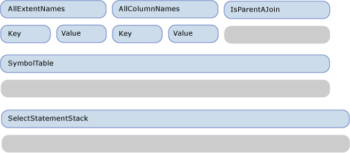
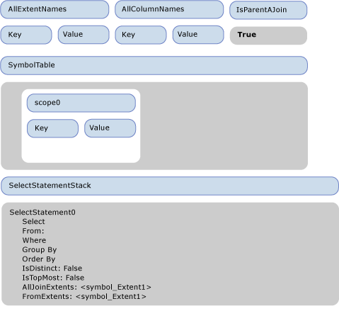
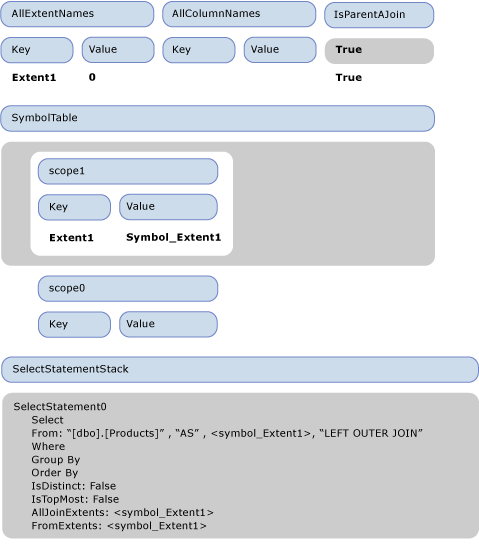
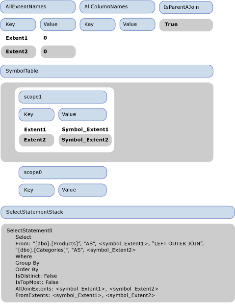
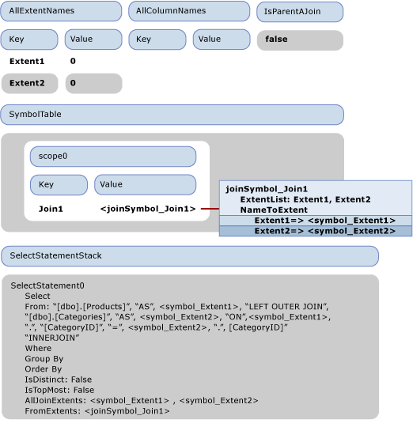
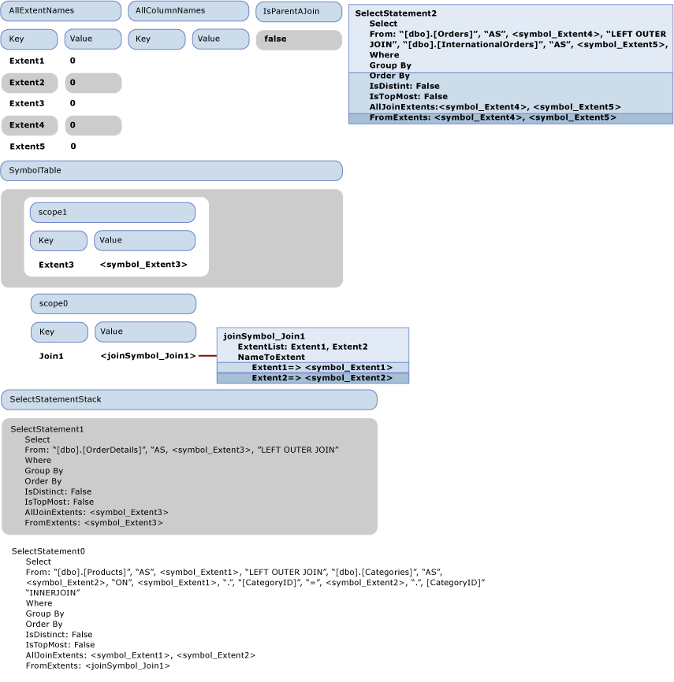
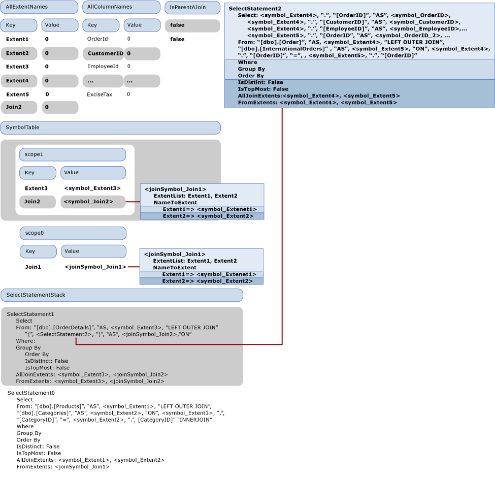

# Walkthrough: SQL Generation
This topic illustrates how SQL generation occurs in the [Sample Provider](http://go.microsoft.com/fwlink/?LinkId=180616). The following Entity SQL query uses the model that is included with the sample provider:  
  
```  
SELECT  j1.ProductId, j1.ProductName, j1.CategoryName, j2.ShipCountry, j2.ProductId  
FROM (  SELECT P.ProductName, P.ProductId, P.Category.CategoryName  
        FROM NorthwindEntities.Products AS P) as j1  
INNER JOIN (SELECT OD.ProductId, OD.Order.ShipCountry as ShipCountry  
            FROM NorthwindEntities.OrderDetails AS OD) as j2  
            ON j1.ProductId == j2.ProductId   
```  
  
 The query produces the following output command tree that is passed to the provider:  
  
```  
DbQueryCommandTree  
|_Parameters  
|_Query : Collection{Record['C1'=Edm.Int32, 'ProductID'=Edm.Int32, 'ProductName'=Edm.String, 'CategoryName'=Edm.String, 'ShipCountry'=Edm.String, 'ProductID1'=Edm.Int32]}  
  |_Project  
    |_Input : 'Join4'  
    | |_InnerJoin  
    |   |_Left : 'Join1'  
    |   | |_LeftOuterJoin  
    |   |   |_Left : 'Extent1'  
    |   |   | |_Scan : dbo.Products  
    |   |   |_Right : 'Extent2'  
    |   |   | |_Scan : dbo.Categories  
    |   |   |_JoinCondition  
    |   |     |_  
    |   |       |_Var(Extent1).CategoryID  
    |   |       |_=  
    |   |       |_Var(Extent2).CategoryID  
    |   |_Right : 'Join3'  
    |   | |_LeftOuterJoin  
    |   |   |_Left : 'Extent3'  
    |   |   | |_Scan : dbo.OrderDetails  
    |   |   |_Right : 'Join2'  
    |   |   | |_LeftOuterJoin  
    |   |   |   |_Left : 'Extent4'  
    |   |   |   | |_Scan : dbo.Orders  
    |   |   |   |_Right : 'Extent5'  
    |   |   |   | |_Scan : dbo.InternationalOrders  
    |   |   |   |_JoinCondition  
    |   |   |     |_  
    |   |   |       |_Var(Extent4).OrderID  
    |   |   |       |_=  
    |   |   |       |_Var(Extent5).OrderID  
    |   |   |_JoinCondition  
    |   |     |_  
    |   |       |_Var(Extent3).OrderID  
    |   |       |_=  
    |   |       |_Var(Join2).Extent4.OrderID  
    |   |_JoinCondition  
    |     |_  
    |       |_Var(Join1).Extent1.ProductID  
    |       |_=  
    |       |_Var(Join3).Extent3.ProductID  
    |_Projection  
      |_NewInstance : Record['C1'=Edm.Int32, 'ProductID'=Edm.Int32, 'ProductName'=Edm.String, 'CategoryName'=Edm.String, 'ShipCountry'=Edm.String, 'ProductID1'=Edm.Int32]  
        |_Column : 'C1'  
        | |_1  
        |_Column : 'ProductID'  
        | |_Var(Join4).Join1.Extent1.ProductID  
        |_Column : 'ProductName'  
        | |_Var(Join4).Join1.Extent1.ProductName  
        |_Column : 'CategoryName'  
        | |_Var(Join4).Join1.Extent2.CategoryName  
        |_Column : 'ShipCountry'  
        | |_Var(Join4).Join3.Join2.Extent4.ShipCountry  
        |_Column : 'ProductID1'  
          |_Var(Join4).Join3.Extent3.ProductID  
```  
  
 This topic describes how to translate this output command tree into the following SQL statements.  
  
```  
SELECT   
1 AS [C1],   
[Extent1].[ProductID] AS [ProductID],   
[Extent1].[ProductName] AS [ProductName],   
[Extent2].[CategoryName] AS [CategoryName],   
[Join3].[ShipCountry] AS [ShipCountry],   
[Join3].[ProductID] AS [ProductID1]  
FROM   [dbo].[Products] AS [Extent1]  
LEFT OUTER JOIN [dbo].[Categories] AS [Extent2] ON [Extent1].[CategoryID] = [Extent2].[CategoryID]  
INNER JOIN    
(SELECT [Extent3].[OrderID] AS [OrderID1], [Extent3].[ProductID] AS [ProductID], [Extent3].[UnitPrice] AS [UnitPrice], [Extent3].[Quantity] AS [Quantity], [Extent3].[Discount] AS [Discount], [Join2].[OrderID2], [Join2].[CustomerID], [Join2].[EmployeeID], [Join2].[OrderDate], [Join2].[RequiredDate], [Join2].[ShippedDate], [Join2].[Freight], [Join2].[ShipName], [Join2].[ShipAddress], [Join2].[ShipCity], [Join2].[ShipRegion], [Join2].[ShipPostalCode], [Join2].[ShipCountry], [Join2].[OrderID3], [Join2].[CustomsDescription], [Join2].[ExciseTax]  
FROM  [dbo].[OrderDetails] AS [Extent3]  
LEFT OUTER JOIN    
      (SELECT [Extent4].[OrderID] AS [OrderID2], [Extent4].[CustomerID] AS [CustomerID], [Extent4].[EmployeeID] AS [EmployeeID], [Extent4].[OrderDate] AS [OrderDate], [Extent4].[RequiredDate] AS [RequiredDate], [Extent4].[ShippedDate] AS [ShippedDate], [Extent4].[Freight] AS [Freight], [Extent4].[ShipName] AS [ShipName], [Extent4].[ShipAddress] AS [ShipAddress], [Extent4].[ShipCity] AS [ShipCity], [Extent4].[ShipRegion] AS [ShipRegion], [Extent4].[ShipPostalCode] AS [ShipPostalCode], [Extent4].[ShipCountry] AS [ShipCountry], [Extent5].[OrderID] AS [OrderID3], [Extent5].[CustomsDescription] AS [CustomsDescription], [Extent5].[ExciseTax] AS [ExciseTax]  
FROM  [dbo].[Orders] AS [Extent4]  
LEFT OUTER JOIN [dbo].[InternationalOrders] AS [Extent5] ON [Extent4].[OrderID] = [Extent5].[OrderID]   
      ) AS [Join2] ON [Extent3].[OrderID] = [Join2].[OrderID2]   
   ) AS [Join3] ON [Extent1].[ProductID] = [Join3].[ProductID]  
```  
  
## First Phase of SQL Generation: Visiting the Expression Tree  
 The following figure illustrates the initial empty state of the visitor.  Throughout this topic, only the properties relevant to the walkthrough explanation are shown.  
  
   
  
 When the Project  node is visited, VisitInputExpression is called over its input (Join4), which triggers the visit of Join4 by the method VisitJoinExpression. Because this is a topmost join, IsParentAJoin returns false and a new SqlSelectStatement (SelectStatement0) is created and pushed on the SELECT statement stack. Also, a new scope (scope0) is entered in the symbol table. Before the first (left) input of the join is visited, 'true' is pushed on the IsParentAJoin stack. Right before Join1, which is the left input of Join4, is visited, the state of the visitor is as shown in the next figure.  
  
   
  
 When the join visit method is invoked over Join4, IsParentAJoin is true, thus it reuses the current select statement SelectStatement0. A new scope is entered (scope1). Before visiting its left child, Extent1, another true is pushed on the IsParentAJoin stack.  
  
 When Extent1 is visited, because IsParentAJoin returns true, it returns a SqlBuilder containing "[dbo].[Products]". The control returns to the method visiting Join4. An entry is popped from IsParentAJoin, and ProcessJoinInputResult is called, which appends the result of visiting Extent1 to the From clause of SelectStatement0. A new from symbol, symbol_Extent1, for the input binding name "Extent1" is created, added to the FromExtents of SelectStatement0, and also "As" and  symbol_Extent1 are appended to the from clause. A new entry is added to AllExtentNames for "Extent1" with the value of 0. A new entry is added to the current scope in the symbol table to associate "Extent1" with its symbol symbol_Extent1. Symbol_Extent1 is also added to the AllJoinExtents of the SqlSelectStatement.  
  
 Before the right input of Join1 is visited, "LEFT OUTER JOIN" is added to the From clause of SelectStatement0. Because the right input is a Scan expression, true is again pushed to the IsParentAJoin stack. The state before visiting the right input as shown in the next figure.  
  
   
  
 The right input is processed in the same way as the left input. The state after visiting the right input is shown in the next figure.  
  
   
  
 Next "false" is pushed on the IsParentAJoin stack and the join condition Var(Extent1).CategoryID == Var(Extent2).CategoryID is processed. Var(Extenent1) is resolved to <symbol_Extent1> after a look up in the symbol table. Because the instance is resolved to a simple Symbol, as a result of processing Var(Extent1).CategoryID, a SqlBuilder with \<symbol1>."CategoryID" is returned. Similarly the other side of the comparison is processed, and the result of visiting the join condition is appended to the FROM clause of SelectStatement1 and the value "false" is popped from the IsParentAJoin stack.  
  
 With this, Join1 has completely been processed, and a scope is popped from the symbol table.  
  
 Control returns to processing Join4, the parent of Join1. Because the child reused the Select statement, the Join1 extents are replaced with a single Join symbol <joinSymbol_Join1>. Also a new entry is added to the symbol table to associate Join1 with <joinSymbol_Join1>.  
  
 The next node to be processed is Join3, the second child of Join4. As it is a right child, "false" is pushed to the IsParentAJoin stack. The state of the visitor at this point is illustrated in the next figure.  
  
   
  
 For Join3, IsParentAJoin returns false and needs to start a new SqlSelectStatement (SelectStatement1) and push it on the stack. Processing continues as it did with the previous the previous joins, a new scope is pushed on the stack and the children are processed. The left child is an Extent (Extent3) and the right child is a join (Join2) which also needs to start a new SqlSelectStatement: SelectStatement2. The children on Join2 are Extents as well and are aggregated into SelectStatement2.  
  
 The state of the visitor right after Join2 is visited, but before its post-processing (ProcessJoinInputResult) is done is shown in the next figure:  
  
   
  
 In the previous figure, SelectStatement2 is shown as free floating because it was popped out of the stack, but not yet post processed by the parent. It needs to be added to the FROM part of the parent, but it is not a complete SQL statement without a SELECT clause. So, at this point, the default columns (all the columns produced by its inputs) are added to the select list by the method AddDefaultColumns. AddDefaultColumns iterates over the symbols in FromExtents and for each symbol adds all the columns brought in scope. For a simple symbol, it looks at the symbol type to retrieve all its properties to be added. It also populates the AllColumnNames dictionary with the column names. The completed SelectStatement2 is appended to the FROM clause of SelectStatement1.  
  
 Next, a new join symbol is created to represent Join2, it is marked as a nested join and added to the AllJoinExtents of SelectStatement1 and added to the symbol table.  Now the join condition of Join3, Var(Extent3).OrderID =  Var(Join2).Extent4.OrderID, needs to be processed. Processing of the left hand side is similar to the join condition of Join1. However, the processing of the right and side "Var(Join2).Extent4.OrderID" is different because join flattening is required.  
  
 The next figure shows the state of the visitor right before the DbPropertyExpression "Var(Join2).Extent4.OrderID" is processed.  
  
 Consider how "Var(Join2).Extent4.OrderID" is visited. First, the instance property "Var(Join2).Extent4" is visited, which is another DbPropertyExpression and first visits its instance "Var(Join2)". In the top most scope in the symbol table, "Join2" resolves to <joinSymbol_join2>. In the visit method for DbPropertyExpression processing "Var(Join2).Extent4" notice that a join symbol was returned when visiting the instance and flattening is required.  
  
 Since it is a nested join, we look up the property "Extent4" in the NameToExtent dictionary of the join symbol, resolve it to <symbol_Extent4> and return a new SymbolPair(<joinSymbol_join2>, <symbol_Extent4>). Since a symbol pair is returned from the processing of the instance of "Var(Join2).Extent4.OrderID",  the property "OrderID" is resolved from the ColumnPart of that symbol pair (<symbol_Extent4>), which has a list of the columns of the extent it represents. So, "Var(Join2).Extent4.OrderID" is resolved to { <joinSymbol_Join2>, ".", <symbol_OrderID>}.  
  
 The join condition of Join4 is similarly processed. The control returns to the VisitInputExpression method that processed the top most project. Looking at the FromExtents of the returned SelectStatement0, the input is identified as a join, and removes the original extents and replaces them with a new extent with just the Join symbol. The symbol table is also updated and next the projection part of the Project is processed. The resolving of the properties and the flattening of the join extents is as described earlier.  
  
   
  
 Finally, the following SqlSelectStatement is produced:  
  
```  
SELECT:   
  "1", " AS ", "[C1]",  
  <symbol_Extent1>, ".", "[ProductID]", " AS ", "[ProductID]",   
  <symbol_Extent1>, ".", "[ProductName]", " AS ", "[ProductName]",  
  <symbol_Extent2>, ".", "[CategoryName]", " AS ", "[CategoryName]",  
  <joinSymbol_Join3>, ".", <symbol_ShipCountry>, " AS ", "[ShipCountry]",   
  <joinSymbol_Join3>, ".", <symbol_ProductID>, " AS ", "[ProductID1]"  
FROM: "[dbo].[Products]", " AS ", <symbol_Extent1>,   
        "LEFT OUTER JOIN ""[dbo].[Categories]", " AS ", <symbol_Extent2>, " ON ", <symbol_Extent1>, ".", "[CategoryID]", " = ", <symbol_Extent2>, ".", "[CategoryID]",   
        "INNER JOIN ",   
        " (", SELECT:   
           <symbol_Extent3>, ".", "[OrderID]", " AS ", <symbol_OrderID>, ",   
              <symbol_Extent3>, ".", "[ProductID]", " AS ", <symbol_ProductID>, ...,  
         <joinSymbol_Join2>, ".", <symbol_OrderID_2>, ", ",   
           <joinSymbol_Join2>, ".", <symbol_CustomerID>, ....,    
        <joinSymbol_Join2>, ".", <symbol_OrderID_3>,   
<joinSymbol_Join2>, ".", <symbol_CustomsDescription>,   
<joinSymbol_Join2>, ".", <symbol_ExciseTax>  
FROM: "[dbo].[OrderDetails]", " AS ", <symbol_Extent3>,   
"LEFT OUTER JOIN ",   
" (", SELECT:   
<symbol_Extent4>, ".", "[OrderID]", " AS ", <symbol_OrderID_2>,   
<symbol_Extent4>, ".", "[CustomerID]", " AS ", <symbol_CustomerID>, ...  
<symbol_Extent5>, ".", "[OrderID]", " AS ", <symbol_OrderID_3>,  
<symbol_Extent5>, ".", "[CustomsDescription]", " AS ", <symbol_CustomsDescription>,  
<symbol_Extent5>, ".", "[ExciseTax]", " AS ", <symbol_ExciseTax>  
FROM: "[dbo].[Orders]", " AS ", <symbol_Extent4>,  
"LEFT OUTER JOIN ", , "[dbo].[InternationalOrders]", " AS ", <symbol_Extent5>,   
" ON ", <symbol_Extent4>, ".", "[OrderID]", " = ", , <symbol_Extent5>, ".", "[OrderID]"  
" )", " AS ", <joinSymbol_Join2>, " ON ", , , <symbol_Extent3>, ".", "[OrderID]", " = ", , <joinSymbol_Join2>, ".", <symbol_OrderID_2>  
" )", " AS ", <joinSymbol_Join3>, " ON ", , , <symbol_Extent1>, ".", "[ProductID]", " = ", , <joinSymbol_Join3>, ".", <symbol_ProductID>  
```  
  
### Second Phase of SQL Generation: Generating the String Command  
 The second phase produces actual names for the symbols, and we only focus on the symbols representing columns named "OrderID", as in this case a conflict needs to be resolved. These are highlighted in the SqlSelectStatement. Note that the suffixes used in the figure are only to emphasize that these are different instances, not to represent any new names, as at this stage their final names (possibly different form the original names) have not been assigned yet.  
  
 The first symbol found that needs to be renamed is <symbol_OrderID>. Its new name is assigned as "OrderID1", 1 is marked as the last used suffix for "OrderID" and the symbol is marked as not needing renaming. Next, the first usage of <symbol_OrderID_2> is found. It is renamed to use the next available suffix ("OrderID2") and again marked as not needing renaming, so that next time it is used it does not get renamed. This is done for <symbol_OrderID_3> too.  
  
 At the end of the second phase, the final SQL statement is generated.  
  
## See Also  
 [SQL Generation in the Sample Provider](../../../../../docs/framework/data/adonet/ef/sql-generation-in-the-sample-provider.md)
