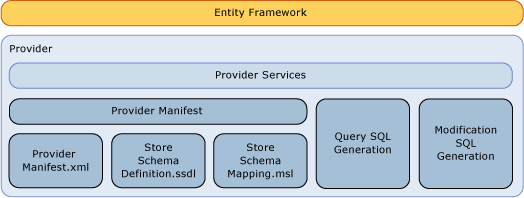

# Writing an Entity Framework Data Provider
This section discusses how to write an [!INCLUDE[adonet_ef](../../../../../includes/adonet-ef-md.md)] provider to support a data source other than [!INCLUDE[ssNoVersion](../../../../../includes/ssnoversion-md.md)]. The [!INCLUDE[adonet_ef](../../../../../includes/adonet-ef-md.md)] includes a provider that supports [!INCLUDE[ssNoVersion](../../../../../includes/ssnoversion-md.md)].  
  
## Introducing the Entity Framework Provider Model  
 The [!INCLUDE[adonet_ef](../../../../../includes/adonet-ef-md.md)] is database independent, and you can write a provider by using the ADO.NET Provider Model to connect to a diverse set of data sources.  
  
 The Entity Framework data provider (built using the ADO.NET Data Provider model) performs the following functions:  
  
-   Maps Entity Data Model (EDM) primitive types to provider types.  
  
-   Exposes provider-specific functions.  
  
-   Generates provider-specific commands for a given DbQueryCommandTree to support [!INCLUDE[adonet_ef](../../../../../includes/adonet-ef-md.md)] queries.  
  
-   Generates provider-specific update commands for a given DbModificationCommandTree to support updates through the [!INCLUDE[adonet_ef](../../../../../includes/adonet-ef-md.md)].  
  
-   Exposes mapping files for the store schema definition, to support generation of a model based on a database.  
  
-   Exposes metadata (tables and views, for example) via a conceptual model.  
  
   
  
## Sample  
 See the [Entity Framework Sample Provider](http://go.microsoft.com/fwlink/?LinkId=180616) for a sample of an [!INCLUDE[adonet_ef](../../../../../includes/adonet-ef-md.md)] provider that supports a data source other than [!INCLUDE[ssNoVersion](../../../../../includes/ssnoversion-md.md)].  
  
## In This Section  
 [SQL Generation](../../../../../docs/framework/data/adonet/ef/sql-generation.md)  
  
 [Modification SQL Generation](../../../../../docs/framework/data/adonet/ef/modification-sql-generation.md)  
  
 [Provider Manifest Specification](../../../../../docs/framework/data/adonet/ef/provider-manifest-specification.md)  
  
## See Also  
 [Working with Data Providers](../../../../../docs/framework/data/adonet/ef/working-with-data-providers.md)
