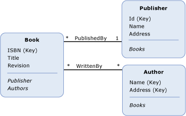

# Entity Data Model Key Concepts
The Entity Data Model (EDM) uses three key concepts to describe the structure of data: *entity type*, *association type*, and *property*. These are the most important concepts in describing the structure of data in any implementation of the EDM.  
  
## Entity Type  
 The [entity type](../../../../docs/framework/data/adonet/entity-type.md) is the fundamental building block for describing the structure of data with the Entity Data Model. In a conceptual model, entity types are constructed from [properties](../../../../docs/framework/data/adonet/property.md) and describe the structure of top-level concepts, such as a customers and orders in a business application. In the same way that a class definition in a computer program is a template for instances of the class, an entity type is a template for entities. An entity represents a specific object (such as a specific customer or order). Each entity must have a unique [entity key](../../../../docs/framework/data/adonet/entity-key.md) within an [entity set](../../../../docs/framework/data/adonet/entity-set.md).  An entity set is a collection of instances of a specific entity type. Entity sets (and [association sets](../../../../docs/framework/data/adonet/association-set.md)) are logically grouped in an [entity container](../../../../docs/framework/data/adonet/entity-container.md).  
  
 Inheritance is supported with entity types: that is, one entity type can be derived from another. For more information, see [Entity Data Model: Inheritance](../../../../docs/framework/data/adonet/entity-data-model-inheritance.md).  
  
## Association Type  
 An [association type](../../../../docs/framework/data/adonet/association-type.md) (also called an association) is the fundamental building block for describing relationships in the Entity Data Model. In a conceptual model, an association represents a relationship between two entity types (such as Customer and Order). Every association has two [association ends](../../../../docs/framework/data/adonet/association-end.md) that specify the entity types involved in the association. Each association end also specifies an [association end multiplicity](../../../../docs/framework/data/adonet/association-end-multiplicity.md) that indicates the number of entities that can be at that end of the association. An association end multiplicity can have a value of one (1), zero or one (0..1), or many (*). Entities at one end of an association can be accessed through [navigation properties](../../../../docs/framework/data/adonet/navigation-property.md), or through foreign keys if they are exposed on an entity type. For more information, see [foreign key property](../../../../docs/framework/data/adonet/foreign-key-property.md).  
  
 In an application, an instance of an association represents a specific association (such as an association between an instance of Customer and instances of Order). Association instances are logically grouped in an [association set](../../../../docs/framework/data/adonet/association-set.md). Association sets (and [entity sets](../../../../docs/framework/data/adonet/entity-set.md)) are logically grouped in an [entity container](../../../../docs/framework/data/adonet/entity-container.md).  
  
## Property  
 [Entity types](../../../../docs/framework/data/adonet/entity-type.md) contain [properties](../../../../docs/framework/data/adonet/property.md) that define their structure and characteristics. For example, a Customer entity type may have properties such as CustomerId, Name, and Address.  
  
 Properties in a conceptual model are analogous to properties defined on a class in a computer program. In the same way that properties on a class define the shape of the class and carry information about objects, properties in a conceptual model define the shape of an entity type and carry information about entity type instances.  
  
 A property can contain primitive data (such as a string, an integer, or a Boolean value), or structured data (such as a complex type). For more information, see [Entity Data Model: Primitive Data Types](../../../../docs/framework/data/adonet/entity-data-model-primitive-data-types.md).  
  
## Representations of a Conceptual Model  
 A *conceptual model* is a specific representation of the structure of some data as entities and relationships. One way to represent a conceptual model is with a diagram. The following diagram represents a conceptual model with three entity types (`Book`, `Publisher`, and `Author`) and two associations (`PublishedBy` and `WrittenBy`):  
  
   
  
 This representation, however, has some shortcomings when it comes to conveying some details about the model. For example, property type and entity set information are not conveyed in the diagram. The richness of a conceptual model can be conveyed more clearly with a domain-specific language (DSL). The [ADO.NET Entity Framework](../../../../docs/framework/data/adonet/ef/index.md) uses an XML-based DSL called *conceptual schema definition language* ([CSDL](../../../../docs/framework/data/adonet/ef/language-reference/csdl-specification.md)) to define conceptual models. The following is the CSDL definition of the conceptual model in the diagram above:  
  
 [!code-xml[EDM_Example_Model#EDMExampleCSDL](../../../../samples/snippets/xml/VS_Snippets_Data/edm_example_model/xml/books.edmx#edmexamplecsdl)]  
  
## See Also  
 [Entity Data Model](../../../../docs/framework/data/adonet/entity-data-model.md)
