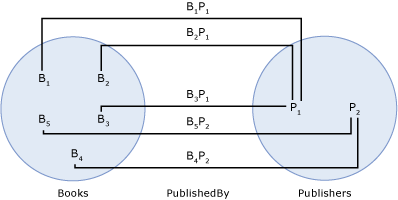

# entity set
An *entity set* is a logical container for instances of an [entity type](entity-type.md) and instances of any type derived from that entity type. (For information about derived types, see [Entity Data Model: Inheritance](entity-data-model-inheritance.md).) The relationship between an entity type and an entity set is analogous to the relationship between a row and a table in a relational database: Like a row, an entity type describes data structure, and, like a table, an entity set contains instances of a given structure. An entity set is not a data modeling construct; it does not describe the structure of data. Instead, an entity set provides a construct for a hosting or storage environment (such as the common language runtime or a SQL Server database) to group entity type instances so that they can be mapped to a data store.  
  
 An entity set is defined within an [entity container](entity-container.md), which is a logical grouping of entity sets and [association sets](association-set.md).  
  
 For an entity type instance to exist in an entity set, the following must be true:  
  
- The type of the instance is either the same as the entity type on which the entity set is based, or the type of the instance is a subtype of the entity type.  
  
- The [entity key](entity-key.md) for the instance is unique within the entity set.  
  
- The instance does not exist in any other entity set.  
  
    > [!NOTE]
    > Multiple entity sets can be defined using the same entity type, but an instance of a given entity type can only exist in one entity set.  
  
 You do not have to define an entity set for each entity type in a conceptual model.  
  
## Example  
 The diagram below shows a conceptual model with three entity types: `Book`, `Publisher`, and `Author`.  
  
   
  
 The following diagram shows two entity sets (`Books` and `Publishers`) and an association set (`PublishedBy`) based on the conceptual model shown above. Bi in the `Books` entity set represents an instance of the `Book` entity type at run time. Similarly, Pj represent a `Publisher` instance in the `Publishers` entity set. BiPj represents an instance of the `PublishedBy` association in the `PublishedBy` association set.  
  
   
  
 The [ADO.NET Entity Framework](./ef/index.md) uses a domain-specific language (DSL) called conceptual schema definition language ([CSDL](./ef/language-reference/csdl-specification.md)) to define conceptual models. The following CSDL defines an entity container with one entity set for each entity type in the conceptual model shown above. Note that the name and entity type for each entity set are defined using XML attributes.  
  
 [!code-xml[EDM_Example_Model#EntityContainerExample](../../../../samples/snippets/xml/VS_Snippets_Data/edm_example_model/xml/books.edmx#entitycontainerexample)]  
  
 It is possible to define multiple entity sets per type (MEST). The following CSDL defines an entity container with two entity sets for the `Book` entity type:  
  
 [!code-xml[EDM_Example_Model#MESTExample](../../../../samples/snippets/xml/VS_Snippets_Data/edm_example_model/xml/books2.edmx#mestexample)]  
  
## See also

- [Entity Data Model Key Concepts](entity-data-model-key-concepts.md)
- [Entity Data Model](entity-data-model.md)
