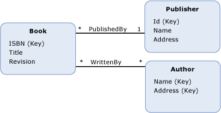

# entity type
The *entity type* is the fundamental building block for describing the structure of data with the Entity Data Model (EDM). In a conceptual model, an entity type represents the structure of top-level concepts, such as customers or orders. An entity type is a template for entity type instances. Each template contains the following information:  
  
- A unique name. (Required.)  
  
- An [entity key](entity-key.md) defined by one or more properties. (Required.)  
  
- Data in the form of [properties](property.md). (Optional.)  
  
- [Navigation properties](navigation-property.md) that allow for navigation from one [end](association-end.md) of an [association](association-type.md) to the other end. (Optional)  
  
 In an application, an instance of an entity type represents a specific object (such as a specific customer or order). Each instance of an entity type must have a unique [entity key](entity-key.md) within an [entity set](entity-set.md).  
  
 Two entity type instances are considered equal only if they are of the same type and the values of their entity keys are the same.  
  
## Example  
 The diagram below shows a conceptual model with three entity types: `Book`, `Publisher`, and `Author`:  
  
   
  
 Note that the properties of each entity type that make up its entity key are denoted with "(Key)".  
  
 The [ADO.NET Entity Framework](./ef/index.md) uses a domain-specific language (DSL) called conceptual schema definition language ([CSDL](./ef/language-reference/csdl-specification.md)) to define conceptual models. The following CSDL defines the `Book` entity type shown in the diagram above:  
  
 [!code-xml[EDM_Example_Model#EntityExample](../../../../samples/snippets/xml/VS_Snippets_Data/edm_example_model/xml/books.edmx#entityexample)]  
  
## See also

- [Entity Data Model Key Concepts](entity-data-model-key-concepts.md)
- [Entity Data Model](entity-data-model.md)
- [facet](facet.md)
