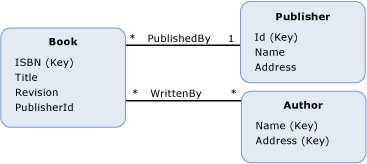

# foreign key property
A *foreign key property* in the Entity Data Model (EDM) is a primitive type [property](property.md) (or a set of primitive type properties) on an [entity type](entity-type.md) that contains the [entity key](entity-key.md) of another entity type.  
  
 A foreign key property is analogous to a foreign key column in a relational database. In the same way that foreign key columns are used in a relational database to create relationships between rows in tables, foreign key properties in a conceptual model are used to establish [associations](association-type.md) between entity types. A [referential integrity constraint](referential-integrity-constraint.md) is used to define an association between two entity types when one of the types has a foreign key property.  
  
## Example  
 The diagram below shows a conceptual model with three entity types: `Book`, `Publisher`, and `Author`. The `Book` entity type has a property, `PublisherId`, that references the entity key of the `Publisher` entity type when you define a referential integrity constraint on the `PublishedBy` association.  
  
   
  
 The [ADO.NET Entity Framework](./ef/index.md) uses a domain-specific language (DSL) called conceptual schema definition language ([CSDL](/ef/ef6/modeling/designer/advanced/edmx/csdl-spec)) to define conceptual models. The following CSDL uses the foreign key property `PublisherId` to define a referential integrity constraint on the `PublishedBy` association shown in the conceptual model shown above.  
  
 [!code-xml[EDM_Example_Model#RefConstraint](../../../../samples/snippets/xml/VS_Snippets_Data/edm_example_model/xml/books4.edmx#refconstraint)]  
  
## See also

- [Entity Data Model Key Concepts](entity-data-model-key-concepts.md)
- [Entity Data Model](entity-data-model.md)
