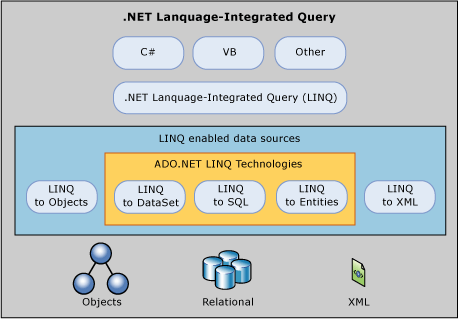

# LINQ and ADO.NET
Today, many business developers must use two (or more) programming languages: a high-level language for the business logic and presentation layers (such as [!INCLUDE[csprcs](../../../../includes/csprcs-md.md)] or [!INCLUDE[vbprvb](../../../../includes/vbprvb-md.md)]), and a query language to interact with the database (such as [!INCLUDE[tsql](../../../../includes/tsql-md.md)]). This requires the developer to be proficient in several languages to be effective, and also causes language mismatches in the development environment. For example, an application that uses a data access API to execute a query against a database specifies the query as a string literal by using quotation marks. This query string is un-readable to the compiler and is not checked for errors, such as invalid syntax or whether the columns or rows it references actually exist. There is no type checking of the query parameters and no `IntelliSense` support, either.  
  
 [!INCLUDE[vbteclinqext](../../../../includes/vbteclinqext-md.md)] enables developers to form set-based queries in their application code, without having to use a separate query language. You can write [!INCLUDE[vbteclinq](../../../../includes/vbteclinq-md.md)] queries against various enumerable data sources (that is, a data source that implements the <xref:System.Collections.IEnumerable> interface), such as in-memory data structures, XML documents, SQL databases, and <xref:System.Data.DataSet> objects. Although these enumerable data sources are implemented in various ways, they all expose the same syntax and language constructs. Because queries can be formed in the programming language itself, you do not have to use another query language that is embedded as string literals that cannot be understood or verified by the compiler. Integrating queries into the programming language also enables [!INCLUDE[vsprvs](../../../../includes/vsprvs-md.md)] programmers to be more productive by providing compile-time type and syntax checking, and `IntelliSense`. These features reduce the need for query debugging and error fixing.  
  
 Transferring data from SQL tables into objects in memory is often tedious and error-prone. The [!INCLUDE[vbteclinq](../../../../includes/vbteclinq-md.md)] provider implemented by [!INCLUDE[linq_dataset](../../../../includes/linq-dataset-md.md)] and [!INCLUDE[vbtecdlinq](../../../../includes/vbtecdlinq-md.md)] converts the source data into <xref:System.Collections.IEnumerable>-based object collections. The programmer always views the data as an <xref:System.Collections.IEnumerable> collection, both when you query and when you update. Full `IntelliSense` support is provided for writing queries against those collections.  
  
 There are three separate ADO.NET [!INCLUDE[vbteclinqext](../../../../includes/vbteclinqext-md.md)] technologies: [!INCLUDE[linq_dataset](../../../../includes/linq-dataset-md.md)], [!INCLUDE[vbtecdlinq](../../../../includes/vbtecdlinq-md.md)], and [!INCLUDE[linq_entities](../../../../includes/linq-entities-md.md)]. [!INCLUDE[linq_dataset](../../../../includes/linq-dataset-md.md)] provides richer, optimized querying over the <xref:System.Data.DataSet> and [!INCLUDE[vbtecdlinq](../../../../includes/vbtecdlinq-md.md)] enables you to directly query [!INCLUDE[ssNoVersion](../../../../includes/ssnoversion-md.md)] database schemas, and [!INCLUDE[linq_entities](../../../../includes/linq-entities-md.md)] allows you to query an [!INCLUDE[adonet_edm](../../../../includes/adonet-edm-md.md)].  
  
 The following diagram provides an overview of how the ADO.NET LINQ technologies relate to high-level programming languages and LINQ-enabled data sources.  
  
   
  
 For general information on the LINQ language features, see [Introduction to LINQ](http://msdn.microsoft.com/library/24dddf19-12a0-4707-a4bc-eba4fa7f219e). For information about using LINQ in your applications, see the [NOT IN BUILD: LINQ General Programming Guide](http://msdn.microsoft.com/library/609c7a6b-cbdd-429d-99f3-78d13d3bc049), which contains detailed information about how to use LINQ technologies.  
  
 The following sections provide more information about [!INCLUDE[linq_dataset](../../../../includes/linq-dataset-md.md)], [!INCLUDE[vbtecdlinq](../../../../includes/vbtecdlinq-md.md)], and [!INCLUDE[linq_entities](../../../../includes/linq-entities-md.md)].  
  
## LINQ to DataSet  
 The <xref:System.Data.DataSet> is a key element of the disconnected programming model that [!INCLUDE[vstecado](../../../../includes/vstecado-md.md)] is built on, and is widely used. [!INCLUDE[linq_dataset](../../../../includes/linq-dataset-md.md)] enables developers to build richer query capabilities into <xref:System.Data.DataSet> by using the same query formulation mechanism that is available for many other data sources. For more information, see [LINQ to DataSet](../../../../docs/framework/data/adonet/linq-to-dataset.md).  
  
## LINQ to SQL  
 [!INCLUDE[vbtecdlinq](../../../../includes/vbtecdlinq-md.md)] is a useful tool for developers who do not require mapping to a conceptual model. By using [!INCLUDE[vbtecdlinq](../../../../includes/vbtecdlinq-md.md)], you can use the [!INCLUDE[vbteclinq](../../../../includes/vbteclinq-md.md)] programming model directly over existing database schema. [!INCLUDE[vbtecdlinq](../../../../includes/vbtecdlinq-md.md)] enables developers to generate [!INCLUDE[dnprdnshort](../../../../includes/dnprdnshort-md.md)] classes that represent data. Rather than mapping to a conceptual data model, these generated classes map directly to database tables, views, stored procedures, and user-defined functions.  
  
 With [!INCLUDE[vbtecdlinq](../../../../includes/vbtecdlinq-md.md)], developers can write code directly against the storage schema using the same [!INCLUDE[vbteclinq](../../../../includes/vbteclinq-md.md)] programming pattern as in-memory collections and the <xref:System.Data.DataSet>, in addition to other data sources such as XML. For more information, see [LINQ to SQL](../../../../docs/framework/data/adonet/sql/linq/index.md).  
  
## LINQ to Entities  
 Most applications are currently written on top of relational databases. At some point, these applications will need to interact with the data represented in a relational form. Database schemas are not always ideal for building applications, and the conceptual models of application are not the same as the logical models of databases. The [!INCLUDE[adonet_edm](../../../../includes/adonet-edm-md.md)] is a conceptual data model that can be used to model the data of a particular domain so that applications can interact with data as objects. See [ADO.NET Entity Framework](../../../../docs/framework/data/adonet/ef/index.md) for more information.  
  
 Through the [!INCLUDE[adonet_edm](../../../../includes/adonet-edm-md.md)], relational data is exposed as objects in the .NET environment. This makes the object layer an ideal target for [!INCLUDE[vbteclinq](../../../../includes/vbteclinq-md.md)] support, allowing developers to formulate queries against the database from the language used to build the business logic. This capability is known as [!INCLUDE[linq_entities](../../../../includes/linq-entities-md.md)]. See [LINQ to Entities](../../../../docs/framework/data/adonet/ef/language-reference/linq-to-entities.md) for more information.  
  
## See Also  
 [LINQ to DataSet](../../../../docs/framework/data/adonet/linq-to-dataset.md)  
 [LINQ to SQL](../../../../docs/framework/data/adonet/sql/linq/index.md)  
 [LINQ to Entities](../../../../docs/framework/data/adonet/ef/language-reference/linq-to-entities.md)  
 [LINQ (Language-Integrated Query)](http://msdn.microsoft.com/library/a73c4aec-5d15-4e98-b962-1274021ea93d)  
 [ADO.NET Managed Providers and DataSet Developer Center](http://go.microsoft.com/fwlink/?LinkId=217917)
