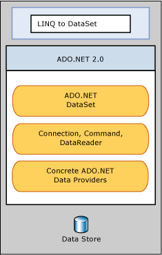

# LINQ to DataSet
LINQ to DataSet makes it easier and faster to query over data cached in a <xref:System.Data.DataSet> object. Specifically, LINQ to DataSet simplifies querying by enabling developers to write queries from the programming language itself, instead of by using a separate query language. This is especially useful for Visual Studio developers, who can now take advantage of the compile-time syntax checking, static typing, and IntelliSense support provided by the Visual Studio in their queries.  
  
 LINQ to DataSet can also be used to query over data that has been consolidated from one or more data sources. This enables many scenarios that require flexibility in how data is represented and handled, such as querying locally aggregated data and middle-tier caching in Web applications. In particular, generic reporting, analysis, and business intelligence applications require this method of manipulation.  
  
 The LINQ to DataSet functionality is exposed primarily through the extension methods in the <xref:System.Data.DataRowExtensions> and <xref:System.Data.DataTableExtensions> classes. LINQ to DataSet builds on and uses the existing ADO.NET architecture, and is not meant to replace ADO.NET in application code. Existing ADO.NET code will continue to function in a LINQ to DataSet application. The relationship of LINQ to DataSet to ADO.NET and the data store is illustrated in the following diagram.  
  
   
  
## In This Section  
 [Getting Started](getting-started-linq-to-dataset.md)  
  
 [Programming Guide](programming-guide-linq-to-dataset.md)  
  
## Reference  
 <xref:System.Data.DataTableExtensions>  
  
 <xref:System.Data.DataRowExtensions>  
  
 <xref:System.Data.DataRowComparer>  
  
## See also

- [Language-Integrated Query (LINQ) - C#](../../../csharp/programming-guide/concepts/linq/index.md)
- [Language-Integrated Query (LINQ) - Visual Basic](../../../visual-basic/programming-guide/concepts/linq/index.md)
- [LINQ and ADO.NET](linq-and-ado-net.md)
- [ADO.NET](index.md)
