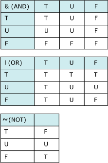

# Handling Null Values
A null value in a relational database is used when the value in a column is unknown or missing. A null is neither an empty string (for character or datetime data types) nor a zero value (for numeric data types). The ANSI SQL-92 specification states that a null must be the same for all data types, so that all nulls are handled consistently. The <xref:System.Data.SqlTypes> namespace provides null semantics by implementing the <xref:System.Data.SqlTypes.INullable> interface. Each of the data types in <xref:System.Data.SqlTypes> has its own `IsNull` property and a `Null` value that can be assigned to an instance of that data type.  
  
> [!NOTE]
>  The .NET Framework version 2.0 introduced support for nullable types, which allow programmers to extend a value type to represent all values of the underlying type. These CLR nullable types represent an instance of the <xref:System.Nullable> structure. This capability is especially useful when value types are boxed and unboxed, providing enhanced compatibility with object types. CLR nullable types are not intended for storage of database nulls because an ANSI SQL null does not behave the same way as a `null` reference (or `Nothing` in Visual Basic). For working with database ANSI SQL null values, use <xref:System.Data.SqlTypes> nulls rather than <xref:System.Nullable>. For more information on working with CLR nullable types in Visual Basic see [Nullable Value Types](~/docs/visual-basic/programming-guide/language-features/data-types/nullable-value-types.md), and for C# see [Using Nullable Types](~/docs/csharp/programming-guide/nullable-types/using-nullable-types.md).  
  
## Nulls and Three-Valued Logic  
 Allowing null values in column definitions introduces three-valued logic into your application. A comparison can evaluate to one of three conditions:  
  
-   True  
  
-   False  
  
-   Unknown  
  
 Because null is considered to be unknown, two null values compared to each other are not considered to be equal. In expressions using arithmetic operators, if any of the operands is null, the result is null as well.  
  
## Nulls and SqlBoolean  
 Comparison between any <xref:System.Data.SqlTypes> will return a <xref:System.Data.SqlTypes.SqlBoolean>. The `IsNull` function for each `SqlType` returns a <xref:System.Data.SqlTypes.SqlBoolean> and can be used to check for null values. The following truth tables show how the AND, OR, and NOT operators function in the presence of a null value. (T=true, F=false, and U=unknown, or null.)  
  
   
  
### Understanding the ANSI_NULLS Option  
 <xref:System.Data.SqlTypes> provides the same semantics as when the ANSI_NULLS option is set on in SQL Server. All arithmetic operators (+, -, *, /, %), bitwise operators (~, &, &#124;), and most functions return null if any of the operands or arguments is null, except for the property `IsNull`.  
  
 The ANSI SQL-92 standard does not support *columnName* = NULL in a WHERE clause. In SQL Server, the ANSI_NULLS option controls both default nullability in the database and evaluation of comparisons against null values. If ANSI_NULLS is turned on (the default), the IS NULL operator must be used in expressions when testing for null values. For example, the following comparison always yields unknown when ANSI_NULLS is on:  
  
```  
colname > NULL  
```  
  
 Comparison to a variable containing a null value also yields unknown:  
  
```  
colname > @MyVariable  
```  
  
 Use the IS NULL or IS NOT NULL predicate to test for a null value. This can add complexity to the WHERE clause. For example, the TerritoryID column in the AdventureWorks Customer table allows null values. If a SELECT statement is to test for null values in addition to others, it must include an IS NULL predicate:  
  
```  
SELECT CustomerID, AccountNumber, TerritoryID  
FROM AdventureWorks.Sales.Customer  
WHERE TerritoryID IN (1, 2, 3)  
   OR TerritoryID IS NULL  
```  
  
 If you set ANSI_NULLS off in SQL Server, you can create expressions that use the equality operator to compare to null. However, you can't prevent different connections from setting null options for that connection. Using IS NULL to test for null values always works, regardless of the ANSI_NULLS settings for a connection.  
  
 Setting ANSI_NULLS off is not supported in a `DataSet`, which always follows the ANSI SQL-92 standard for handling null values in <xref:System.Data.SqlTypes>.  
  
## Assigning Null Values  
 Null values are special, and their storage and assignment semantics differ across different type systems and storage systems. A `Dataset` is designed to be used with different type and storage systems.  
  
 This section describes the null semantics for assigning null values to a <xref:System.Data.DataColumn> in a <xref:System.Data.DataRow> across the different type systems.  
  
 `DBNull.Value`  
 This assignment is valid for a `DataColumn` of any type. If the type implements `INullable`, `DBNull.Value` is coerced into the appropriate strongly typed Null value.  
  
 `SqlType.Null`  
 All <xref:System.Data.SqlTypes> data types implement `INullable`. If the strongly typed null value can be converted into the column's data type using implicit cast operators, the assignment should go through. Otherwise an invalid cast exception is thrown.  
  
 `null`  
 If 'null' is a legal value for the given `DataColumn` data type, it is coerced into the appropriate `DbNull.Value` or `Null` associated with the `INullable` type (`SqlType.Null`)  
  
 `derivedUdt.Null`  
 For UDT columns, nulls are always stored based on the type associated with the `DataColumn`. Consider the case of a UDT associated with a `DataColumn` that does not implement `INullable` while its sub-class does. In this case, if a strongly typed null value associated with the derived class is assigned, it is stored as an untyped `DbNull.Value`, because null storage is always consistent with the DataColumn's data type.  
  
> [!NOTE]
>  The `Nullable<T>` or <xref:System.Nullable> structure is not currently supported in the `DataSet`.  
  
### Multiple Column (Row) Assignment  
 `DataTable.Add`, `DataTable.LoadDataRow`, or other APIs that accept an <xref:System.Data.DataRow.ItemArray%2A> that gets mapped to a row, map 'null' to the DataColumn's default value. If an object in the array contains `DbNull.Value` or its strongly typed counterpart, the same rules as described above are applied.  
  
 In addition, the following rules apply for an instance of `DataRow.["columnName"]` null assignments:  
  
1.  The default *default* value is `DbNull.Value` for all except the strongly typed null columns where it is the appropriate strongly typed null value.  
  
2.  Null values are never written out during serialization to XML files (as in "xsi:nil").  
  
3.  All non-null values, including defaults, are always written out while serializing to XML. This is unlike XSD/XML semantics where a null value (xsi:nil) is explicit and the default value is implicit (if not present in XML, a validating parser can get it from an associated XSD schema). The opposite is true for a `DataTable`: a null value is implicit and the default value is explicit.  
  
4.  All missing column values for rows read from XML input are assigned NULL. Rows created using <xref:System.Data.DataTable.NewRow%2A> or similar methods are assigned the DataColumn's default value.  
  
5.  The <xref:System.Data.DataRow.IsNull%2A> method returns `true` for both `DbNull.Value` and `INullable.Null`.  
  
## Assigning Null Values  
 The default value for any <xref:System.Data.SqlTypes> instance is null.  
  
 Nulls in <xref:System.Data.SqlTypes> are type-specific and cannot be represented by a single value, such as `DbNull`. Use the `IsNull` property to check for nulls.  
  
 Null values can be assigned to a <xref:System.Data.DataColumn> as shown in the following code example. You can directly assign null values to `SqlTypes` variables without triggering an exception.  
  
### Example  
 The following code example creates a <xref:System.Data.DataTable> with two columns defined as <xref:System.Data.SqlTypes.SqlInt32> and <xref:System.Data.SqlTypes.SqlString>. The code adds one row of known values, one row of null values and then iterates through the <xref:System.Data.DataTable>, assigning the values to variables and displaying the output in the console window.  
  
 [!code-csharp[DataWorks SqlTypes.IsNull#1](../../../../../samples/snippets/csharp/VS_Snippets_ADO.NET/DataWorks SqlTypes.IsNull/CS/source.cs#1)]
 [!code-vb[DataWorks SqlTypes.IsNull#1](../../../../../samples/snippets/visualbasic/VS_Snippets_ADO.NET/DataWorks SqlTypes.IsNull/VB/source.vb#1)]  
  
 This example displays the following results:  
  
```  
isColumnNull=False, ID=123, Description=Side Mirror  
isColumnNull=True, ID=Null, Description=Null  
```  
  
## Comparing Null Values with SqlTypes and CLR Types  
 When comparing null values, it is important to understand the difference between the way the `Equals` method evaluates null values in <xref:System.Data.SqlTypes> as compared with the way it works with CLR types. All of the <xref:System.Data.SqlTypes>`Equals` methods use database semantics for evaluating null values: if either or both of the values is null, the comparison yields null. On the other hand, using the CLR `Equals` method on two <xref:System.Data.SqlTypes> will yield true if both are null. This reflects the difference between using an instance method such as the CLR `String.Equals` method, and using the static/shared method, `SqlString.Equals`.  
  
 The following example demonstrates the difference in results between the `SqlString.Equals` method and the `String.Equals` method when each is passed a pair of null values and then a pair of empty strings.  
  
 [!code-csharp[DataWorks SqlTypes.CompareNulls#1](../../../../../samples/snippets/csharp/VS_Snippets_ADO.NET/DataWorks SqlTypes.CompareNulls/CS/source.cs#1)]
 [!code-vb[DataWorks SqlTypes.CompareNulls#1](../../../../../samples/snippets/visualbasic/VS_Snippets_ADO.NET/DataWorks SqlTypes.CompareNulls/VB/source.vb#1)]  
  
 The code produces the following output:  
  
```  
SqlString.Equals shared/static method:  
  Two nulls=Null  
  
String.Equals instance method:  
  Two nulls=True  
  
SqlString.Equals shared/static method:  
  Two empty strings=True  
  
String.Equals instance method:  
  Two empty strings=True   
```  
  
## See Also  
 [SQL Server Data Types and ADO.NET](../../../../../docs/framework/data/adonet/sql/sql-server-data-types.md)  
 [ADO.NET Managed Providers and DataSet Developer Center](http://go.microsoft.com/fwlink/?LinkId=217917)
