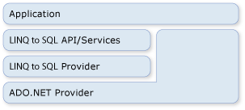

# ADO.NET and LINQ to SQL
[!INCLUDE[vbtecdlinq](../../../../../../includes/vbtecdlinq-md.md)] is part of the [!INCLUDE[vstecado](../../../../../../includes/vstecado-md.md)] family of technologies. It is based on services provided by the [!INCLUDE[vstecado](../../../../../../includes/vstecado-md.md)] provider model. You can therefore mix [!INCLUDE[vbtecdlinq](../../../../../../includes/vbtecdlinq-md.md)] code with existing [!INCLUDE[vstecado](../../../../../../includes/vstecado-md.md)] applications and migrate current [!INCLUDE[vstecado](../../../../../../includes/vstecado-md.md)] solutions to [!INCLUDE[vbtecdlinq](../../../../../../includes/vbtecdlinq-md.md)]. The following illustration provides a high-level view of the relationship.  
  
   
  
## Connections  
 You can supply an existing [!INCLUDE[vstecado](../../../../../../includes/vstecado-md.md)] connection when you create a [!INCLUDE[vbtecdlinq](../../../../../../includes/vbtecdlinq-md.md)] <xref:System.Data.Linq.DataContext>. All operations against the <xref:System.Data.Linq.DataContext> (including queries) use this provided connection. If the connection is already open, [!INCLUDE[vbtecdlinq](../../../../../../includes/vbtecdlinq-md.md)] leaves it as is when you are finished with it.  
  
 [!code-csharp[DLinqCommunicatingWithDatabase#4](../../../../../../samples/snippets/csharp/VS_Snippets_Data/DLinqCommunicatingWithDatabase/cs/Program.cs#4)]
 [!code-vb[DLinqCommunicatingWithDatabase#4](../../../../../../samples/snippets/visualbasic/VS_Snippets_Data/DLinqCommunicatingWithDatabase/vb/Module1.vb#4)]  
  
 You can always access the connection and close it yourself by using the <xref:System.Data.Linq.DataContext.Connection%2A> property, as in the following code:  
  
 [!code-csharp[DLinqAdoNet#1](../../../../../../samples/snippets/csharp/VS_Snippets_Data/DLinqAdoNet/cs/Program.cs#1)]
 [!code-vb[DLinqAdoNet#1](../../../../../../samples/snippets/visualbasic/VS_Snippets_Data/DLinqAdoNet/vb/Module1.vb#1)]  
  
## Transactions  
 You can supply your <xref:System.Data.Linq.DataContext> with your own database transaction when your application has already initiated the transaction and you want your <xref:System.Data.Linq.DataContext> to be involved.  
  
 The preferred method of doing transactions with the [!INCLUDE[dnprdnshort](../../../../../../includes/dnprdnshort-md.md)] is to use the <xref:System.Transactions.TransactionScope> object. By using this approach, you can make distributed transactions that work across databases and other memory-resident resource managers. Transaction scopes require few resources to start. They promote themselves to distributed transactions only when there are multiple connections within the scope of the transaction.  
  
 [!code-csharp[DLinqAdoNet#2](../../../../../../samples/snippets/csharp/VS_Snippets_Data/DLinqAdoNet/cs/Program.cs#2)]
 [!code-vb[DLinqAdoNet#2](../../../../../../samples/snippets/visualbasic/VS_Snippets_Data/DLinqAdoNet/vb/Module1.vb#2)]  
  
 You cannot use this approach for all databases. For example, the SqlClient connection cannot promote system transactions when it works against a [!INCLUDE[ss2k](../../../../../../includes/ss2k-md.md)] server. Instead, it automatically enlists to a full, distributed transaction whenever it sees a transaction scope being used.  
  
## Direct SQL Commands  
 At times you can encounter situations where the ability of the <xref:System.Data.Linq.DataContext> to query or submit changes is insufficient for the specialized task you want to perform. In these circumstances you can use the <xref:System.Data.Linq.DataContext.ExecuteQuery%2A> method to issue SQL commands to the database and convert the query results to objects.  
  
 For example, assume that the data for the `Customer` class is spread over two tables (customer1 and customer2). The following query returns a sequence of `Customer` objects:  
  
 [!code-csharp[DLinqAdoNet#3](../../../../../../samples/snippets/csharp/VS_Snippets_Data/DLinqAdoNet/cs/Program.cs#3)]
 [!code-vb[DLinqAdoNet#3](../../../../../../samples/snippets/visualbasic/VS_Snippets_Data/DLinqAdoNet/vb/Module1.vb#3)]  
  
 As long as the column names in the tabular results match column properties of your entity class, [!INCLUDE[vbtecdlinq](../../../../../../includes/vbtecdlinq-md.md)] creates your objects out of any SQL query.  
  
### Parameters  
 The <xref:System.Data.Linq.DataContext.ExecuteQuery%2A> method accepts parameters. The following code executes a parameterized query:  
  
 [!code-csharp[DlinqAdoNet#4](../../../../../../samples/snippets/csharp/VS_Snippets_Data/DLinqAdoNet/cs/Program.cs#4)]
 [!code-vb[DlinqAdoNet#4](../../../../../../samples/snippets/visualbasic/VS_Snippets_Data/DLinqAdoNet/vb/Module1.vb#4)]  
  
> [!NOTE]
>  Parameters are expressed in the query text by using the same curly notation used by `Console.WriteLine()` and `String.Format()`. `String.Format()` takes the query string you provide and substitutes the curly-braced parameters with generated parameter names such as `@p0`, `@p1` …, `@p(n)`.  
  
## See Also  
 [Background Information](../../../../../../docs/framework/data/adonet/sql/linq/background-information.md)  
 [How to: Reuse a Connection Between an ADO.NET Command and a DataContext](../../../../../../docs/framework/data/adonet/sql/linq/how-to-reuse-a-connection-between-an-ado-net-command-and-a-datacontext.md)
