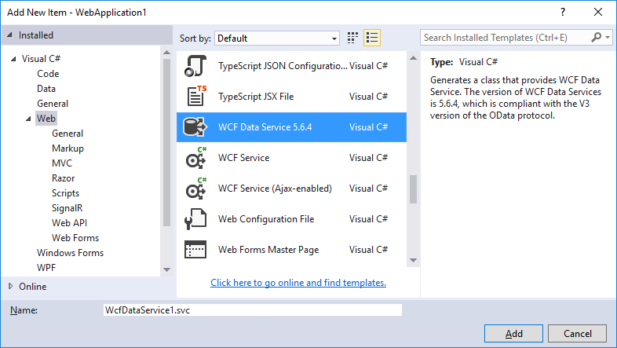

# Create the data service

In this topic, you create a sample data service that uses WCF Data Services to expose an [!INCLUDE[ssODataFull](../../../../includes/ssodatafull-md.md)] feed that's based on the Northwind sample database. The task involves the following basic steps:

1. Create an ASP.NET Web application.

2. Define the data model by using the Entity Data Model tools.

3. Add the data service to the Web application.

4. Enable access to the data service.

## Create the ASP.NET web app

1. In Visual Studio, on the **File** menu, select **New** > **Project**.

1. In the **New Project** dialog box, under either Visual Basic or Visual C# select the **Web** category, and then select **ASP.NET Web Application**.

1. Enter `NorthwindService` as the name of the project and then select **OK**.

1. In the **New ASP.NET Web Application** dialog, select **Empty** and then select **OK**.

1. (Optional) Specify a specific port number for your Web application. Note: the port number `12345` is used in this series of quickstart topics.

    1. In **Solution Explorer**, right-click on the ASP.NET project that you just created, and then choose **Properties**.

    2. Select the **Web** tab, and set the value of the **Specific port** text box to `12345`.

## Define the data model

1. In **Solution Explorer**, right-click the name of the ASP.NET project, and then click **Add** > **New Item**.

2. In the **Add New Item** dialog box, select the **Data** category, and then select **ADO.NET Entity Data Model**.

3. For the name of the data model, enter `Northwind.edmx`.

4. In the **Entity Data Model Wizard**, select **EF Designer from Database**, and then click **Next**.

5. Connect the data model to the database by doing one of the following steps, and then click **Next**:

    -   If you don't have a database connection already configured, click **New Connection** and create a new connection. For more information, see [How to: Create Connections to SQL Server Databases](https://docs.microsoft.com/previous-versions/visualstudio/visual-studio-2008/s4yys16a(v=vs.90)). This SQL Server instance must have the Northwind sample database attached.

         \- or -

    -   If you have a database connection already configured to connect to the Northwind database, select that connection from the list of connections.

6. On the final page of the wizard, select the check boxes for all tables in the database, and clear the check boxes for views and stored procedures.

7. Click **Finish** to close the wizard.

## Create the WCF data service

1. In **Solution Explorer**, right-click on the ASP.NET project, and then choose **Add** > **New Item**.

2. In the **Add New Item** dialog box, select the **WCF Data Service** item template from the **Web** category.

   

   > [!NOTE]
   > The **WCF Data Service** template is available in Visual Studio 2015, but not in Visual Studio 2017.

3. For the name of the service, type `Northwind`.

     Visual Studio creates the XML markup and code files for the new service. By default, the code-editor window opens. In **Solution Explorer**, the service has the name Northwind with the extension *.svc.cs* or *.svc.vb*.

4. In the code for the data service, replace the comment `/* TODO: put your data source class name here */` in the definition of the class that defines the data service with the type that is the entity container of the data model, which in this case is `NorthwindEntities`. The class definition should look this the following:

     [!code-csharp[Astoria Quickstart Service#ServiceDefinition](../../../../samples/snippets/csharp/VS_Snippets_Misc/astoria quickstart service/cs/northwind.svc.cs#servicedefinition)]
     [!code-vb[Astoria Quickstart Service#ServiceDefinition](../../../../samples/snippets/visualbasic/VS_Snippets_Misc/astoria quickstart service/vb/northwind.svc.vb#servicedefinition)]

## Enable access to data service resources

1. In the code for the data service, replace the placeholder code in the `InitializeService` function with the following:

     [!code-csharp[Astoria Quickstart Service#AllReadConfig](../../../../samples/snippets/csharp/VS_Snippets_Misc/astoria quickstart service/cs/northwind.svc.cs#allreadconfig)]
     [!code-vb[Astoria Quickstart Service#AllReadConfig](../../../../samples/snippets/visualbasic/VS_Snippets_Misc/astoria quickstart service/vb/northwind.svc.vb#allreadconfig)]

     This enables authorized clients to have read and write access to resources for the specified entity sets.

    > [!NOTE]
    > Any client that can access the ASP.NET application can also access the resources exposed by the data service. In a production data service, to prevent unauthorized access to resources you should also secure the application itself. For more information, see [Securing WCF Data Services](../../../../docs/framework/data/wcf/securing-wcf-data-services.md).

## Next steps

You have successfully created a new data service that exposes an OData feed that is based on the Northwind sample database, and you have enabled access to the feed for clients that have permissions on the ASP.NET Web application. Next, you'll start the data service from Visual Studio and access the OData feed by submitting HTTP GET requests through a Web browser:

> [!div class="nextstepaction"]
> [Access the service from a web browser](../../../../docs/framework/data/wcf/accessing-the-service-from-a-web-browser-wcf-data-services-quickstart.md)

## See also

- [ADO.NET Entity Data Model Tools](https://msdn.microsoft.com/library/91076853-0881-421b-837a-f582f36be527)