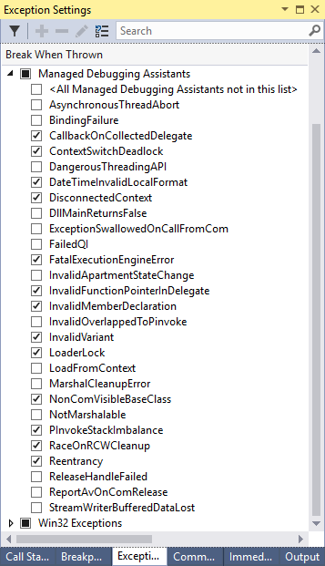

# Diagnose Errors with Managed Debugging Assistants

Managed debugging assistants (MDAs) are debugging aids that work in conjunction with the common language runtime (CLR) to provide information on runtime state. The assistants generate informational messages about runtime events that you cannot otherwise trap. You can use MDAs to isolate hard-to-find application bugs that occur when transitioning between managed and unmanaged code.

You can [enable or disable](#enable-and-disable-mdas) all MDAs by adding a key to the Windows registry or by setting an environment variable. You can enable specific MDAs by using application configuration settings. You can set additional configuration settings for some individual MDAs in the application's configuration file. Because these configuration files are parsed when the runtime is loaded, you must enable the MDA before the managed application starts. You cannot enable it for applications that have already started.

The following table lists the MDAs that ship with the .NET Framework:

|||
|-|-|
|[asynchronousThreadAbort](../../../docs/framework/debug-trace-profile/asynchronousthreadabort-mda.md)|[bindingFailure](../../../docs/framework/debug-trace-profile/bindingfailure-mda.md)|
|[callbackOnCollectedDelegate](../../../docs/framework/debug-trace-profile/callbackoncollecteddelegate-mda.md)|[contextSwitchDeadlock](../../../docs/framework/debug-trace-profile/contextswitchdeadlock-mda.md)|
|[dangerousThreadingAPI](../../../docs/framework/debug-trace-profile/dangerousthreadingapi-mda.md)|[dateTimeInvalidLocalFormat](../../../docs/framework/debug-trace-profile/datetimeinvalidlocalformat-mda.md)|
|[dirtyCastAndCallOnInterface](../../../docs/framework/debug-trace-profile/dirtycastandcalloninterface-mda.md)|[disconnectedContext](../../../docs/framework/debug-trace-profile/disconnectedcontext-mda.md)|
|[dllMainReturnsFalse](../../../docs/framework/debug-trace-profile/dllmainreturnsfalse-mda.md)|[exceptionSwallowedOnCallFromCom](../../../docs/framework/debug-trace-profile/exceptionswallowedoncallfromcom-mda.md)|
|[failedQI](../../../docs/framework/debug-trace-profile/failedqi-mda.md)|[fatalExecutionEngineError](../../../docs/framework/debug-trace-profile/fatalexecutionengineerror-mda.md)|
|[gcManagedToUnmanaged](../../../docs/framework/debug-trace-profile/gcmanagedtounmanaged-mda.md)|[gcUnmanagedToManaged](../../../docs/framework/debug-trace-profile/gcunmanagedtomanaged-mda.md)|
|[illegalPrepareConstrainedRegion](../../../docs/framework/debug-trace-profile/illegalprepareconstrainedregion-mda.md)|[invalidApartmentStateChange](../../../docs/framework/debug-trace-profile/invalidapartmentstatechange-mda.md)|
|[invalidCERCall](../../../docs/framework/debug-trace-profile/invalidcercall-mda.md)|[invalidFunctionPointerInDelegate](../../../docs/framework/debug-trace-profile/invalidfunctionpointerindelegate-mda.md)|
|[invalidGCHandleCookie](../../../docs/framework/debug-trace-profile/invalidgchandlecookie-mda.md)|[invalidIUnknown](../../../docs/framework/debug-trace-profile/invalidiunknown-mda.md)|
|[invalidMemberDeclaration](../../../docs/framework/debug-trace-profile/invalidmemberdeclaration-mda.md)|[invalidOverlappedToPinvoke](../../../docs/framework/debug-trace-profile/invalidoverlappedtopinvoke-mda.md)|
|[invalidVariant](../../../docs/framework/debug-trace-profile/invalidvariant-mda.md)|[jitCompilationStart](../../../docs/framework/debug-trace-profile/jitcompilationstart-mda.md)|
|[loaderLock](../../../docs/framework/debug-trace-profile/loaderlock-mda.md)|[loadFromContext](../../../docs/framework/debug-trace-profile/loadfromcontext-mda.md)|
|[marshalCleanupError](../../../docs/framework/debug-trace-profile/marshalcleanuperror-mda.md)|[marshaling](../../../docs/framework/debug-trace-profile/marshaling-mda.md)|
|[memberInfoCacheCreation](../../../docs/framework/debug-trace-profile/memberinfocachecreation-mda.md)|[moduloObjectHashcode](../../../docs/framework/debug-trace-profile/moduloobjecthashcode-mda.md)|
|[nonComVisibleBaseClass](../../../docs/framework/debug-trace-profile/noncomvisiblebaseclass-mda.md)|[notMarshalable](../../../docs/framework/debug-trace-profile/notmarshalable-mda.md)|
|[openGenericCERCall](../../../docs/framework/debug-trace-profile/opengenericcercall-mda.md)|[overlappedFreeError](../../../docs/framework/debug-trace-profile/overlappedfreeerror-mda.md)|
|[pInvokeLog](../../../docs/framework/debug-trace-profile/pinvokelog-mda.md)|[pInvokeStackImbalance](../../../docs/framework/debug-trace-profile/pinvokestackimbalance-mda.md)|
|[raceOnRCWCleanup](../../../docs/framework/debug-trace-profile/raceonrcwcleanup-mda.md)|[reentrancy](../../../docs/framework/debug-trace-profile/reentrancy-mda.md)|
|[releaseHandleFailed](../../../docs/framework/debug-trace-profile/releasehandlefailed-mda.md)|[reportAvOnComRelease](../../../docs/framework/debug-trace-profile/reportavoncomrelease-mda.md)|
|[streamWriterBufferedDataLost](../../../docs/framework/debug-trace-profile/streamwriterbuffereddatalost-mda.md)|[virtualCERCall](../../../docs/framework/debug-trace-profile/virtualcercall-mda.md)|

By default, the .NET Framework activates a subset of MDAs for all managed debuggers. You can view the default set in Visual Studio by choosing **Windows** > **Exception Settings** on the **Debug** menu, and then expanding the **Managed Debugging Assistants** list.



## Enable and Disable MDAs

You can enable and disable MDAs by using a registry key, an environment variable, and application configuration settings. You must enable either the registry key or the environment variable to use the application configuration settings.

> [!TIP]
> Instead of disabling MDAs, you can prevent Visual Studio from displaying the MDA dialog box whenever an MDA notification is received. To do that, choose **Windows** > **Exception Settings** on the **Debug** menu, expand the **Managed Debugging Assistants** list, and then select or clear the **Break When Thrown** check box for the individual MDA.

### Registry Key

To enable MDAs, add the **HKEY_LOCAL_MACHINE\SOFTWARE\Microsoft\\.NETFramework\MDA** subkey (type REG_SZ, value 1) in the Windows registry. Copy the following example into a text file named *MDAEnable.reg*. Open the Windows Registry Editor (RegEdit.exe), and from the **File** menu choose **Import**. Select the *MDAEnable.reg* file to enable MDAs on that computer. Setting the subkey to string value of **1** (not DWORD value of **1**) enables the reading of MDA settings from the *ApplicationName.suffix*.mda.config file. For example, the MDA configuration file for Notepad would be named notepad.exe.mda.config.

```text
Windows Registry Editor Version 5.00

[HKEY_LOCAL_MACHINE\SOFTWARE\Microsoft\.NETFramework]
"MDA"="1"
```

If the computer is running a 32-bit application on a 64-bit operating system, then the MDA key should be set like the following:

```text
Windows Registry Editor Version 5.00

[HKEY_LOCAL_MACHINE\SOFTWARE\Wow6432Node\Microsoft\.NETFramework]
"MDA"="1"
```

See [Application-Specific Configuration Settings](#application-specific-configuration-settings) for more information. The registry setting can be overridden by the COMPLUS_MDA environment variable. See [Environment Variable](#environment-variable) for more information.

To disable MDAs, set the MDA subkey to **0** (zero) using the Windows Registry Editor.

By default, some MDAs are enabled when you run an application that is attached to a debugger, even without adding the registry key. You can disable these assistants by running the *MDADisable.reg* file as described earlier in this section.

### Environment Variable

MDA activation can also controlled by the environment variable COMPLUS_MDA, which overrides the registry key. The COMPLUS_MDA string is a case-insensitive, semicolon-delimited list of MDA names or other special control strings. Starting under a managed or unmanaged debugger enables a set of MDAs by default. This is done by implicitly prepending the semicolon-delimited list of MDAs enabled by default under debuggers to the value of the environment variable or registry key. The special control strings are the following:

- `0` - Deactivates all MDAs.

- `1` - Reads MDA settings from *ApplicationName*.mda.config.

- `managedDebugger` - Explicitly activates all MDAs that are implicitly activated when a managed executable is started under a debugger.

- `unmanagedDebugger` - Explicitly activates all MDAs that are implicitly activated when an unmanaged executable is started under a debugger.

If there are conflicting settings, the most recent settings override previous settings:

- `COMPLUS_MDA=0` disables all MDAs, including those implicitly enabled under a debugger.

- `COMPLUS_MDA=gcUnmanagedToManaged` enables `gcUnmanagedToManaged` in addition to any MDAs that are implicitly enabled under a debugger.

- `COMPLUS_MDA=0;gcUnmanagedToManaged` enables `gcUnmanagedToManaged` but disables MDAs that would otherwise be implicitly enabled under a debugger.

### Application-Specific Configuration Settings

You can enable, disable, and configure some assistants individually in the MDA configuration file for the application. To enable the use of an application configuration file for configuring MDAs, either the MDA registry key or the COMPLUS_MDA environment variable must be set. The application configuration file is typically located in the same directory as the application's executable (.exe) file. The file name takes the form *ApplicationName*.mda.config; for example, notepad.exe.mda.config. Assistants that are enabled in the application configuration file may have attributes or elements specifically designed to control that assistant's behavior.

The following example shows how to enable and configure the [marshaling](../../../docs/framework/debug-trace-profile/marshaling-mda.md):

```xml
<mdaConfig>
  <assistants>
    <marshaling>
      <methodFilter>
        <match name="*"/>
      </methodFilter>
      <fieldFilter>
        <match name="*"/>
      </fieldFilter>
    </marshaling>
  </assistants>
</mdaConfig>
```

The `Marshaling` MDA emits information about the managed type that is being marshaled to an unmanaged type for each managed-to-unmanaged transition in the application. The `Marshaling` MDA can also filter the names of the method and structure fields supplied in the **methodFilter** and **fieldFilter** child elements, respectively.

The following example shows how to enable multiple MDAs by using their default settings:

```xml
<mdaConfig>
  <assistants>
    <illegalPrepareConstrainedRegion />
    <invalidCERCall />
    <openGenericCERCall />
    <virtualCERCall />
  </assistants>
</mdaConfig>
```

> [!IMPORTANT]
> When you specify more than one assistant in a configuration file, you must list them in alphabetical order. For example, if you want to enable both the `virtualCERCall` and the `invalidCERCall` MDAs, you must add the `<invalidCERCall />` entry before the `<virtualCERCall />` entry. If the entries are not in alphabetical order, an unhandled invalid configuration file exception message is displayed.

## MDA exceptions

When an MDA is enabled, it's active even when your code is not executing under a debugger. If an MDA event is raised when a debugger is not present, the event message is presented in an unhandled exception dialog box, although it is not an unhandled exception. To avoid the dialog box, remove the MDA-enabling settings when your code is not executing in a debugging environment.

When your code executes in the Visual Studio integrated development environment (IDE), you can avoid the exception dialog box that appears for specific MDA events. To do that, on the **Debug** menu, choose **Windows** > **Exception Settings**. In the **Exception Settings** window, expand the **Managed Debugging Assistants** list, and then clear the **Break When Thrown** check box for the individual MDA. You can also use this dialog box to *enable* the display of MDA exception dialog boxes.

## MDA Output

MDA output is similar to the following example, which shows the output from the `PInvokeStackImbalance` MDA:

**A call to PInvoke function 'MDATest!MDATest.Program::StdCall' has unbalanced the stack. This is likely because the managed PInvoke signature does not match the unmanaged target signature. Check that the calling convention and parameters of the PInvoke signature match the target unmanaged signature.**

## See also

- [Debugging, Tracing, and Profiling](../../../docs/framework/debug-trace-profile/index.md)
