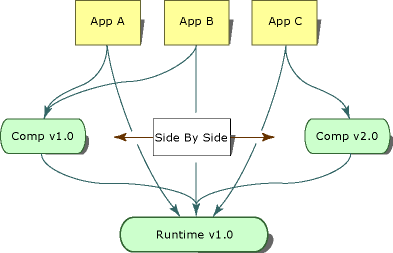

# Side-by-Side Execution in the .NET Framework
Side-by-side execution is the ability to run multiple versions of an application or component on the same computer. You can have multiple versions of the common language runtime, and multiple versions of applications and components that use a version of the runtime, on the same computer at the same time.  
  
 The following illustration shows several applications using two different versions of the runtime on the same computer. Applications A, B, and C use runtime version 1.0, while application D uses runtime version 1.1.  
  
   
Side-by-side execution of two versions of the runtime  
  
 The .NET Framework consists of the common language runtime and a collection of assemblies that contain the API types. The runtime and the .NET Framework assemblies are versioned separately. For example, version 4.0 of the runtime is actually version 4.0.319, while version 1.0 of the .NET Framework assemblies is version 1.0.3300.0.  
  
 The following illustration shows several applications using two different versions of a component on the same computer. Application A and B use version 1.0 of the component while Application C uses version 2.0 of the same component.  
  
   
Side-by-side execution of two versions of a component  
  
 Side-by-side execution gives you more control over which versions of a component an application binds to, and more control over which version of the runtime an application uses.  
  
## Benefits of Side-by-Side Execution  
 Prior to Windows XP and the .NET Framework, DLL conflicts occurred because applications were unable to distinguish between incompatible versions of the same code. Type information contained in a DLL was bound only to a file name. An application had no way of knowing if the types contained in a DLL were the same types that the application was built with. As a result, a new version of a component could overwrite an older version and break applications.  
  
 Side-by-side execution and the .NET Framework provide the following features to eliminate DLL conflicts:  
  
-   Strong-named assemblies.  
  
     Side-by-side execution uses strong-named assemblies to bind type information to a specific version of an assembly. This prevents an application or component from binding to an invalid version of an assembly. Strong-named assemblies also allow multiple versions of a file to exist on the same computer and to be used by applications. For more information, see [Strong-Named Assemblies](../../../docs/framework/app-domains/strong-named-assemblies.md).  
  
-   Version-aware code storage.  
  
     The .NET Framework provides version-aware code storage in the global assembly cache. The global assembly cache is a computer-wide code cache present on all computers with the .NET Framework installed. It stores assemblies based on version, culture, and publisher information, and supports multiple versions of components and applications. For more information, see [Global Assembly Cache](../../../docs/framework/app-domains/gac.md).  
  
-   Isolation.  
  
     Using the .NET Framework, you can create applications and components that execute in isolation. Isolation is an essential component of side-by-side execution. It involves being aware of the resources you are using and sharing resources with confidence among multiple versions of an application or component. Isolation also includes storing files in a version-specific way. For more information about isolation, see [Guidelines for Creating Components for Side-by-Side Execution](../../../docs/framework/deployment/guidelines-for-creating-components-for-side-by-side-execution.md).  
  
## Version Compatibility  
 Versions 1.0 and 1.1 of the .NET Framework are designed to be compatible with one another. An application built with the .NET Framework version 1.0 should run on version 1.1, and an application built with the .NET Framework version 1.1 should run on version 1.0. Note, however, that API features added in version 1.1 of the .NET Framework will not work with version 1.0 of the .NET Framework. Applications created with version 2.0 will run on version 2.0 only. Version 2.0 applications will not run on version 1.1 or earlier.  
  
 Versions of the .NET Framework are treated as a single unit consisting of the runtime and its associated .NET Framework assemblies (a concept referred to as assembly unification). You can redirect assembly binding to include other versions of the .NET Framework assemblies, but overriding the default assembly binding can be risky and must be rigorously tested before deployment.  
  
## Locating Runtime Version Information  
 Information on which runtime version an application or component was compiled with and which versions of the runtime the application requires to run are stored in two locations. When an application or component is compiled, information on the runtime version used to compile it is stored in the managed executable. Information on the runtime versions the application or component requires is stored in the application configuration file.  
  
### Runtime Version Information in the Managed Executable  
 The portable executable (PE) file header of each managed application and component contains information about the runtime version it was built with. The common language runtime uses this information to determine the most likely version of the runtime the application needs to run.  
  
### Runtime Version Information in the Application Configuration File  
 In addition to the information in the PE file header, an application can be deployed with an application configuration file that provides runtime version information. The application configuration file is an XML-based file that is created by the application developer and that ships with an application. The [\<requiredRuntime> Element](../../../docs/framework/configure-apps/file-schema/startup/requiredruntime-element.md) of the [\<startup> section](../../../docs/framework/configure-apps/file-schema/startup/startup-element.md), if it is present in this file, specifies which versions of the runtime and which versions of a component the application supports. You can also use this file in testing to test an application's compatibility with different versions of the runtime.  
  
 Unmanaged code, including COM and COM+ applications, can have application configuration files that the runtime uses for interacting with managed code. The application configuration file affects any managed code that you activate through COM. The file can specify which runtime versions it supports, as well as assembly redirects. By default, COM interop applications calling to managed code use the latest version of the runtime installed on the computer.  
  
 For more information about the application configuration files, see [Configuring Apps](../../../docs/framework/configure-apps/index.md).  
  
## Determining Which Version of the Runtime to Load  
 The common language runtime uses the following information to determine which version of the runtime to load for an application:  
  
-   The runtime versions that are available.  
  
-   The runtime versions that an application supports.  
  
### Supported Runtime Versions  
 The runtime uses the application configuration file and the portable executable (PE) file header to determine which version of the runtime an application supports. If no application configuration file is present, the runtime loads the runtime version specified in the application's PE file header, if that version is available.  
  
 If an application configuration file is present, the runtime determines the appropriate runtime version to load based on the results of the following process:  
  
1.  The runtime examines the [\<supportedRuntime> Element](../../../docs/framework/configure-apps/file-schema/startup/supportedruntime-element.md) element in the application configuration file. If one or more of the supported runtime versions specified in the **\<supportedRuntime>** element are present, the runtime loads the runtime version specified by the first **\<supportedRuntime>** element. If this version is not available, the runtime examines the next **\<supportedRuntime>** element and attempts to load the runtime version specified. If this runtime version is not available, subsequent **\<supportedRuntime>** elements are examined. If none of the supported runtime versions are available, the runtime fails to load a runtime version and displays a message to the user (see step 3).  
  
2.  The runtime reads the PE file header of the application's executable file. If the runtime version specified by the PE file header is available, the runtime loads that version. If the runtime version specified is not available, the runtime searches for a runtime version determined by Microsoft to be compatible with the runtime version in the PE header. If that version is not found, the process continues to step 3.  
  
3.  The runtime displays a message stating that the runtime version supported by the application is unavailable. The runtime is not loaded.  
  
    > [!NOTE]
    >  You can suppress the display of this message by using the NoGuiFromShim value under the registry key HKLM\Software\Microsoft\\.NETFramework or using the environment variable COMPLUS_NoGuiFromShim. For example, you can suppress the message for applications that do not typically interact with the user, such as unattended installations or Windows services. When this message display is suppressed, the runtime writes a message to the event log.  Set the registry value NoGuiFromShim to 1 to suppress this message for all applications on a computer. Alternately, set the COMPLUS_NoGuiFromShim environment variable to 1 to suppress the message for applications running in a particular user context.  
  
> [!NOTE]
>  After a runtime version is loaded, assembly binding redirects can specify that a different version of an individual .NET Framework assembly be loaded. These binding redirects affect only the specific assembly that is redirected.  
  
## Partially Qualified Assembly Names and Side-by-Side Execution  
 Because they are a potential source of side-by-side problems, partially qualified assembly references can be used only to bind to assemblies within an application directory. Avoid partially qualified assembly references in your code.  
  
 To mitigate partially qualified assembly references in code, you can use the [\<qualifyAssembly>](../../../docs/framework/configure-apps/file-schema/runtime/qualifyassembly-element.md) element in an application configuration file to fully qualify partially qualified assembly references that occur in code. Use the **\<qualifyAssembly>** element to specify only fields that were not set in the partial reference. The assembly identity listed in the **fullName** attribute must contain all the information needed to fully qualify the assembly name: assembly name, public key, culture, and version.  
  
 The following example shows the application configuration file entry to fully qualify an assembly called `myAssembly`.  
  
```xml  
<assemblyBinding xmlns="urn:schemas-microsoft-com:asm.v1">   
<qualifyAssembly partialName="myAssembly"   
fullName="myAssembly,  
      version=1.0.0.0,   
publicKeyToken=...,   
      culture=neutral"/>   
</assemblyBinding>   
```  
  
 Whenever an assembly load statement references `myAssembly`, these configuration file settings cause the runtime to automatically translate the partially qualified `myAssembly` reference to a fully qualified reference. For example, Assembly.Load("myAssembly") becomes Assembly.Load("myAssembly, version=1.0.0.0, publicKeyToken=..., culture=neutral").  
  
> [!NOTE]
>  You can use the **LoadWithPartialName** method to bypass the common language runtime restriction that prohibits partially referenced assemblies from being loaded from the global assembly cache. This method should be used only in remoting scenarios as it can easily cause problems in side-by-side execution.  
  
## Related Topics  
  
|Title|Description|  
|-----------|-----------------|  
|[How to: Enable and Disable Automatic Binding Redirection](../../../docs/framework/configure-apps/how-to-enable-and-disable-automatic-binding-redirection.md)|Describes how to bind an application to a specific version of an assembly.|  
|[Configuring Assembly Binding Redirection](../../../docs/framework/deployment/configuring-assembly-binding-redirection.md)|Explains how to redirect assembly binding references to a specific version of the .NET Framework assemblies.|  
|[In-Process Side-by-Side Execution](../../../docs/framework/deployment/in-process-side-by-side-execution.md)|Discusses how you can use in-process side-by-side runtime host activation to run multiple versions of the CLR in a single process.|  
|[Assemblies in the Common Language Runtime](../../../docs/framework/app-domains/assemblies-in-the-common-language-runtime.md)|Provides a conceptual overview of assemblies.|  
|[Application Domains](../../../docs/framework/app-domains/application-domains.md)|Provides a conceptual overview of application domains.|  
  
## Reference  
 [\<supportedRuntime> Element](../../../docs/framework/configure-apps/file-schema/startup/supportedruntime-element.md)
