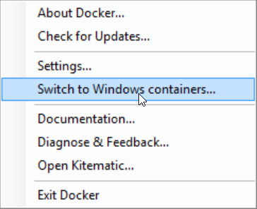

# Running console applications in Windows containers

Console applications are used for many purposes; from simple querying of a status to long running document image processing tasks. In any case, the ability to start up and scale these applications are met with limitations of hardware acquisitions, startup times or running multiple instances.

Moving your console applications to use Docker and Windows Server containers allows for starting these applications from a clean state, enabling them to perform the operation and then shutdown cleanly. This topic will show the steps needed to move a console application to a Windows based container and start it using a PowerShell script.

The sample console application is a simple example which takes an argument, a question in this case, and returns a random answer. This could take a `customer_id` and process their taxes, or create a thumbnail for an `image_url` argument.

In addition to the answer, the `Environment.MachineName` has been added to the response to show the difference between running the application locally and in a Windows container. When running the application locally, your local machine name should be returned and when running in a Windows Container; the container session id is returned.

The [complete example](https://github.com/dotnet/samples/tree/master/framework/docker/ConsoleRandomAnswerGenerator) is available in the dotnet/samples repository on GitHub. For download instructions, see [Samples and Tutorials](../../samples-and-tutorials/index.md#viewing-and-downloading-samples).

You need to be familiar with some Docker terms before you begin working
on moving your application to a container.

> A *Docker image* is a read-only template that defines the environment
> for a running container, including the operating system (OS), system components, and application(s).

One important feature of Docker images is that images are composed from a
base image. Each new image adds a small set of features to an existing
image. 

> A *Docker container* is a running instance of an image. 

You scale an application by running the same image in many containers.
Conceptually, this is similar to running the same application in multiple
hosts.

You can learn more about the Docker architecture by reading the 
[Docker Overview](https://docs.docker.com/engine/understanding-docker/)
on the Docker site. 

Moving your console application is a matter of a few steps.

1. [Build the application](#building-the-application)
1. [Creating a Dockerfile for the image](#creating-the-dockerfile)
1. [Process to build and run the Docker container](#creating-the-image)

## Prerequisites
Windows containers are supported on [Windows 10 Anniversary Update](https://www.microsoft.com/en-us/software-download/windows10/) or 
[Windows Server 2016](https://www.microsoft.com/en-us/cloud-platform/windows-server).

> [!NOTE]
>If you are using Windows Server 2016, you must enable containers manually since the Docker for Windows installer will not enable the feature. Make sure all updates have run for the OS and then follow the instructions from the [Container Host Deployment](https://msdn.microsoft.com/virtualization/windowscontainers/deployment/deployment) article to install the containers and Docker features.

You need to have Docker for Windows, version 1.12 Beta 26 or higher to support Windows containers. By default, Docker enables Linux based containers; switch to Windows containers by right clicking the Docker icon in the system tray and select **Switch to Windows containers**. Docker will run the process to change and a restart may be required.



## Building the application
Typically console applications are distributed through an installer, FTP, or File Share deployment. When deploying to a container, the assets need to be compiled and staged to a location that can be used when the Docker image is created.

In *build.ps1*, the script uses [MSBuild](/visualstudio/msbuild/msbuild) to compile the application to complete the task of building the assets. There are a few parameters passed to MSBuild to finalize the needed assets. The name of the project file or solution to be compiled, the location for the output and finally the configuration (Release or Debug).

In the call to `Invoke-MSBuild` the `OutputPath` is set to **publish** and  `Configuration` set to **Release**. 

```
function Invoke-MSBuild ([string]$MSBuildPath, [string]$MSBuildParameters) {
    Invoke-Expression "$MSBuildPath $MSBuildParameters"
}

Invoke-MSBuild -MSBuildPath "MSBuild.exe" -MSBuildParameters ".\ConsoleRandomAnswerGenerator.csproj /p:OutputPath=.\publish /p:Configuration=Release"
```

## Creating the Dockerfile
The base image used for a console .NET Framework application is `microsoft/windowsservercore`, publicly available on [Docker Hub](https://hub.docker.com/r/microsoft/windowsservercore/). The base image contains a minimal installation of Windows Server 2016, .NET Framework 4.6.2 and serves as the base OS image for Windows Containers.

```
FROM microsoft/windowsservercore
ADD publish/ /
ENTRYPOINT ConsoleRandomAnswerGenerator.exe
```
The first line in the Dockerfile designates the base image using the [`FROM`](https://docs.docker.com/engine/reference/builder/#/from) instruction. Next, [`ADD`](https://docs.docker.com/engine/reference/builder/#/add) in the file copies the application assets from the **publish** folder to root folder of the container and last; setting the [`ENTRYPOINT`](https://docs.docker.com/engine/reference/builder/#/entrypoint) of the image states that this is the command or application that will run when the container starts. 

## Creating the image
In order to create the Docker image, the following code is added to the *build.ps1* script. When the script is run, the `console-random-answer-generator` image is created using the assets compiled from MSBuild defined in the [Building the application](#building-the-application) section.

```powershell
$ImageName="console-random-answer-generator"

function Invoke-Docker-Build ([string]$ImageName, [string]$ImagePath, [string]$DockerBuildArgs = "") {
    echo "docker build -t $ImageName $ImagePath $DockerBuildArgs"
    Invoke-Expression "docker build -t $ImageName $ImagePath $DockerBuildArgs"
}

Invoke-Docker-Build -ImageName $ImageName -ImagePath "."
```

Run the script using `.\build.ps1` from the PowerShell command prompt.

When the build is complete, using the `docker images` command from a command line or PowerShell prompt; you'll see that the image is created and ready to be run.

```
REPOSITORY                        TAG                 IMAGE ID            CREATED             SIZE
console-random-answer-generator   latest              8f7c807db1b5        8 seconds ago       7.33 GB
```

## Running the container
You can start the container from the command line using the Docker commands.

```
docker run console-random-answer-generator "Are you a square container?"
```

The output is

```
The answer to your question: 'Are you a square container?' is Concentrate and ask again on (70C3D48F4343)
```

If you run the `docker ps -a` command from PowerShell, you can see that the container still exists.

```
CONTAINER ID        IMAGE                             COMMAND                  CREATED             STATUS                          
70c3d48f4343        console-random-answer-generator   "cmd /S /C ConsoleRan"   2 minutes ago       Exited (0) About a minute ago      
```

The STATUS column shows at "About a minute ago", the application was complete and could be shut down. If the command was run a hundred times, there would be a hundred containers left static with no work to do. In the beginning scenario the ideal operation was to do the work and shutdown or cleanup. To accomplish that workflow, adding the `--rm` option to the `docker run` command will remove the container as soon as the `Exited` signal is received.

```
docker run --rm console-random-answer-generator "Are you a square container?"
```

Running the command with this option and then looking at the output of `docker ps -a` command; notice that the container id (the `Environment.MachineName`) is not in the list.

### Running the container using PowerShell
In the sample project files there is also a *run.ps1* which is an example of how to use PowerShell to run the application accepting the arguments.

To run, open PowerShell and use the following command:

```
.\run.ps1 "Is this easy or what?"
```

## Summary
Just by adding a Dockerfile and publishing the application, you can containerize your .NET Framework console applications and now take the advantage of running multiple instances, clean start and stop and more Windows Server 2016 capabilities without making any changes to the application code at all.
