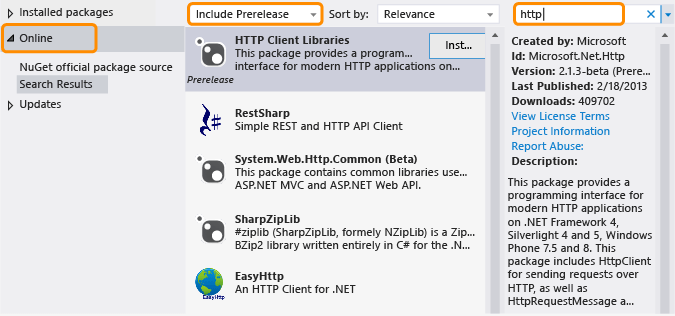

# .NET Framework and out-of-band releases

.NET Framework has evolved to accommodate different platforms, such as UWP apps and traditional desktop and web apps, and to maximize code reuse. In addition to regular .NET Framework releases, new features are released out of band (OOB) to improve cross-platform development or to introduce new functionality.

## Advantages of OOB releases

Shipping new components or updates to components out of band enables Microsoft to provide more frequent updates to .NET Framework. In addition, we can gather and respond to customer feedback more quickly.

When you use an OOB feature in your app, your users do not have to install the latest version of .NET Framework to run your app, because the OOB assemblies deploy with your app package.

## How OOB packages are distributed

OOB releases for core common language runtime (CLR) components are delivered through [NuGet](https://www.nuget.org/), which is the package manager for .NET. NuGet enables you to browse and add libraries to your .NET Framework projects easily from within Visual Studio. NuGet Package Manager is included with all editions of Visual Studio starting with Visual Studio 2012. Look for **NuGet Package Manager** on the **Tools** menu in Visual Studio. If it's not installed, follow the instructions on [Installing NuGet](/nuget/install-nuget-client-tools). For more information about NuGet, see the [NuGet docs](/nuget).

## Use a NuGet OOB package

If NuGet Package Manager is installed, you can browse and add references to NuGet packages by using Solution Explorer in Visual Studio:

1. Open the shortcut menu for your project in Visual Studio, and then choose **Manage NuGet Packages**. (This option is also available from the **Project** menu.)

2. In the left pane, choose **Online**.

3. If you want to use prerelease packages, in the drop-down list box in the middle pane, choose **Include Prerelease** instead of **Stable Only**.

4. In the right pane, use the **Search** box to locate the package you would like to use. Some Microsoft packages are identified by the Microsoft .NET Framework logo, and all identify Microsoft as the publisher.

As mentioned previously, when you deploy an app that uses an OOB package, the OOB assemblies will ship with your app package.

## Types of OOB releases

Typically, an OOB package has one or more prerelease versions and a stable version. The license that accompanies a prerelease doesn't typically allow redistribution, but enables you to try out a package and provide feedback. Feedback is incorporated in any updates made to the package. A final release is distributed as a stable package with NuGet and includes a license that lets you redistribute the NuGet package with your app. Stable packages are supported by Microsoft. Microsoft provides IntelliSense support as well as other types of documentation such as blog posts and forum answers for all packages. In addition, source code may be available with some, but not all, packages. For announcements regarding new and updated packages, you can subscribe to [the .NET Framework Blog](https://devblogs.microsoft.com/dotnet/).

To find both prerelease and stable packages, choose **Include Prerelease** in NuGet Package Manager.

## See also

- [Getting started](index.md)
