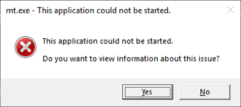
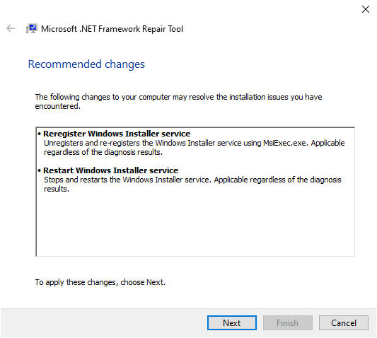
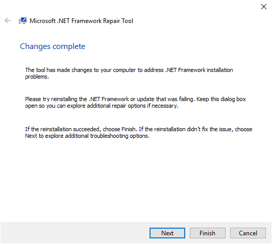
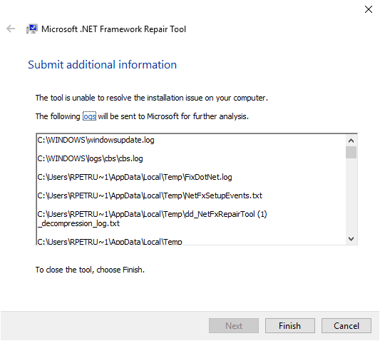
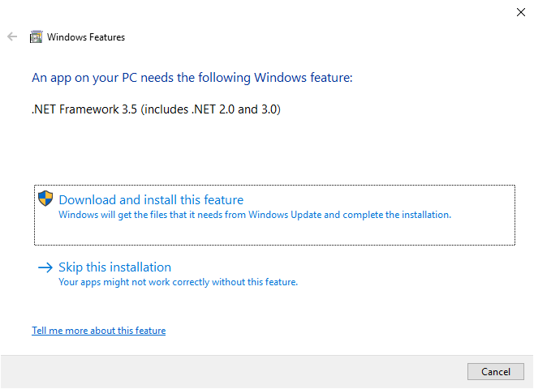

# Troubleshooting a 'This application could not be started' error message

Applications that are developed for .NET Framework typically require that a specific version of .NET Framework be installed on your system. In some cases, you may attempt to run an application without either an installed version or the expected version of .NET Framework present. This often produces an error dialog box like the following:

## Error causes

This error typically indicates one of the following conditions:

- A .NET Framework installation on your system has become corrupted.

- The version of .NET Framework needed by your application cannot be detected.

## How to fix the error

To address this issue so that you can run your application, do the following:

1. Download the [.NET Framework Repair Tool (NetFxRepairTool.exe)](https://www.microsoft.com/download/details.aspx?id=30135). The tool runs automatically when the download completes.

1. If the .NET Framework Repair Tool recommends any additional action, such as those shown in the following figure, select **Next**.

   

1. The .NET Framework Repair Tools displays a dialog box shown in the following figure to indicate that changes are complete. Leave the dialog box open while you to try rerun your application. This should succeed if the .NET Framework Repair Tool has identified and corrected a corrupted .NET Framework installation.

   

1. If your application runs successfully, select the **Finish** button. Otherwise, select the **Next** button.

1. If you selected the **Next** button, the .NET Framework Repair Tool displays a dialog box like the following. Select the **Finish** button to send diagnostic information to Microsoft.

   

1. If you still cannot run the application, install the latest version of .NET Framework that's supported by your version of Windows, as shown in the following table.

   |Windows version|.NET Framework installation|
   |---|---|
   |Windows 10 Anniversary Update and later versions|[.NET Framework 4.8 Runtime](https://dotnet.microsoft.com/download/dotnet-framework/net48)|
   |Windows 10, Windows 10 November Update|[.NET Framework 4.6.2](https://dotnet.microsoft.com/download/dotnet-framework/net462)|
   |Windows 8.1|[.NET Framework 4.8 Runtime](https://dotnet.microsoft.com/download/dotnet-framework/net48)|
   |Windows 8|[.NET Framework 4.6.1](https://dotnet.microsoft.com/download/dotnet-framework/net461)|
   |Windows 7 SP1|[.NET Framework 4.8 Runtime](https://dotnet.microsoft.com/download/dotnet-framework/net48)|
   |Windows Vista SP2|[.NET Framework 4.6](https://dotnet.microsoft.com/download/dotnet-framework/net46)|

   > [!NOTE]
   > .NET Framework 4.8 is preinstalled on Windows 11 and Windows 10 May 2019 Update and later versions.

1. Attempt to launch the application.

1. In some cases, you may see a dialog box like the following, which asks you to install .NET Framework 3.5. Select **Download and install this feature** to install .NET Framework 3.5, then launch the application again.

   

## See also

- [.NET Framework System Requirements](../get-started/system-requirements.md)
- [.NET Framework installation guide](index.md)
- [Troubleshoot blocked .NET Framework installations and uninstallations](troubleshoot-blocked-installations-and-uninstallations.md)
