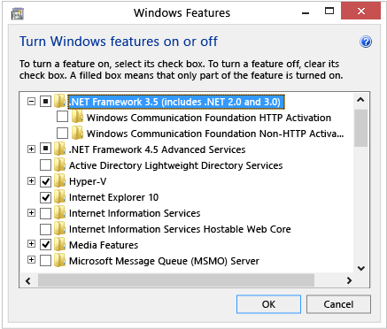

# Install the .NET Framework 3.5 on Windows 10, Windows 8.1, and Windows 8

You may need the .NET Framework 3.5 to run an application on Windows 10, Windows 8.1, and Windows 8. You can also use these instructions for earlier Windows versions.

## Install the .NET Framework 3.5 on Demand

You may see the following configuration dialog if you try to run an application that requires the .NET Framework 3.5. Choose **Install this feature** to enable the .NET Framework 3.5. This option requires an Internet connection.

## Enable the .NET Framework 3.5 in Control Panel

You can enable the .NET Framework 3.5 through the Windows Control Panel. This option requires an Internet connection.

1. Press the Windows key Windows  on your keyboard, type "Windows Features", and press Enter. The **Turn Windows features on or off** dialog box appears.

2. Select the **.NET Framework 3.5 (includes .NET 2.0 and 3.0)** check box, select OK, and reboot your computer if prompted.

   

   You don't need to select the child items for **Windows Communication Foundation (WCF) HTTP Activation** and **Windows Communication Foundation (WCF) Non-HTTP Activation** unless you're a developer or server administrator who requires this functionality.
