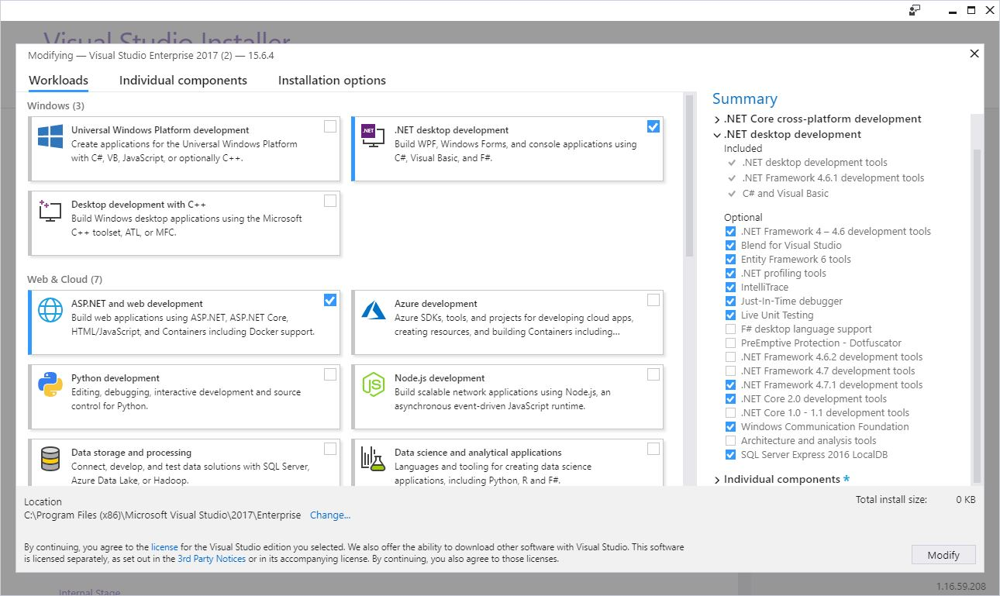

# Install the .NET Framework for developers

.NET is an integral part of many apps running on Windows and provides common functionality for those apps to run. For developers, the .NET Framework provides a comprehensive and consistent programming model for building apps that have visually stunning user experiences and seamless and secure communication.  

> [!NOTE]
> This topic is intended for **developers** who either want to install the .NET Framework on their own system or who want to install it with their applications. For **users** interested in installing the .NET Framework, see the individual topics that discuss installing the .NET Framework on specific operating systems, such as [Install the .NET Framework on Windows 10 and Windows Server 2016](on-windows-10.md).  

This article provides links for installing all versions of the .NET Framework from the .NET Framework 4.5 to the [!INCLUDE[net_current](../../../includes/net-current-version.md)] on your computer. If you're a developer, you can also use these links to download and redistribute the .NET Framework with your apps. For information on deploying a version of the .NET Framework with your app, see [.NET Framework deployment guide for developers](../deployment/deployment-guide-for-developers.md).

[!INCLUDE[net-framework-4-versions](../../../includes/net-framework-4x-versions.md)]
  
For more information about versions of the .NET Framework and how to determine which versions are installed on a computer, see [Versions and Dependencies](~/docs/framework/migration-guide/versions-and-dependencies.md) and [How to: Determine Which .NET Framework Versions Are Installed](../../../docs/framework/migration-guide/how-to-determine-which-versions-are-installed.md).  

> [!NOTE]
> For information on the .NET Framework 3.5, see [Install the .NET Framework 3.5 on Windows 10, Windows 8.1, and Windows 8](~/docs/framework/install/dotnet-35-windows-10.md).  
  
Use the following table for quick links, or read further for details. To view the system requirements for the .NET Framework before installation, see [System Requirements](~/docs/framework/get-started/system-requirements.md). For help with troubleshooting, see [Troubleshooting](~/docs/framework/install/troubleshoot-blocked-installations-and-uninstallations.md).  
  
|.NET Framework version|Developer installation|Redistributable installation|Platform support|  
|----------------------------|----------------------------|----------------------------------|----------------------|  
|**4.7.1**|[NET Framework 4.7.1 Developer Pack](http://go.microsoft.com/fwlink/?LinkId=852105)|[Download page for 4.7.1 web installer](http://go.microsoft.com/fwlink/?LinkId=852095)   [Download page for 4.7.1 offline installer](http://go.microsoft.com/fwlink/?LinkId=852107)|Included in:  Windows 10 Fall Creators Update Windows Server, version 1709   You can install on:  Windows 10 Creators Update   Windows 10 Anniversary Update  Windows 8.1 and earlier  Windows Server 2012 R2 and earlier  (for a full list, see [system requirements](~/docs/framework/get-started/system-requirements.md))||
|**4.7**|[NET Framework 4.7 Developer Pack](http://go.microsoft.com/fwlink/?LinkId=825319)|[Download page for 4.7 web installer](http://go.microsoft.com/fwlink/?LinkId=825299)   [Download page for 4.7 offline installer](http://go.microsoft.com/fwlink/?LinkId=825303)|Included in:  Windows 10 Creators Update   You can install on:  Windows 10 Anniversary Update  Windows 8.1 and earlier  Windows Server 2012 R2 and earlier  (for a full list, see [system requirements](~/docs/framework/get-started/system-requirements.md))||
|**4.6.2**|[NET Framework 4.6.2 Developer Pack](http://go.microsoft.com/fwlink/?LinkId=780617)|[Download page for 4.6.2 web installer](http://go.microsoft.com/fwlink/?LinkId=780597)   [Download page for 4.6.2 offline installer](http://go.microsoft.com/fwlink/?LinkId=780601)|Included in:   Windows 10 Anniversary Update   You can install on:  Windows 10 November Update   Windows 10   Windows 8.1 and earlier  Windows Server 2012 R2 and earlier  (for a full list, see [system requirements](~/docs/framework/get-started/system-requirements.md))|
|**4.6.1**|[NET Framework 4.6.1 Developer Pack](http://go.microsoft.com/fwlink/?LinkId=690706)|[Download page for 4.6.1 web installer](http://go.microsoft.com/fwlink/?LinkId=671729)   [Download page for 4.6.1 offline installer](http://go.microsoft.com/fwlink/?LinkId=671744)|You can install on:  Windows 10   Windows 8.1 and earlier  Windows Server 2012 R2 and earlier  (for a full list, see [system requirements](~/docs/framework/get-started/system-requirements.md))|
|**4.6**|Included in [!INCLUDE[vs_dev14](../../../includes/vs-dev14-md.md)]. For more information, see [Welcome to Visual Studio 2015](http://msdn.microsoft.com/library/dd831853\(v=vs.140\).aspx).   [Microsoft .NET Framework 4.6 targeting pack](http://go.microsoft.com/fwlink/?LinkId=528261)|[Download page for 4.6 web installer](http://go.microsoft.com/fwlink/?LinkId=528259)   [Download page for 4.6 offline installer](http://go.microsoft.com/fwlink/?LinkId=528233)|Included in:   Windows 10  [!INCLUDE[vs_dev14](../../../includes/vs-dev14-md.md)]   You can also install on:  Windows 8.1 and earlier  Windows Server 2012 R2 and earlier  (for a full list, see [system requirements](~/docs/framework/get-started/system-requirements.md))|  
|**4.5.2**|[Microsoft .NET Framework 4.5.2 Developer Pack](http://go.microsoft.com/fwlink/?LinkId=397702)   For use with [Visual Studio 2013](http://go.microsoft.com/fwlink/?LinkID=325532), Visual Studio 2012, or other IDEs|[Download page for 4.5.2 web installer](http://go.microsoft.com/fwlink/p/?LinkId=397703)   [Download page for 4.5.2 offline installer](http://go.microsoft.com/fwlink/p/?LinkId=397706)|You can install on:  Windows 8.1 and earlier  Windows Server 2012 R2 and earlier  (for a full list, see [system requirements](~/docs/framework/get-started/system-requirements.md))|  
|**4.5.1**|[Microsoft .NET Framework 4.5.1 Developer Pack](http://go.microsoft.com/fwlink/?LinkId=324213)   For use with Visual Studio 2012 or other IDEs|[Download page for 4.5.1 web installer](http://go.microsoft.com/fwlink/p/?LinkId=310158)   [Download page for 4.5.1 offline installer](http://go.microsoft.com/fwlink/p/?LinkId=310159)|Included in:  [!INCLUDE[win81](../../../includes/win81-md.md)]  Windows Server 2012 R2  [Visual Studio 2013](http://go.microsoft.com/fwlink/?LinkID=325532)   You can also install on:  [!INCLUDE[win8](../../../includes/win8-md.md)] and earlier  [!INCLUDE[winserver8](../../../includes/winserver8-md.md)] and earlier (for a full list, see [system requirements](~/docs/framework/get-started/system-requirements.md))|  
|**4.5**|Included in Visual Studio 2012   Also available as part of the [Windows 8 SDK](http://msdn.microsoft.com/windows/hardware/hh852363)|[Download page for 4.5 web installer](http://go.microsoft.com/fwlink/p/?LinkId=245484)|Included in:   [!INCLUDE[win8](../../../includes/win8-md.md)]  [!INCLUDE[winserver8](../../../includes/winserver8-md.md)]  Visual Studio 2012   You can also install on:  Windows 7 and earlier  Windows Server 2008 SP2 and earlier (for a full list, see [system requirements](~/docs/framework/get-started/system-requirements.md))|  

You can install the **Developer Pack** for a specific version of the .NET Framework, if one is available, on all supported platforms.  
  
You can install the **Web or Offline installer** on:  
  
- Windows 8.1 and earlier  
  
- Windows Server 2012 R2 and earlier  
  
For a full list, see [System Requirements](~/docs/framework/get-started/system-requirements.md).  

For a general introduction to the .NET Framework for both users and developers, see [Getting Started](../get-started/index.md). For information about deploying the .NET Framework with your app, see the [deployment guide](~/docs/framework/deployment/deployment-guide-for-developers.md). To read about the architecture and key features of the .NET Framework, see the [overview](~/docs/framework/get-started/overview.md).  

## Installation choices

Install a developer targeting pack to develop against the most recent version of the .NET Framework in Visual Studio or another development environment, or download the .NET Framework redistributable for distribution with your app or control.  
  
### To install the .NET Framework Developer Pack or Targeting Pack

A *targeting pack* lets your app target a specific version of the .NET Framework when developing in Visual Studio and some other development environments. A *developer pack* includes a specific version of the .NET Framework and its accompanying SDK along with its corresponding targeting pack.

The developer pack for the .NET Framework 4.5.1 or 4.5.2, the targeting pack for the .NET Framework 4.6, and  the developer pack for the .NET Framework 4.6.1, 4.6.2, 4.7, or 4.7.1 provides a particular .NET Framework's version of the reference assemblies, language packs, and IntelliSense files for use in an integrated development environment such as Visual Studio.  If you are using Visual Studio, the developer pack or targeting pack also adds the installed version of the .NET Framework to the target choices when you create a new project.  Choose one of the following:  

- [Microsoft .NET Framework 4.7.1 Developer Pack](http://go.microsoft.com/fwlink/?LinkId=852105)

- [Microsoft .NET Framework 4.7 Developer Pack](http://go.microsoft.com/fwlink/?LinkId=825319)
  
- [Microsoft .NET Framework 4.6.2 Developer Pack](http://go.microsoft.com/fwlink/?LinkId=780617)  
  
- [Microsoft .NET Framework 4.6.1 Developer Pack](http://go.microsoft.com/fwlink/?LinkId=690706)  
  
- [Microsoft .NET Framework 4.6 Targeting Pack](http://go.microsoft.com/fwlink/?LinkId=528261)  
  
- [.NET Framework 4.5.2 Developer Pack](http://go.microsoft.com/fwlink/?LinkId=397702) to install version 4.5.2 on Windows 8.1 or earlier, Visual Studio 2013, Visual Studio 2012, or other IDEs.  
  
- [.NET Framework 4.5.1 Developer Pack](http://go.microsoft.com/fwlink/?LinkId=324213) to install version 4.5.1 on Visual Studio 2012 or other IDEs.  
  
From the developer pack download page, choose **Download**. Next choose **Run** or **Save**, and follow the instructions when prompted. You can also install the developer pack or targeting pack for a specific version of the .NET Framework by selecting it from the optional components in the **.NET desktop development** workload in the Visual Studio Installer, as the following figure shows.

    

When you target a particular version of the .NET Framework, your application is built by using the reference assemblies that are included with that version's developer pack. At runtime, assemblies are resolved from the Global Assembly Cache, and the reference assemblies are not used.

When building an application from Visual Studio or using MSBuild from the command line, MSBuild may display error MSB3644, "The reference assemblies for framework "*framework-version*" were not found." To address the error, download the developer pack or the targeting pack for that version of the .NET Framework.   

### To install or download the .NET Framework redistributable

Installers download the .NET Framework components for an app or control that targets those versions of the .NET Framework. These components must be installed on each computer where the app or control runs. These installers are redistributable, so you can include them in the setup program for your app.  
  
The download page is provided in several languages, but most of the downloads are provided in English only. For additional language support, you must install a language pack.  
  
Two types of redistributable installers are available:  
  
- **Web installer** (web bootstrapper) downloads the required components and the language pack that matches the operating system of the installation computer from the web. This package is much smaller than the offline installer but requires a consistent Internet connection. You can download the [standalone language packs](#standalone_language_packs) to install additional language support.  
  
- **Offline installer** (standalone redistributable) contains all the required components for installing the .NET Framework but doesn't contain language packs. This download is larger than the web installer. The offline installer doesn't require an Internet connection. After you run the offline installer, you can download the [standalone language packs](#standalone_language_packs) to install language support. Use the offline installer if you can't rely on having a consistent Internet connection.  
  
Both web and offline installers are designed for x86-based and x64-based computers (see [system requirements](~/docs/framework/get-started/system-requirements.md)), but do not support Itanium-based computers.  
  
1.  Open the download page for the .NET Framework version you want to install:  

    - .NET Framework 4.7.1 ([web installer](http://go.microsoft.com/fwlink/?LinkId=852095) or [offline installer](http://go.microsoft.com/fwlink/p/?LinkId=852107))

    - .NET Framework 4.7 ([web installer](http://go.microsoft.com/fwlink/?LinkId=825299) or [offline installer](http://go.microsoft.com/fwlink/p/?LinkId=825303))

    - .NET Framework 4.6.2 ([web installer](http://go.microsoft.com/fwlink/?LinkId=780597) or [offline installer](http://go.microsoft.com/fwlink/p/?LinkId=780601))  
    
    - .NET Framework 4.6.1 ([web installer](http://go.microsoft.com/fwlink/?LinkId=671729) or [offline installer](http://go.microsoft.com/fwlink/p/?LinkId=671744))  
  
    - .NET Framework 4.6 ([web installer](http://go.microsoft.com/fwlink/?LinkId=528259) or [offline installer](http://go.microsoft.com/fwlink/p/?LinkId=528233))    
   
    - .NET Framework 4.5.2 ([web installer](http://go.microsoft.com/fwlink/p/?LinkId=397703) or [offline installer](http://go.microsoft.com/fwlink/p/?LinkId=397706))  
  
    - .NET Framework 4.5.1 ([web installer](http://go.microsoft.com/fwlink/p/?LinkId=310158) or [offline installer](http://go.microsoft.com/fwlink/p/?LinkId=310159))  
  
    - [.NET Framework 4.5](http://go.microsoft.com/fwlink/p/?LinkId=245484)

1. Select the language for the download page. This option does not download the localized resources of the .NET Framework; it only affects the text displayed on the download page.  
  
1. Choose **Download**.  
  
1. If prompted, select the download that matches your system architecture, and then choose **Next**.  
  
1. When the download prompt appears do **ONE** of the following:
  
   - If you want to install the .NET Framework on your computer, choose **Run**, and then follow the prompts on your screen.   
  
   - If you want to download the .NET Framework for redistribution, choose **Save**, and then follow the prompts on your screen.  
  
1. If you want to download resources for additional languages, follow the instructions in the next section to install one or more language packs.  
  
> [!NOTE]
> If you encounter any problems during the installation, see [Troubleshooting](~/docs/framework/install/troubleshoot-blocked-installations-and-uninstallations.md).  
  
 **Installation notes:**  
  
- The [!INCLUDE[net_v451](../../../includes/net-v451-md.md)] and 4.5.2, as well as the [!INCLUDE[net_v46](../../../includes/net-v46-md.md)], 4.6.1, 4.6.2, 4.7, and 4.7.1 are in-place updates to the [!INCLUDE[net_v45](../../../includes/net-v45-md.md)].  
  
- The [!INCLUDE[net_v45](../../../includes/net-v45-md.md)], its point releases, the [!INCLUDE[net_v46](../../../includes/net-v46-md.md)] and its point releases, and the .NET Framework 4.7 and its point release replace the [!INCLUDE[net_v40_long](../../../includes/net-v40-long-md.md)]. When you install these versions on a system that has the [!INCLUDE[net_v40_short](../../../includes/net-v40-short-md.md)] installed, the assemblies are replaced.
  
- Uninstalling the [!INCLUDE[net_v45](../../../includes/net-v45-md.md)], its point releases, the [!INCLUDE[net_v46](../../../includes/net-v46-md.md)] and its point releases, or the .NET Framework 4.7 and its point release also removes pre-existing [!INCLUDE[net_v40_short](../../../includes/net-v40-short-md.md)] files. If you want to go back to the [!INCLUDE[net_v40_short](../../../includes/net-v40-short-md.md)], you must reinstall it and any updates to it. (See [Installing the .NET Framework 4](http://go.microsoft.com/fwlink/p/?LinkId=230665).)  
  
- You must have administrative credentials to install the [!INCLUDE[net_v45](../../../includes/net-v45-md.md)], its point releases, the .NET Framework 4.6 and its point releases, and the .NET Framework 4.7 and its point release.
  
- The .NET Framework 4.5 redistributable was updated on October 9, 2012 to correct an issue related to an improper timestamp on a digital certificate, which caused the digital signature on files produced and signed by Microsoft to expire prematurely. If you previously installed the .NET Framework 4.5 redistributable package dated August 16, 2012, we recommend that you update your copy with the latest redistributable from the [Microsoft Download Center](http://go.microsoft.com/fwlink/p/?LinkId=245484). For more information about this issue, see [Microsoft Security Advisory 2749655](http://technet.microsoft.com/security/advisory/2749655) and [Knowledge Base article 2770445](http://support.microsoft.com/kb/2770445).  
  
   
## To install language packs

 Language packs are executable files that contain the localized resources (such as translated error messages and UI text) for supported languages. If you don't install a language pack, .NET Framework error messages and other text are displayed in English.  Note that the web installer automatically installs the language pack that matches your operating system, but you can download additional language packs to your computer. The offline installers don’t include any language packs. 
  
> [!IMPORTANT]
> The language packs don't contain the .NET Framework components that are required to run an app, so you must run the web or offline installer before you install a language pack. If you have already installed a language pack, uninstall it, install the .NET Framework, and then reinstall the language pack.  
  
1.  Open the language pack download page for the .NET Framework version you've installed:  
  
    - [.NET Framework 4.7.1 language packs](http://go.microsoft.com/fwlink/?LinkID=852090) 

    - [.NET Framework 4.7 language packs](http://go.microsoft.com/fwlink/?LinkID=825306) 

    - [.NET Framework 4.6.2 language packs](http://go.microsoft.com/fwlink/?LinkID=780604)  
  
    - [.NET Framework 4.6.1 language packs](http://go.microsoft.com/fwlink/?LinkID=671747)  
  
    - [.NET Framework 4.6 language packs](http://go.microsoft.com/fwlink/?LinkID=528314)  
  
    - [.NET Framework 4.5.2 language packs](http://go.microsoft.com/fwlink/?LinkId=397701)  
  
    - [.NET Framework 4.5.1 language packs](http://go.microsoft.com/fwlink/?LinkId=322101)  
  
    - [.NET Framework 4.5 language packs](http://go.microsoft.com/fwlink/p/?LinkId=245451)  
  
2.  In the language list, choose the language you want to download, and wait a few seconds for the page to reload in that language.  
  
3.  Choose **Download**.  
  
The following table lists the supported languages.  
  
| Language              | Culture |
| --------------------- | :-----: |
| Arabic                | ar      |
| Czech                 | cs      |
| Danish                | da      |
| Dutch                 | nl      |
| Finnish               | fi      |
| French                | fr      |
| German                | de      |
| Greek                 | el      |
| Hebrew                | he      |
| Hungarian             | hu      |
| Italian               | it      |
| Japanese              | ja      |
| Korean                | ko      |
| Norwegian             | no      |
| Polish                | pl      |
| Portuguese (Brazil)   | pt-BR   |
| Portuguese (Portugal) | pt-PT   |
| Russian               | ru      |
| Simplified Chinese    | zh-CHS  |
| Spanish               | es      |
| Swedish               | sv      |
| Traditional Chinese   | zh-CHT  |
| Turkish               | tr      |
| US English            | en-US   |
  
## Next steps  
  
- If you're new to the .NET Framework, see the [overview](~/docs/framework/get-started/overview.md) for an introduction to key concepts and components.  
  
- For new features and improvements in the .NET Framework 4.5 and all later versions, see [What's New](../../../docs/framework/whats-new/index.md).  
  
- For detailed information about deploying the .NET Framework with your app, see [Deployment Guide for Developers](~/docs/framework/deployment/deployment-guide-for-developers.md).  
  
- For changes that affect the deployment of the .NET Framework with your app, see [Reducing System Restarts During .NET Framework 4.5 Installations](~/docs/framework/deployment/reducing-system-restarts.md).  
  
- For information about migrating your app from the .NET Framework 4 to the [!INCLUDE[net_v45](../../../includes/net-v45-md.md)] or one of its point releases, see the [migration guide](~/docs/framework/migration-guide/index.md). 

- See the [.NET Framework Reference Source](http://referencesource.microsoft.com/) to browse through the .NET Framework source code online. The reference source is also available on [GitHub](https://github.com/Microsoft/referencesource). You can [download the reference source](http://referencesource.microsoft.com/download.html) for offline viewing and step through the sources (including patches and updates) during debugging. For more information, see the blog entry [A new look for .NET Reference Source](http://blogs.msdn.com/b/dotnet/archive/2014/02/24/a-new-look-for-net-reference-source.aspx).  
  
## See also

[Deployment Guide for Developers](~/docs/framework/deployment/deployment-guide-for-developers.md)   
[Deployment Guide for Administrators](~/docs/framework/deployment/guide-for-administrators.md)   
[Install the .NET Framework 3.5 on Windows 10, Windows 8.1, and Windows 8](~/docs/framework/install/dotnet-35-windows-10.md)   
[Troubleshoot Blocked .NET Framework Installations and Uninstallations](~/docs/framework/install/troubleshoot-blocked-installations-and-uninstallations.md)
