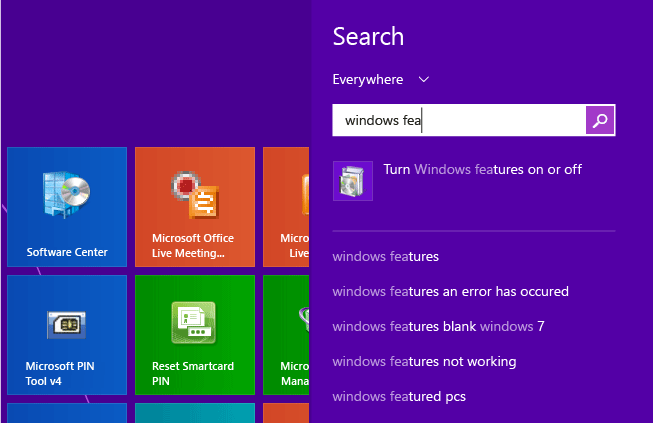

# Installing the .NET Framework 3.5 on Windows 8, Windows 8.1 and Windows 10
The .NET Framework is an integral part of many applications running on Windows and provides common functionality for those applications to run. For developers, the .NET Framework provides a consistent programming model for building applications. if you are using the Windows operating system, the .NET Framework may already be installed on your computer. Specifically, the [!INCLUDE[net_v45](../../../includes/net-v45-md.md)] is included with [!INCLUDE[win8](../../../includes/win8-md.md)], the [!INCLUDE[net_v451](../../../includes/net-v451-md.md)] is included with [!INCLUDE[win81](../../../includes/win81-md.md)] and the [!INCLUDE[net_v46](../../../includes/net-v46-md.md)] is included with Windows 10.  
  
 The .NET Framework 3.5, however, is not automatically installed with [!INCLUDE[win8](../../../includes/win8-md.md)], [!INCLUDE[win81](../../../includes/win81-md.md)] or Windows 10, and must be separately enabled to run applications that depend on it. This must happen through Windows Update, which is invoked in one of three ways. All of these require an Internet connection:  
  
-   [Install the .NET Framework 3.5 on Demand](#OnDemand)  
  
-   [Enable the .NET Framework 3.5 in Control Panel](#ControlPanel)  
  
-   [Download the .NET Framework 3.5 installer](http://www.microsoft.com/en-us/download/details.aspx?id=21) (Note: this does not download the .NET Framework directly; it is an installer that invokes Windows Update.)  
  
 During installation you may encounter error 0x800f0906, 0x800f0907, or 0x800f081f, in which case refer to [.NET Framework 3.5 installation error: 0x800f0906, 0x800f0907, or 0x800f081f](https://support.microsoft.com/en-us/kb/2734782). Note that these are possibly resolved by installing [security update 3005628](https://support.microsoft.com/kb/3005628).  
  
 If any of the above methods fail, or if you do not have an Internet connection, it is necessary to use your Windows installation media. For details, see Method 3 for error 0x800f0906 in the [.NET Framework 3.5 installation error article](https://support.microsoft.com/en-us/kb/2734782). If you do not have installation media, see [Create Installation media for Windows 8.1](http://windows.microsoft.com/en-US/windows-8/create-reset-refresh-media?woldogcb=0).  
  
 Important notes:  
  
-   In general, do not uninstall any versions of the .NET Framework from your computer. Different apps depend on different versions of the framework and multiple versions of the .NET Framework can be loaded on a single computer at the same time.  
  
-   The .NET Framework 3.5 is also used by apps built for versions 2.0 and 3.0.  
  
-   Installing a Windows language pack before installing the .NET Framework 3.5 may cause the .NET Framework 3.5 installation to fail. Install the .NET Framework 3.5 before installing any Windows language packs.  
  
-   Windows CardSpace is not available with the .NET Framework 3.5 on [!INCLUDE[win8](../../../includes/win8-md.md)].  
  
-   Because of complications around how the .NET Framework 3.5 must be installed, it is unfortunately not possible to provide a separate, standalone installer that can run independently of Windows Update. Again, if all other methods fail, you must resort to installation media as described earlier.  
  
   
## Install the .NET Framework 3.5 on Demand  
 If an app requires the .NET Framework 3.5, but doesn't find that version enabled on your computer, it displays the following message box, either during installation, or when you run the app for the first time. In the message box, choose **Install this feature** to enable the .NET Framework 3.5. This option requires an Internet connection.  
  
   
  
   
## Enable the .NET Framework 3.5 in Control Panel  
 You can enable the .NET Framework 3.5 yourself through Control Panel. This option requires an Internet connection.  
  
1.  Press the Windows key  on your keyboard, type Windows Features, and press Enter. This brings up the **Turn Windows features on or off** dialog box. Alternately, open Control Panel, click on the Programs items, and then click on "Turn Windows features on or off" under Programs and Features.  
  
2.  Select the **.NET Framework 3.5 (includes .NET 2.0 and 3.0)** check box, press OK, and reboot your computer if prompted.  
  
 You do not need to select the child items for Windows Communication Foundation (WCF) HTTP activation unless you are a developer who requires WCF script and handler mapping functionality.  
  
 The following video shows how to do this:  
  
   
  
## See Also  
 [Installation Guide](../../../docs/framework/get-started/index.md)
