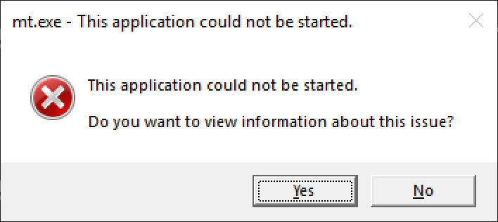
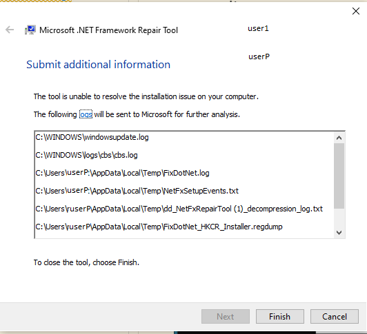

# Troubleshooting a 'This application could not be started' error message

Applications that are developed for the .NET Framework typically require that a specific version of the .NET Framework be installed on your system. In some cases, you may attempt to run an application without either an installed version or the expected version of the .NET Framework present. This often produces an error dialog box like the following:

This typically indicates one of the following conditions:

- A .NET Framework installation on your system has become corrupted.

- The version of the .NET Framework needed by your application cannot be detected.

To address this issue so that you can run your application, do the following:

1. Download the [.NET Framework Repair Tool (NetFxRepairTool.exe)](https://www.microsoft.com/en-us/download/details.aspx?id=30135). The tool runs automatically when the download completes.

1. If the .NET Framework Repair Tool recommends any additional action, such as those shown in the following figure, select **Next**.

   

1. If the .NET Framework Repair Tool is unable to diagnose and resolve the problem, it displays a a dialog box like the following:

   

1. Attempt to launch the application. This should succeed if the .NET Framework Repair Tool has identified and corrected a corrupted .NET Framework installation.

1. If you still cannot run the application, install the latest version of the .NET Framework supported by your version of Windows, as shown in the following table.

   |Windows version|.NET Framework installation|
   |---|---|
   |Windows 10 Anniversary Update and later versions|[.NET Framework 4.8 Runtime](https://dotnet.microsoft.com/download/dotnet-framework/net48)|
   |Windows 10 November Update|[.NET Framework 4.6.2](https://www.microsoft.com/en-us/download/details.aspx?id=53345)|
   |Windows 10|[.NET Framework 4.6.2](https://www.microsoft.com/en-us/download/details.aspx?id=53345)|
   |Windows 8.1|[.NET Framework 4.8 Runtime](https://dotnet.microsoft.com/download/dotnet-framework/net48)|
   |Windows 8|[.NET Framework 4.6.1](https://www.microsoft.com/en-us/download/details.aspx?id=49981)|
   |Windows 7 SP1|[.NET Framework 4.8 Runtime](https://dotnet.microsoft.com/download/dotnet-framework/net48)|
   |Windows Vista SP2|[.NET Framework 4.6](https://www.microsoft.com/download/details.aspx?id=48130)|

   > [!NOTE]
   >  .NET Framework 4.8 is preinstalled on Windows 10 May 2019 Update.

1. Attempt to launch the application.

1. In some cases, you may see a dialog box like the following, which asks you to install the .NET Framework 3.5. Select **Download and install this feature** to install the .NET Framewoork 3.5, then launch the application again.

   

## See also

- [.NET Framework System Requirements](../get-started/system.requirements.md)
- [.NET Framework installation guide](install.md)
