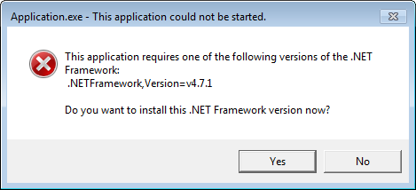

# Install the .NET Framework on Windows 7 SP1 and Windows Server 2008 R2

The .NET Framework is required to run many applications on Windows. You can use the following instructions to install it. You may have arrived on this page after trying to run an application and seeing the following dialog on your machine.

These instructions will help you install the .NET Framework versions you need. The [.NET Framework 4.7.1](https://www.microsoft.com/en-us/download/details.aspx?id=56115&desc=dotnet47) is the latest version. It is supported on Windows 7 and Windows Server 2008 R2 and is included with the [Windows 10 Fall Creators Update](https://www.microsoft.com/software-download/windows10) and [Windows Server 2016 Version 1709](https://docs.microsoft.com/windows-server/get-started/get-started-with-1709).

## .NET Framework 4.7.1

* [Download the .NET Framework 4.7.1](https://www.microsoft.com/net/framework/versions/net471?utm_source=ms-docs&utm_medium=referral)

The [.NET Framework 4.7.1](https://www.microsoft.com/en-us/download/details.aspx?id=56115&desc=dotnet47) can be used to run applications built for .NET Framework 4.0 or later.

## .NET Framework 3.5

The [.NET Framework 3.5](https://www.microsoft.com/en-us/download/details.aspx?id=21) is included with Windows 7.

The .NET Framework 3.5 supports apps built for .NET Framework 1.0 through 3.5.

## Help

You can [contact Microsoft for help](mailto:dotnet-install-help@service.microsoft.com?subject=Install-Help) if you cannot get the correct version of the .NET Framework installed.

## See also

[Download the .NET Framework](https://www.microsoft.com/net/download/framework?utm_source=ms-docs&utm_medium=referral)   
[Troubleshoot blocked .NET Framework installations and uninstallations](troubleshoot-blocked-installations-and-uninstallations.md)   
[Install the .NET Framework for developers](guide-for-developers.md)
