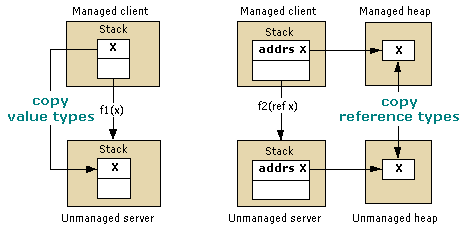

# Copying and Pinning
When marshaling data, the interop marshaler can copy or pin the data being marshaled. Copying the data places a copy of data from one memory location in another memory location. The following illustration shows the differences between copying a value type and copying a type passed by reference from managed to unmanaged memory.  
  
   
Value types passed by value and by reference  
  
 Method arguments passed by value are marshaled to unmanaged code as values on the stack. The copying process is direct. Arguments passed by reference are passed as pointers on the stack. Reference types are also passed by value and by reference. As the following illustration shows, reference types passed by value are either copied or pinned.  
  
   
Reference types passed by value and by reference  
  
 Pinning temporarily locks the data in its current memory location, thus keeping it from being relocated by the common language runtime's garbage collector. The marshaler pins data to reduce the overhead of copying and enhance performance. The type of the data determines whether it is copied or pinned during the marshaling process.  Pinning is automatically performed during marshaling for objects such as <xref:System.String>, however you can also manually pin memory using the <xref:System.Runtime.InteropServices.GCHandle> class.  
  
## Formatted Blittable Classes  
 Formatted [blittable](blittable-and-non-blittable-types.md) classes have fixed layout (formatted) and common data representation in both managed and unmanaged memory. When these types require marshaling, a pointer to the object in the heap is passed to the callee directly. The callee can change the contents of the memory location being referenced by the pointer.  
  
> [!NOTE]
>  The callee can change the memory contents if the parameter is marked Out or In/Out. In contrast, the callee should avoid changing the contents when the parameter is set to marshal as In, which is the default for formatted blittable types. Modifying an In object generates problems when the same class is exported to a type library and used to make cross-apartment calls.  
  
## Formatted Non-Blittable Classes  
 Formatted [non-blittable](blittable-and-non-blittable-types.md) classes have fixed layout (formatted) but the data representation is different in managed and unmanaged memory. The data can require transformation under the following conditions:  
  
-   If a non-blittable class is marshaled by value, the callee receives a pointer to a copy of the data structure.  
  
-   If a non-blittable class is marshaled by reference, the callee receives a pointer to a pointer to a copy of the data structure.  
  
-   If the <xref:System.Runtime.InteropServices.InAttribute> attribute is set, this copy is always initialized with the instance's state, marshaling as necessary.  
  
-   If the <xref:System.Runtime.InteropServices.OutAttribute> attribute is set, the state is always copied back to the instance on return, marshaling as necessary.  
  
-   If both **InAttribute** and **OutAttribute** are set, both copies are required. If either attribute is omitted, the marshaler can optimize by eliminating either copy.  
  
## Reference Types  
 Reference types can be passed by value or by reference. When they are passed by value, a pointer to the type is passed on the stack. When passed by reference, a pointer to a pointer to the type is passed on the stack.  
  
 Reference types have the following conditional behavior:  
  
-   If a reference type is passed by value and it has members of non-blittable types, the types are converted twice:  
  
    -   When an argument is passed to the unmanaged side.  
  
    -   On return from the call.  
  
     To avoid unnecessarily copying and conversion, these types are marshaled as In parameters. You must explicitly apply the **InAttribute** and **OutAttribute** attributes to an argument for the caller to see changes made by the callee.  
  
-   If a reference type is passed by value and it has only members of blittable types, it can be pinned during marshaling and any changes made to the members of the type by the callee are seen by the caller. Apply **InAttribute** and **OutAttribute** explicitly if you want this behavior. Without these directional attributes, the interop marshaler does not export directional information to the type library (it exports as In, which is the default) and this can cause problems with COM cross-apartment marshaling.  
  
-   If a reference type is passed by reference, it will be marshaled as In/Out by default.  
  
## System.String and System.Text.StringBuilder  
 When data is marshaled to unmanaged code by value or by reference, the marshaler typically copies the data to a secondary buffer (possibly converting character sets during the copy) and passes a reference to the buffer to the callee. Unless the reference is a **BSTR** allocated with **SysAllocString**, the reference is always allocated with **CoTaskMemAlloc**.  
  
 As an optimization when either string type is marshaled by value (such as a Unicode character string), the marshaler passes the callee a direct pointer to managed strings in the internal Unicode buffer instead of copying it to a new buffer.  
  
> [!CAUTION]
>  When a string is passed by value, the callee must never alter the reference passed by the marshaler. Doing so can corrupt the managed heap.  
  
 When a <xref:System.String?displayProperty=nameWithType> is passed by reference, the marshaler copies the contents the string to a secondary buffer before making the call. It then copies the contents of the buffer into a new string on return from the call. This technique ensures that the immutable managed string remains unaltered.  
  
 When a <xref:System.Text.StringBuilder?displayProperty=nameWithType> is passed by value, the marshaler passes a reference to the internal buffer of the **StringBuilder** directly to the caller. The caller and callee must agree on the size of the buffer. The caller is responsible for creating a **StringBuilder** of adequate length. The callee must take the necessary precautions to ensure that the buffer is not overrun. **StringBuilder** is an exception to the rule that reference types passed by value are passed as In parameters by default. It is always passed as In/Out.  
  
## See Also  
 [Default Marshaling Behavior](default-marshaling-behavior.md)  
 [Memory Management with the Interop Marshaler](https://msdn.microsoft.com/library/417206ce-ee3e-4619-9529-0c0b686c7bee(v=vs.100))  
 [Directional Attributes](https://msdn.microsoft.com/library/241ac5b5-928e-4969-8f58-1dbc048f9ea2(v=vs.100))  
 [Interop Marshaling](interop-marshaling.md)
