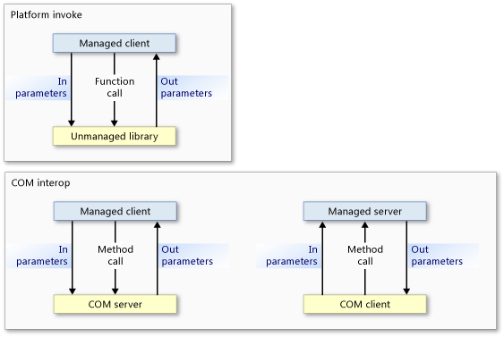
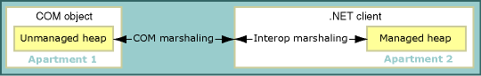
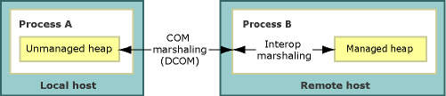
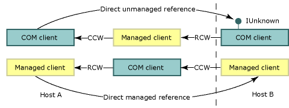

# Interop Marshaling

Interop marshalling governs how data is passed in method arguments and return values between managed and unmanaged memory during calls. Interop marshalling is a run-time activity performed by the common language runtime's marshalling service.

Most data types have common representations in both managed and unmanaged memory. The interop marshaller handles these types for you. Other types can be ambiguous or not represented at all in managed memory.

An ambiguous type can have either multiple unmanaged representations that map to a single managed type, or missing type information, such as the size of an array. For ambiguous types, the marshaller provides a default representation and alternative representations where multiple representations exist. You can supply explicit instructions to the marshaller on how it is to marshal an ambiguous type.

## Platform Invoke and COM Interop Models

The common language runtime provides two mechanisms for interoperating with unmanaged code:

- Platform invoke, which enables managed code to call functions exported from an unmanaged library.
- COM interop, which enables managed code to interact with Component Object Model (COM) objects through interfaces.

Both platform invoke and COM interop use interop marshalling to accurately move method arguments between caller and callee and back, if required. As the following illustration shows, a platform invoke method call flows from managed to unmanaged code and never the other way, except when [callback functions](callback-functions.md) are involved. Even though platform invoke calls can flow only from managed to unmanaged code, data can flow in both directions as input or output parameters. COM interop method calls can flow in either direction.

At the lowest level, both mechanisms use the same interop marshalling service; however, certain data types are supported exclusively by COM interop or platform invoke. For details, see [Default Marshalling Behavior](default-marshalling-behavior.md).

## Marshalling and COM Apartments

The interop marshaller marshals data between the common language runtime heap and the unmanaged heap. Marshalling occurs whenever the caller and callee cannot operate on the same instance of data. The interop marshaller makes it possible for the caller and callee to appear to be operating on the same data even if they have their own copy of the data.

COM also has a marshaller that marshals data between COM apartments or different COM processes. When calling between managed and unmanaged code within the same COM apartment, the interop marshaller is the only marshaller involved. When calling between managed code and unmanaged code in a different COM apartment or a different process, both the interop marshaller and the COM marshaller are involved.

### COM Clients and Managed Servers

An exported managed server with a type library registered by the [Regasm.exe (Assembly Registration Tool)](../tools/regasm-exe-assembly-registration-tool.md) has a `ThreadingModel` registry entry set to `Both`. This value indicates that the server can be activated in a single-threaded apartment (STA) or a multithreaded apartment (MTA). The server object is created in the same apartment as its caller, as shown in the following table:

|COM client|.NET server|Marshalling requirements|
|----------------|-----------------|-----------------------------|
|STA|`Both` becomes STA.|Same-apartment marshalling.|
|MTA|`Both` becomes MTA.|Same-apartment marshalling.|

Because the client and server are in the same apartment, the interop marshalling service automatically handles all data marshalling. The following illustration shows the interop marshalling service operating between managed and unmanaged heaps within the same COM-style apartment.

If you plan to export a managed server, be aware that the COM client determines the apartment of the server. A managed server called by a COM client initialized in an MTA must ensure thread safety.

### Managed Clients and COM Servers

The default setting for managed client apartments is MTA; however, the application type of the .NET client can change the default setting. For example, a Visual Basic client apartment setting is STA. You can use the <xref:System.STAThreadAttribute?displayProperty=nameWithType>, the <xref:System.MTAThreadAttribute?displayProperty=nameWithType>, the <xref:System.Threading.Thread.ApartmentState%2A?displayProperty=nameWithType> property, or the <xref:System.Web.UI.Page.AspCompatMode%2A?displayProperty=nameWithType> property to examine and change the apartment setting of a managed client.

The author of the component sets the thread affinity of a COM server. The following table shows the combinations of apartment settings for .NET clients and COM servers. It also shows the resulting marshalling requirements for the combinations.

|.NET client|COM server|Marshalling requirements|
|-----------------|----------------|-----------------------------|
|MTA (default)|MTA   STA|Interop marshalling.   Interop and COM marshalling.|
|STA|MTA   STA|Interop and COM marshalling.   Interop marshalling.|

When a managed client and unmanaged server are in the same apartment, the interop marshalling service handles all data marshalling. However, when client and server are initialized in different apartments, COM marshalling is also required. The following illustration shows the elements of a cross-apartment call:

For cross-apartment marshalling, you can do the following:

- Accept the overhead of the cross-apartment marshalling, which is noticeable only when there are many calls across the boundary. You must register the type library of the COM component for calls to successfully cross the apartment boundary.
- Alter the main thread by setting the client thread to STA or MTA. For example, if your C# client calls many STA COM components, you can avoid cross-apartment marshalling by setting the main thread to STA.

    > [!NOTE]
    > Once the thread of a C# client is set to STA, calls to MTA COM components will require cross-apartment marshalling.

For instructions on explicitly selecting an apartment model, see [Managed and Unmanaged Threading](/previous-versions/dotnet/netframework-4.0/5s8ee185(v=vs.100)).

## Marshalling Remote Calls

As with cross-apartment marshalling, COM marshalling is involved in each call between managed and unmanaged code whenever the objects reside in separate processes. For example:

- A COM client that invokes a managed server on a remote host uses distributed COM (DCOM).
- A managed client that invokes a COM server on a remote host uses DCOM.

The following illustration shows how interop marshalling and COM marshalling provide communications channels across process and host boundaries:

### Preserving Identity

The common language runtime preserves the identity of managed and unmanaged references. The following illustration shows the flow of direct unmanaged references (top row) and direct managed references (bottom row) across process and host boundaries.

In this illustration:

- An unmanaged client gets a reference to a COM object from a managed object that gets this reference from a remote host. The remoting mechanism is DCOM.
- A managed client gets a reference to a managed object from a COM object that gets this reference from a remote host. The remoting mechanism is DCOM.

    > [!NOTE]
    > The exported type library of the managed server must be registered.

The number of process boundaries between caller and callee is irrelevant; the same direct referencing occurs for in-process and out-of-process calls.

### Managed Remoting

The runtime also provides managed remoting, which you can use to establish a communications channel between managed objects across process and host boundaries. Managed remoting can accommodate a firewall between the communicating components, as the following illustration shows:

Remote calls across firewalls using SOAP or the TcpChannel class

Some unmanaged calls can be channeled through SOAP, such as the calls between serviced components and COM.

## Related Topics

|Title|Description|
|-----------|-----------------|
|[Default Marshalling Behavior](default-marshalling-behavior.md)|Describes the rules that the interop marshalling service uses to marshal data.|
|[Marshalling Data with Platform Invoke](marshalling-data-with-platform-invoke.md)|Describes how to declare method parameters and pass arguments to functions exported by unmanaged libraries.|
|[Marshalling Data with COM Interop](marshalling-data-with-com-interop.md)|Describes how to customize COM wrappers to alter marshalling behavior.|
|[How to: Migrate Managed-Code DCOM to WCF](how-to-migrate-managed-code-dcom-to-wcf.md)|Describes how to migrate from DCOM to WCF.|
|[How to: Map HRESULTs and Exceptions](how-to-map-hresults-and-exceptions.md)|Describes how to map custom exceptions to HRESULTs and provides the complete mapping from each HRESULT to its comparable exception class in the .NET Framework.|
|[Interoperating Using Generic Types](/previous-versions/dotnet/netframework-4.0/ms229590(v=vs.100))|Describes which actions are supported when using generic types for COM interoperability.|
|[Interoperating with Unmanaged Code](index.md)|Describes interoperability services provided by the common language runtime.|
|[Advanced COM Interoperability](/previous-versions/dotnet/netframework-4.0/bd9cdfyx(v=vs.100))|Provides links to more information about incorporating COM components into your .NET Framework application.|
|[Design Considerations for Interoperation](/previous-versions/dotnet/netframework-4.0/61aax4kh(v=vs.100))|Provides tips for writing integrated COM components.|

## Reference

<xref:System.Runtime.InteropServices?displayProperty=nameWithType>
