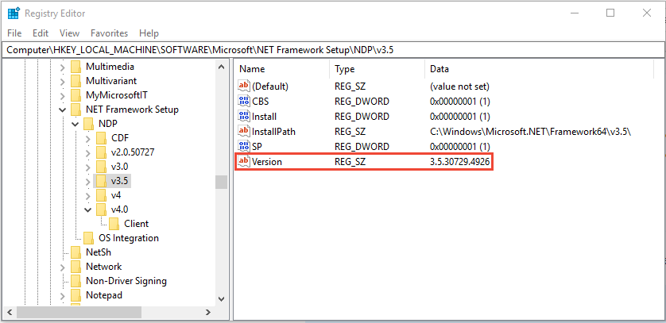

# How to: Determine which .NET Framework versions are installed

Users can [install](../install/index.md) and run multiple versions of .NET Framework on their computers. When you develop or deploy your app, you might need to know which .NET Framework versions are installed on the user's computer. The registry contains a list of the versions of .NET Framework installed on the computer.

> [!NOTE]
> This article is specific to .NET Framework. To determine which .NET Core and .NET 5+ SDKs and runtimes are installed, see [How to check that .NET is already installed](../../core/install/how-to-detect-installed-versions.md).

.NET Framework consists of two main components, which are versioned separately:

- A set of assemblies, which are collections of types and resources that provide the functionality for your apps. .NET Framework and the assemblies share the same version number. For example, .NET Framework versions include 4.5, 4.6.1, and 4.7.2.

- The common language runtime (CLR), which manages and executes your app's code. A single CLR version typically supports multiple .NET Framework versions. For example, CLR version 4.0.30319.*xxxxx* where *xxxxx* is less than 42000, supports .NET Framework versions 4 through 4.5.2. CLR version greater than or equal to 4.0.30319.42000 supports .NET Framework versions starting with .NET Framework 4.6.

Community-maintained tools are available to help detect which .NET Framework versions are installed:

- [https://github.com/jmalarcon/DotNetVersions](https://github.com/jmalarcon/DotNetVersions)

  A .NET Framework 2.0 command-line tool.

- [https://github.com/EliteLoser/DotNetVersionLister](https://github.com/EliteLoser/DotNetVersionLister)

  A PowerShell 2.0 module.

For information about detecting the installed updates for each version of .NET Framework, see [How to: Determine which .NET Framework updates are installed](how-to-determine-which-net-framework-updates-are-installed.md).

## Determine which .NET implementation and version an app is running on

You can use the <xref:System.Runtime.InteropServices.RuntimeInformation.FrameworkDescription?displayProperty=nameWithType> property to query for which .NET implementation and version your app is running on. If the app is running on .NET Framework, the output will be similar to:

```output
.NET Framework 4.8.4250.0
```

By comparison, if the app is running on .NET Core or .NET 5+, the output will be similar to:

```output
.NET Core 3.1.9
.NET 5.0.0
```

## Detect .NET Framework 4.5 and later versions

The version of .NET Framework (4.5 and later) installed on a machine is listed in the registry at **HKEY_LOCAL_MACHINE\\SOFTWARE\\Microsoft\\NET Framework Setup\\NDP\\v4\\Full**. If the **Full** subkey is missing, then .NET Framework 4.5 or above isn't installed.

> [!NOTE]
> The **NET Framework Setup** subkey in the registry path does *not* begin with a period.

The **Release** REG_DWORD value in the registry represents the version of .NET Framework installed.

<a name="version_table"></a>

| .NET Framework version | Value of **Release** |
| ---------------------- | -------------------------- |
| .NET Framework 4.5     | All Windows operating systems: 378389 |
| .NET Framework 4.5.1   | On Windows 8.1 and Windows Server 2012 R2: 378675<br />On all other Windows operating systems: 378758 |
| .NET Framework 4.5.2   | All Windows operating systems: 379893 |
| .NET Framework 4.6     | On Windows 10: 393295<br />On all other Windows operating systems: 393297 |
| .NET Framework 4.6.1   | On Windows 10 November Update systems: 394254<br />On all other Windows operating systems (including Windows 10): 394271 |
| .NET Framework 4.6.2   | On Windows 10 Anniversary Update and Windows Server 2016: 394802<br />On all other Windows operating systems (including other Windows 10 operating systems): 394806 |
| .NET Framework 4.7     | On Windows 10 Creators Update: 460798<br />On all other Windows operating systems (including other Windows 10 operating systems): 460805 |
| .NET Framework 4.7.1   | On Windows 10 Fall Creators Update and Windows Server, version 1709: 461308<br/>On all other Windows operating systems (including other Windows 10 operating systems): 461310 |
| .NET Framework 4.7.2   | On Windows 10 April 2018 Update and Windows Server, version 1803: 461808<br/>On all Windows operating systems other than Windows 10 April 2018 Update and Windows Server, version 1803: 461814 |
| .NET Framework 4.8     | On Windows 10 May 2019 Update and Windows 10 November 2019 Update: 528040<br/>On Windows 10 May 2020 Update and Windows 10 October 2020 Update and Windows 10 May 2021 Update: 528372<br/>On Windows 11 and Windows Server 2022: 528449<br/>On all other Windows operating systems (including other Windows 10 operating systems): 528049 |

### Minimum version

To determine whether a *minimum* version of .NET Framework is present, check for a **Release** REG_DWORD value that's greater than or equal to the corresponding value listed in the following table. For example, if your application runs under .NET Framework 4.8 or a later version, test for a **Release** REG_DWORD value that's *greater than or equal to* 528040.

| .NET Framework version | Minimum value |
| ---------------------- | ------------- |
| .NET Framework 4.5     | 378389 |
| .NET Framework 4.5.1   | 378675 |
| .NET Framework 4.5.2   | 379893 |
| .NET Framework 4.6     | 393295 |
| .NET Framework 4.6.1   | 394254 |
| .NET Framework 4.6.2   | 394802 |
| .NET Framework 4.7     | 460798 |
| .NET Framework 4.7.1   | 461308 |
| .NET Framework 4.7.2   | 461808 |
| .NET Framework 4.8     | 528040 |

### Use Registry Editor

1. From the **Start** menu, choose **Run**, enter *regedit*, and then select **OK**.

   (You must have administrative credentials to run regedit.)

1. In the Registry Editor, open the following subkey: **HKEY_LOCAL_MACHINE\\SOFTWARE\\Microsoft\\NET Framework Setup\\NDP\\v4\\Full**. If the **Full** subkey isn't present, then you don't have .NET Framework 4.5 or later installed.

1. Check for a REG_DWORD entry named **Release**. If it exists, then you have .NET Framework 4.5 or later installed. Its value corresponds to a particular version of .NET Framework. In the following figure, for example, the value of the **Release** entry is 528040, which is the release key for .NET Framework 4.8.

   

### Use PowerShell to check for a minimum version

Use PowerShell commands to check the value of the **Release** entry of the **HKEY_LOCAL_MACHINE\\SOFTWARE\\Microsoft\\NET Framework Setup\\NDP\\v4\\Full** subkey.

The following examples check the value of the **Release** entry to determine whether .NET Framework 4.6.2 or later is installed. This code returns `True` if it's installed and `False` otherwise.

```powershell
(Get-ItemProperty "HKLM:\SOFTWARE\Microsoft\NET Framework Setup\NDP\v4\Full").Release -ge 394802
```

### Query the registry using code

01. Use the <xref:Microsoft.Win32.RegistryKey.OpenBaseKey%2A?displayProperty=nameWithType> and <xref:Microsoft.Win32.RegistryKey.OpenSubKey%2A?displayProperty=nameWithType> methods to access the **HKEY_LOCAL_MACHINE\\SOFTWARE\\Microsoft\\NET Framework Setup\\NDP\\v4\\Full** subkey in the Windows registry.

    > [!IMPORTANT]
    > If the app you're running is 32-bit and running in 64-bit Windows, the registry paths will be different than previously listed. The 64-bit registry is available in the **HKEY_LOCAL_MACHINE\\SOFTWARE\\Wow6432Node\\** subkey. For example, the registry subkey for .NET Framework 4.5 is **HKEY_LOCAL_MACHINE\\SOFTWARE\\Wow6432Node\\Microsoft\\NET Framework Setup\\NDP\\v4\\Full**.

01. Check the **Release** REG_DWORD value to determine the installed version. To be forward-compatible, check for a value greater than or equal to the value listed in the [.NET Framework version table](#version_table).

The following example checks the value of the **Release** entry in the registry to find the versions of .NET Framework 4.5-4.8 that are installed.

> [!TIP]
> Add the directive `using Microsoft.Win32` or `Imports Microsoft.Win32` at the top of your code file if you haven't already done so.

:::code language="csharp" source="snippets/csharp/versions-installed.cs" id="2":::

:::code language="vb" source="snippets/visual-basic/versions-installed.vb" id="2":::

The example displays output like the following:

```output
.NET Framework Version: 4.6.1
```

This example follows the recommended practice for version checking:

- It checks whether the value of the **Release** entry is *greater than or equal to* the value of the known release keys.
- It checks in order from most recent version to earliest version.

## Detect .NET Framework 1.0 through 4.0

Each version of .NET Framework from 1.1 to 4.0 is listed as a subkey at **HKEY_LOCAL_MACHINE\\SOFTWARE\\Microsoft\\NET Framework Setup\\NDP**. The following table lists the path to each .NET Framework version. For most versions, there's an **Install** REG_DWORD value of `1` to indicate this version is installed. In these subkeys, there's also a **Version** REG_SZ value that contains a version string.

> [!NOTE]
> The **NET Framework Setup** subkey in the registry path does *not* begin with a period.

| Framework Version  | Registry Subkey | Value |
| ------------------ | --------------- | ----- |
| 1.0                | **HKLM\\Software\\Microsoft\\.NETFramework\\Policy\\v1.0\\3705**     | **Install** REG_SZ equals `1` |
| 1.1                | **HKLM\\Software\\Microsoft\\NET Framework Setup\\NDP\\v1.1.4322**   | **Install** REG_DWORD equals `1` |
| 2.0                | **HKLM\\Software\\Microsoft\\NET Framework Setup\\NDP\\v2.0.50727**  | **Install** REG_DWORD equals `1` |
| 3.0                | **HKLM\\Software\\Microsoft\\NET Framework Setup\\NDP\\v3.0\\Setup** | **InstallSuccess** REG_DWORD equals `1` |
| 3.5                | **HKLM\\Software\\Microsoft\\NET Framework Setup\\NDP\\v3.5**        | **Install** REG_DWORD equals `1` |
| 4.0 Client Profile | **HKLM\\Software\\Microsoft\\NET Framework Setup\\NDP\\v4\\Client**  | **Install** REG_DWORD equals `1` |
| 4.0 Full Profile   | **HKLM\\Software\\Microsoft\\NET Framework Setup\\NDP\\v4\\Full**    | **Install** REG_DWORD equals `1` |

> [!IMPORTANT]
> If the app you're running is 32-bit and running in 64-bit Windows, the registry paths will be different than previously listed. The 64-bit registry is available in the **HKEY_LOCAL_MACHINE\\SOFTWARE\\Wow6432Node\\** subkey. For example, the registry subkey for .NET Framework 3.5 is **HKEY_LOCAL_MACHINE\\SOFTWARE\\Wow6432Node\\Microsoft\\NET Framework Setup\\NDP\\v3.5**.

Notice that the registry path to the .NET Framework 1.0 subkey is different from the others.

### Use Registry Editor (older framework versions)

01. From the **Start** menu, choose **Run**, enter *regedit*, and then select **OK**.

    You must have administrative credentials to run regedit.

01. Open the subkey that matches the version you want to check. Use the table in the [Detect .NET Framework 1.0 through 4.0](#detect-net-framework-10-through-40) section.

    The following figure shows the subkey and its **Version** value for .NET Framework 3.5.

    

### Query the registry using code (older framework versions)

Use the <xref:Microsoft.Win32.RegistryKey?displayProperty=nameWithType> class to access the **HKEY_LOCAL_MACHINE\\SOFTWARE\\Microsoft\\NET Framework Setup\\NDP** subkey in the Windows registry.

> [!IMPORTANT]
> If the app you're running is 32-bit and running in 64-bit Windows, the registry paths will be different than previously listed. The 64-bit registry is available in the **HKEY_LOCAL_MACHINE\\SOFTWARE\\Wow6432Node\\** subkey. For example, the registry subkey for .NET Framework 3.5 is **HKEY_LOCAL_MACHINE\\SOFTWARE\\Wow6432Node\\Microsoft\\NET Framework Setup\\NDP\\v3.5**.

The following example finds the versions of .NET Framework 1-4 that are installed:

:::code language="csharp" source="snippets/csharp/versions-installed.cs" id="1":::

:::code language="vb" source="snippets/visual-basic/versions-installed.vb" id="1":::

The example displays output similar to the following:

```output
v2.0.50727  2.0.50727.4927  SP2
v3.0  3.0.30729.4926  SP2
v3.5  3.5.30729.4926  SP1
v4.0
  Client  4.0.0.0
```

## Find CLR versions

The .NET Framework CLR installed with .NET Framework is versioned separately. There are two ways to detect the version of the .NET Framework CLR:

- **The Clrver.exe tool**

  Use the [CLR Version tool (Clrver.exe)](../tools/clrver-exe-clr-version-tool.md) to determine which versions of the CLR are installed on a computer. Open [Visual Studio Developer Command Prompt or Visual Studio Developer PowerShell](/visualstudio/ide/reference/command-prompt-powershell) and enter `clrver`.

  Sample output:

  ```console
  Versions installed on the machine:
  v2.0.50727
  v4.0.30319
  ```

- **The `Environment` class**

  > [!IMPORTANT]
  > For .NET Framework 4.5 and later versions, don't use the <xref:System.Environment.Version%2A?displayProperty=nameWithType> property to detect the version of the CLR. Instead, query the registry as described in [Detect .NET Framework 4.5 and later versions](#detect-net-framework-45-and-later-versions).

  1. Query the <xref:System.Environment.Version?displayProperty=nameWithType> property to retrieve a <xref:System.Version> object.

     The returned `System.Version` object identifies the version of the runtime that's currently executing the code. It doesn't return assembly versions or other versions of the runtime that may have been installed on the computer.

     For .NET Framework versions 4, 4.5, 4.5.1, and 4.5.2, the string representation of the returned <xref:System.Version> object has the form 4.0.30319.*xxxxx*, where *xxxxx* is less than 42000. For .NET Framework 4.6 and later versions, it has the form 4.0.30319.42000.

  1. After you have the **Version** object, query it as follows:

     - For the major release identifier (for example, *4* for version 4.0), use the <xref:System.Version.Major%2A?displayProperty=nameWithType> property.

     - For the minor release identifier (for example, *0* for version 4.0), use the <xref:System.Version.Minor%2A?displayProperty=nameWithType> property.

     - For the entire version string (for example, *4.0.30319.18010*), use the <xref:System.Version.ToString%2A?displayProperty=nameWithType> method. This method returns a single value that reflects the version of the runtime that's executing the code. It doesn't return assembly versions or other runtime versions that may be installed on the computer.

  The following example uses the <xref:System.Environment.Version%2A?displayProperty=nameWithType> property to retrieve CLR version information:

  ```csharp
  Console.WriteLine($"Version: {Environment.Version}");
  ```

  ```vb
  Console.WriteLine($"Version: {Environment.Version}")
  ```

  The example displays output similar to the following:

  ```output
  Version: 4.0.30319.18010
  ```

## See also

- [How to: Determine which .NET Framework updates are installed](how-to-determine-which-net-framework-updates-are-installed.md)
- [Install .NET Framework for developers](../install/guide-for-developers.md)
- [.NET Framework versions and dependencies](versions-and-dependencies.md)
