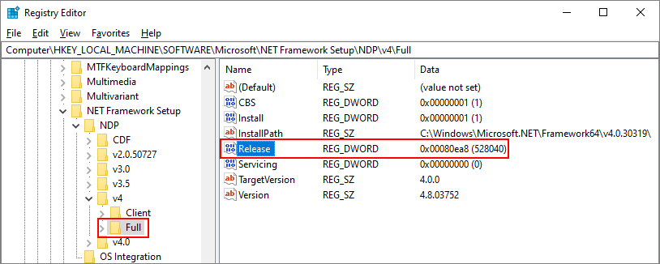

# How to: Determine which .NET Framework versions are installed

Users can install and run multiple versions of the .NET Framework on their computers. When you develop or deploy your app, you might need to know which .NET Framework versions are installed on the user’s computer. Note that the .NET Framework consists of two main components, which are versioned separately:  
  
-   A set of assemblies, which are collections of types and resources that provide the functionality for your apps. The .NET Framework and assemblies share the same version number.  
  
-   The common language runtime (CLR), which manages and executes your app's code. The CLR is identified by its own version number (see [Versions and Dependencies](~/docs/framework/migration-guide/versions-and-dependencies.md)).  
  
 To get an accurate list of the .NET Framework versions installed on a computer, you can view the registry or query the registry in code:  
  
 [Viewing the registry (versions 1-4)](#net_a)  
 [Viewing the registry (version 4.5 and later)](#net_b)  
 [Using code to query the registry (versions 1-4)](#net_c)  
 [Using code to query the registry (version 4.5 and later)](#net_d)  
 [Using PowerShell to query the registry (version 4.5 and later)](#ps_a)  
  
 To find the CLR version, you can use a tool or code:  
  
 [Using the Clrver tool](#clr_a)  
 [Using code to query the System.Environment class](#clr_b)  
  
 For information about detecting the installed updates for each version of the .NET Framework, see [How to: Determine Which .NET Framework Updates Are Installed](~/docs/framework/migration-guide/how-to-determine-which-net-framework-updates-are-installed.md). For information about installing the .NET Framework, see [Install the .NET Framework for developers](../../../docs/framework/install/guide-for-developers.md).  
  
<a name="net_a"></a>   
## To find .NET Framework versions by viewing the registry (.NET Framework 1-4)  
  
1.  On the **Start** menu, choose **Run**.  
  
2.  In the **Open** box, enter **regedit.exe**.  
  
     You must have administrative credentials to run regedit.exe.  
  
3.  In the Registry Editor, open the following subkey:  
  
     `HKEY_LOCAL_MACHINE\SOFTWARE\Microsoft\NET Framework Setup\NDP`  
  
     The installed versions are listed under the NDP subkey. The version number is stored in the **Version** entry. For the [!INCLUDE[net_v40_long](../../../includes/net-v40-long-md.md)] the **Version** entry is under the Client or Full subkey (under NDP), or under both subkeys.  
  

    > [!NOTE]
    > The "NET Framework Setup" folder in the registry does not begin with a period.

<a name="net_b"></a> 
## To find .NET Framework versions by viewing the registry (.NET Framework 4.5 and later)

1. On the **Start** menu, choose **Run**.

2. In the **Open** box, enter **regedit.exe**.

     You must have administrative credentials to run regedit.exe.

3. In the Registry Editor, open the following subkey:

     `HKEY_LOCAL_MACHINE\SOFTWARE\Microsoft\NET Framework Setup\NDP\v4\Full`

     Note that the path to the `Full` subkey includes the subkey `Net Framework` rather than `.NET Framework`.

    > [!NOTE]
    > If the `Full` subkey is not present, then you do not have the .NET Framework 4.5 or later installed.

     Check for a DWORD value named `Release`. The existence of the `Release` DWORD indicates that the [!INCLUDE[net_v45](../../../includes/net-v45-md.md)] or newer has been installed on that computer.

     

     The value of the `Release` DWORD indicates which version of the .NET Framework is installed.

    [!INCLUDE[Release key values note](~/includes/version-keys-note.md)]

    |Value of the Release DWORD|Version|
    |--------------------------------|-------------|
    |378389|.NET Framework 4.5|
    |378675|.NET Framework 4.5.1 installed with Windows 8.1 or Windows Server 2012 R2|
    |378758|.NET Framework 4.5.1 installed on Windows 8, Windows 7 SP1, or Windows Vista SP2|
    |379893|.NET Framework 4.5.2|
    |On Windows 10 systems: 393295<br /><br /> On all other OS versions: 393297|[!INCLUDE[net_v46](../../../includes/net-v46-md.md)]|
    |On Windows 10 November Update systems: 394254<br /><br /> On all other OS versions: 394271|[!INCLUDE[net_v461](../../../includes/net-v461-md.md)]|
    |On Windows 10 Anniversary Update: 394802<br /><br /> On all other OS versions: 394806|[!INCLUDE[net_v462](../../../includes/net-v462-md.md)]| 
    |On Windows 10 Creators Update: 460798<br/><br/> On all other OS versions: 460805 | .NET Framework 4.7 |
    |On Windows 10 Fall Creators Update: 461308<br/><br/> On all other OS versions: 461310 | .NET Framework 4.7.1 |
    
<a name="net_c"></a> 
## To find .NET Framework versions by querying the registry in code (.NET Framework 1-4)

- Use the <xref:Microsoft.Win32.RegistryKey?displayProperty=nameWithType> class to access the Software\Microsoft\NET Framework Setup\NDP\ subkey under HKEY_LOCAL_MACHINE in the Windows registry.

     The following code shows an example of this query.

    > [!NOTE]
    > This code does not show how to detect the [!INCLUDE[net_v45](../../../includes/net-v45-md.md)] or later. Check the `Release` DWORD to detect those versions, as described in the previous section. For code that does detect the [!INCLUDE[net_v45](../../../includes/net-v45-md.md)] or later versions, see the next section in this article.

     [!code-csharp[ListVersions](../../../samples/snippets/csharp/framework/migration-guide/versions-installed1.cs)]
     [!code-vb[ListVersions](../../../samples/snippets/visualbasic/framework/migration-guide/versions-installed1.vb)]

     The example produces output that's similar to the following:

    ```
    v2.0.50727  2.0.50727.4016  SP2
    v3.0  3.0.30729.4037  SP2
    v3.5  3.5.30729.01  SP1
    v4
      Client  4.0.30319
      Full  4.0.30319
    ```

<a name="net_d"></a> 
## To find .NET Framework versions by querying the registry in code (.NET Framework 4.5 and later)

1. The existence of the `Release` DWORD indicates that the .NET Framework 4.5 or later has been installed on a computer. The value of the keyword indicates the installed version. To check this keyword, use the <xref:Microsoft.Win32.RegistryKey.OpenBaseKey%2A> and <xref:Microsoft.Win32.RegistryKey.OpenSubKey%2A> methods of the <xref:Microsoft.Win32.RegistryKey?displayProperty=nameWithType> class to access the Software\Microsoft\NET Framework Setup\NDP\v4\Full subkey under HKEY_LOCAL_MACHINE in the Windows registry.

2. Check the value of the `Release` keyword to determine the installed version. To be forward-compatible, you can check for a value greater than or equal to the values listed in the table. Here are the .NET Framework versions and associated `Release` keywords.

    [!INCLUDE[Release key values note](~/includes/version-keys-note.md)]

    |Version|Value of the Release DWORD|
    |-------------|--------------------------------|
    |.NET Framework 4.5|378389|
    |.NET Framework 4.5.1 installed with Windows 8.1|378675|
    |.NET Framework 4.5.1 installed on Windows 8, Windows 7 SP1, or Windows Vista SP2|378758|
    |.NET Framework 4.5.2|379893|
    |.NET Framework 4.6 installed with Windows 10|393295|
    |.NET Framework 4.6 installed on all other Windows OS versions|393297|
    |.NET Framework 4.6.1 installed on Windows 10|394254|
    |.NET Framework 4.6.1 installed on all other Windows OS versions|394271|
    |.NET Framework 4.6.2 installed on Windows 10 Anniversary Update|394802|
    |.NET Framework 4.6.2 installed on all other Windows OS versions|394806|
    |.NET Framework 4.7 installed on Windows 10 Creators Update|460798|
    |.NET Framework 4.7 installed on all other Windows OS versions|460805|
    |.NET Framework 4.7.1 installed on Windows 10 Fall Creators Update|461308|
    |.NET Framework 4.7.1 installed on all other Windows OS versions|461310|

     The following example checks the `Release` value in the registry to determine whether the [!INCLUDE[net_v45](../../../includes/net-v45-md.md)] or a later version of the .NET Framework is installed.

     [!code-csharp[ListVersions#5](../../../samples/snippets/csharp/framework/migration-guide/versions-installed3.cs)]
     [!code-vb[ListVersions#5](../../../samples/snippets/visualbasic/framework/migration-guide/versions-installed3.vb)]

     This example follows the recommended practice for version checking:

    - It checks whether the value of the `Release` entry is *greater than or equal to* the value of the known release keys.

    - It checks in order from most recent version to earliest version.

<a name="ps_a"></a> 
## To check for a minimum-required .NET Framework version by querying the registry in PowerShell (.NET Framework 4.5 and later)

- The following example checks the value of the `Release` keyword to determine whether .NET Framework 4.6.2 or higher is installed, regardless of Windows OS version (returning `True` if it is and `False` otherwise).

    ```PowerShell
    Get-ChildItem "HKLM:SOFTWARE\Microsoft\NET Framework Setup\NDP\v4\Full\" | Get-ItemPropertyValue -Name Release | ForEach-Object { $_ -ge 394802 } 
    ```

    You can replace `394802` in the previous example with another value from the following table to check for a different minimum-required .NET Framework version.
  
    |Version|Minimum value of the Release DWORD|
    |-------------|--------------------------------|
    |.NET Framework 4.5|378389|
    |.NET Framework 4.5.1|378675|
    |.NET Framework 4.5.2|379893|
    |[!INCLUDE[net_v46](../../../includes/net-v46-md.md)]|393295|
    |[!INCLUDE[net_v461](../../../includes/net-v461-md.md)]|394254|
    |[!INCLUDE[net_v462](../../../includes/net-v462-md.md)]|394802|
    |.NET Framework 4.7|460798|
    |.NET Framework 4.7.1|461308|
    
<a name="clr_a"></a> 
## To find the current runtime version by using the Clrver tool

- Use the CLR Version Tool (Clrver.exe) to determine which versions of the common language runtime are installed on a computer.

     From a Visual Studio Command Prompt, enter `clrver`. This command produces output similar to the following:

    ```
    Versions installed on the machine:
    v2.0.50727
    v4.0.30319
    ```

     For more information about using this tool, see [Clrver.exe (CLR Version Tool)](~/docs/framework/tools/clrver-exe-clr-version-tool.md).

<a name="clr_b"></a> 
## To find the current runtime version by querying the Environment class in code

- Query the <xref:System.Environment.Version%2A?displayProperty=nameWithType> property to retrieve a <xref:System.Version> object that identifies the version of the runtime that is currently executing the code. You can use the <xref:System.Version.Major%2A?displayProperty=nameWithType> property to get the major release identifier (for example, "4" for version 4.0), the <xref:System.Version.Minor%2A?displayProperty=nameWithType> property to get the minor release identifier (for example, "0" for version 4.0), or the <xref:System.Object.ToString%2A?displayProperty=nameWithType> method to get the entire version string (for example, "4.0.30319.18010", as shown in the following code). This property returns a single value that reflects the version of the runtime that is currently executing the code; it does not return assembly versions or other versions of the runtime that may have been installed on the computer.

     For the .NET Framework Versions 4, 4.5, 4.5.1, and 4.5.2, the <xref:System.Environment.Version%2A?displayProperty=nameWithType> property returns a <xref:System.Version> object whose string representation has the form `4.0.30319.xxxxx`. For the .NET Framework 4.6 and later, it has the form `4.0.30319.42000`.

    > [!IMPORTANT]
    > For the [!INCLUDE[net_v45](../../../includes/net-v45-md.md)] and later, we do not recommend using the  <xref:System.Environment.Version%2A?displayProperty=nameWithType> property to detect the version of the runtime. Instead, we recommend that you query the registry, as described in the [To find .NET Framework versions by querying the registry in code (.NET Framework 4.5 and later)](#net_d) section earlier in this article.

     Here's an example of querying the <xref:System.Environment.Version%2A?displayProperty=nameWithType> property for runtime version information:

     [!code-csharp[ListVersions](../../../samples/snippets/csharp/framework/migration-guide/versions-installed2.cs)]
     [!code-vb[ListVersions](../../../samples/snippets/visualbasic/framework/migration-guide/versions-installed2.vb)]

     The example produces output that's similar to the following:

    ```
    Version: 4.0.30319.18010
    ```

## See also

[How to: Determine Which .NET Framework Updates Are Installed](~/docs/framework/migration-guide/how-to-determine-which-net-framework-updates-are-installed.md)  
[Install the .NET Framework for developers](../../../docs/framework/install/guide-for-developers.md)  
[Versions and Dependencies](~/docs/framework/migration-guide/versions-and-dependencies.md)  
