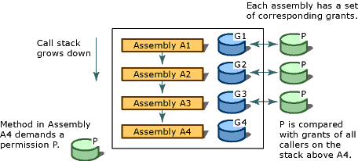

# Code Access Security
[!INCLUDE[net_security_note](../../../includes/net-security-note-md.md)]  
  
 Today's highly connected computer systems are frequently exposed to code originating from various, possibly unknown sources. Code can be attached to email, contained in documents, or downloaded over the Internet. Unfortunately, many computer users have experienced firsthand the effects of malicious mobile code, including viruses and worms, which can damage or destroy data and cost time and money.  
  
 Most common security mechanisms give rights to users based on their logon credentials (usually a password) and restrict resources (often directories and files) that the user is allowed to access. However, this approach fails to address several issues: users obtain code from many sources, some of which might be unreliable; code can contain bugs or vulnerabilities that enable it to be exploited by malicious code; and code sometimes does things that the user does not know it will do. As a result, computer systems can be damaged and private data can be leaked when cautious and trustworthy users run malicious or error-filled software. Most operating system security mechanisms require that every piece of code must be completely trusted in order to run, except perhaps for scripts on a Web page. Therefore, there is still a need for a widely applicable security mechanism that allows code originating from one computer system to execute with protection on another system, even when there is no trust relationship between the systems.  
  
 The .NET Framework provides a security mechanism called code access security to help protect computer systems from malicious mobile code, to allow code from unknown origins to run with protection, and to help prevent trusted code from intentionally or accidentally compromising security. Code access security enables code to be trusted to varying degrees depending on where the code originates and on other aspects of the code's identity. Code access security also enforces the varying levels of trust on code, which minimizes the amount of code that must be fully trusted in order to run. Using code access security can reduce the likelihood that your code will be misused by malicious or error-filled code. It can reduce your liability, because you can specify the set of operations your code should be allowed to perform. Code access security can also help minimize the damage that can result from security vulnerabilities in your code.  
  
> [!NOTE]
>  Major changes have been made to code access security in the [!INCLUDE[net_v40_long](../../../includes/net-v40-long-md.md)]. The most notable change has been [security transparency](../../../docs/framework/misc/security-transparent-code.md), but there are also other significant changes that affect code access security. For information about these changes, see [Security Changes](../../../docs/framework/security/security-changes.md).  
  
 Code access security primarily affects library code and partially trusted applications. Library developers must protect their code from unauthorized access from partially trusted applications. Partially trusted applications are applications that are loaded from external sources such as the Internet. Applications that are installed on your desktop or on the local intranet run in full trust. Full-trust applications are not affected by code access security unless they are marked as [security-transparent](../../../docs/framework/misc/security-transparent-code.md), because they are fully trusted. The only limitation for full-trust applications is that applications that are marked with the <xref:System.Security.SecurityTransparentAttribute> attribute cannot call code that is marked with the <xref:System.Security.SecurityCriticalAttribute> attribute. Partially trusted applications must be run in a sandbox (for example, in Internet Explorer) so that code access security can be applied. If you download an application from the Internet and try to run it from your desktop, you will get a <xref:System.NotSupportedException> with the message: "An attempt was made to load an assembly from a network location which would have caused the assembly to be sandboxed in previous versions of the .NET Framework. This release of the .NET Framework does not enable CAS policy by default, so this load may be dangerous." If you are sure that the application can be trusted, you can enable it to be run as full trust by using the [\<loadFromRemoteSources> element](../../../docs/framework/configure-apps/file-schema/runtime/loadfromremotesources-element.md). For information about running an application in a sandbox, see [How to: Run Partially Trusted Code in a Sandbox](../../../docs/framework/misc/how-to-run-partially-trusted-code-in-a-sandbox.md).  
  
 All managed code that targets the common language runtime receives the benefits of code access security, even if that code does not make a single code access security call. For more information, see [Code Access Security Basics](../../../docs/framework/misc/code-access-security-basics.md).  
  
   
## Key Functions of Code Access Security  
 Code access security helps limit the access that code has to protected resources and operations. In the .NET Framework, code access security performs the following functions:  
  
-   Defines permissions and permission sets that represent the right to access various system resources.  
  
-   Enables code to demand that its callers have specific permissions.  
  
-   Enables code to demand that its callers possess a digital signature, thus allowing only callers from a particular organization or site to call the protected code.  
  
-   Enforces restrictions on code at run time by comparing the granted permissions of every caller on the call stack to the permissions that callers must have.  
  
   
## Walking the Call Stack  
 To determine whether code is authorized to access a resource or perform an operation, the runtime's security system walks the call stack, comparing the granted permissions of each caller to the permission being demanded. If any caller in the call stack does not have the demanded permission, a security exception is thrown and access is refused. The stack walk is designed to help prevent luring attacks, in which less-trusted code calls highly trusted code and uses it to perform unauthorized actions. Demanding permissions of all callers at run time affects performance, but it is essential to help protect code from luring attacks by less-trusted code. To optimize performance, you can have your code perform fewer stack walks; however, you must be sure that you do not expose a security weakness whenever you do this.  
  
 The following illustration shows the stack walk that results when a method in Assembly A4 demands that its callers have permission P.  
  
   
Security stack walk  
  
   
## Related Topics  
  
|Title|Description|  
|-----------|-----------------|  
|[Code Access Security Basics](../../../docs/framework/misc/code-access-security-basics.md)|Describes code access security and its most common uses.|  
|[Security-Transparent Code, Level 2](../../../docs/framework/misc/security-transparent-code-level-2.md)|Describes the security transparency model in the [!INCLUDE[net_v40_short](../../../includes/net-v40-short-md.md)].|  
|[Using Libraries from Partially Trusted Code](../../../docs/framework/misc/using-libraries-from-partially-trusted-code.md)|Describes how to enable libraries for use with unmanaged code and how to use libraries from unmanaged code.|  
|[Key Security Concepts](../../../docs/standard/security/key-security-concepts.md)|Provides an overview of many of the key terms and concepts used in the .NET Framework security system.|  
|[Role-Based Security](../../../docs/standard/security/role-based-security.md)|Describes how to incorporate security based on roles.|  
|[Cryptographic Services](../../../docs/standard/security/cryptographic-services.md)|Describes how to incorporate cryptography into your applications.|
