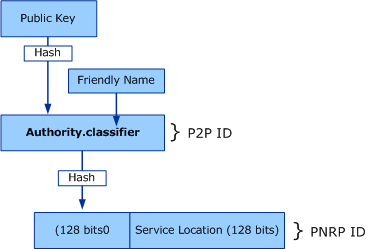

# Peer Names and PNRP IDs
A Peer Name represents an endpoint for communication, which can be a computer, a user, a group, a service, or anything associated with a Peer that can be resolved to an IPv6 address. The Peer Name Resolution Protocol (PNRP) takes the statistically unique Peer Name for the creation of a PNRP ID, which is used to identify cloud members.  
  
## Peer Names  
 Peer names can be registered as unsecured or secured. Unsecured names are just text strings that are subject to spoofing, as anyone can register a duplicate unsecured name. Unsecured names are best used in private or otherwise protected networks. Secured names are protected with a certificate and a digital signature. Only the original publisher will be able to prove ownership of a secured name.  
  
 The combination of cloud and scope provides a reasonably secure environment for peers that participate in PNRP activity. However, using a secured peer name does not ensure the overall security of the networking application. Security of the application is implementation-dependent.  
  
 Secured peer names are only registered by their owner and are protected with public key cryptography. A secured peer name is considered owned by the peer entity having the corresponding private key. Ownership can be proved via the certified peer address (CPA), which is signed using the private key. A malicious user cannot forge ownership of a peer name without the corresponding private key.  
  
## PNRP IDs  
   
  
 PNRP IDs are composed of the following:  
  
-   The high-order 128 bits, known as the peer-to-peer (P2P) ID, are a hash of a peer name assigned to the endpoint. The peer name has the following format: *Authority.Classifier*. For secured names, *Authority* is the Secure Hash Algorithm 1 (SHA1) hash of the public key of the peer name in hexadecimal characters. For unsecured names, the *Authority* is the single character "0". *Classifier* is a string that identifies the application. No peer name classifier can be greater than 149 characters long, including the `null` terminator.  
  
-   The low-order 128 bits are used for the Service Location, which is a generated number that identifies different instances of the same P2P ID in the same cloud.  
  
 This combination of P2P ID and Service Location allows multiple PNRP IDs to be registered from a single computer.  
  
## See Also  
 <xref:System.Net.PeerToPeer.PeerName>  
 <xref:System.Net.PeerToPeer>
