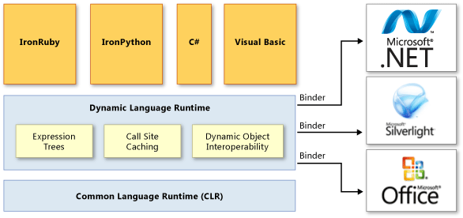

# Dynamic Language Runtime Overview
The *dynamic language runtime* (DLR) is a runtime environment that adds a set of services for dynamic languages to the common language runtime (CLR). The DLR makes it easier to develop dynamic languages to run on the .NET Framework and to add dynamic features to statically typed languages.  
  
 Dynamic languages can identify the type of an object at run time, whereas in statically typed languages such as C# and Visual Basic (when you use `Option Explicit On`) you must specify object types at design time. Examples of dynamic languages are Lisp, Smalltalk, JavaScript, PHP, Ruby, Python, ColdFusion, Lua, Cobra, and Groovy.  
  
 Most dynamic languages provide the following advantages for developers:  
  
-   The ability to use a rapid feedback loop (REPL, or read-evaluate-print loop). This lets you enter several statements and immediately execute them to see the results.  
  
-   Support for both top-down development and more traditional bottom-up development. For example, when you use a top-down approach, you can call functions that are not yet implemented and then add underlying implementations when you need them.  
  
-   Easier refactoring and code modifications, because you do not have to change static type declarations throughout the code.  
  
 Dynamic languages make excellent scripting languages. Customers can easily extend applications created by using dynamic languages with new commands and functionality. Dynamic languages are also frequently used for creating Web sites and test harnesses, maintaining server farms, developing various utilities, and performing data transformations.  
  
 The purpose of the DLR is to enable a system of dynamic languages to run on the .NET Framework and give them .NET interoperability. The DLR introduces dynamic objects to C# and Visual Basic in Visual Studio 2010 to support dynamic behavior in these languages and enable their interoperation with dynamic languages.  
  
 The DLR also helps you create libraries that support dynamic operations. For example, if you have a library that uses XML or JavaScript Object Notation (JSON) objects, your objects can appear as dynamic objects to languages that use the DLR. This lets library users write syntactically simpler and more natural code for operating with objects and accessing object members.  
  
 For example, you might use the following code to increment a counter in XML in C#.  
  
 `Scriptobj.SetProperty("Count", ((int)GetProperty("Count")) + 1);`  
  
 By using the DLR, you could use the following code instead for the same operation.  
  
 `scriptobj.Count += 1;`  
  
 Like the CLR, the DLR is a part of the .NET Framework and is provided with the .NET Framework and Visual Studio installation packages. The open-source version of the DLR is also available for download on the [IronLanguages/dlr](https://github.com/IronLanguages/dlr) repo on GitHub.  
  
> [!NOTE]
>  The open-source version of the DLR has all the features of the DLR that is included in Visual Studio and the .NET Framework. It also provides additional support for language implementers. For more information, see the documentation on the [IronLanguages/dlr](https://github.com/IronLanguages/dlr) repo on GitHub. 
  
 Examples of languages developed by using the DLR include the following:  
  
-   IronPython. Available as open-source software from the [GitHub](https://github.com/IronLanguages/ironpython2) Web site.  
  
-   IronRuby. Available as open-source software from the [RubyForge](http://go.microsoft.com/fwlink/?LinkId=141044) Web site.  
  
## Primary DLR Advantages  
 The DLR provides the following advantages.  
  
### Simplifies Porting Dynamic Languages to the .NET Framework  
 The DLR allows language implementers to avoid creating lexical analyzers, parsers, semantic analyzers, code generators, and other tools that they traditionally had to create themselves. To use the DLR, a language needs to produce *expression trees*, which represent language-level code in a tree-shaped structure, runtime helper routines, and optional dynamic objects that implement the <xref:System.Dynamic.IDynamicMetaObjectProvider> interface. The DLR and the .NET Framework automate a lot of code analysis and code generation tasks. This enables language implementers to concentrate on unique language features.  
  
### Enables Dynamic Features in Statically Typed Languages  
 Existing .NET Framework languages such as C# and Visual Basic can create dynamic objects and use them together with statically typed objects. For example, C# and Visual Basic can use dynamic objects for HTML, Document Object Model (DOM), and .NET reflection.  
  
### Provides Future Benefits of the DLR and .NET Framework  
 Languages implemented by using the DLR can benefit from future DLR and .NET Framework improvements. For example, if the .NET Framework releases a new version that has an improved garbage collector or faster assembly loading time, languages implemented by using the DLR immediately get the same benefit. If the DLR adds optimizations such as better compilation, the performance also improves for all languages implemented by using the DLR.  
  
### Enables Sharing of Libraries and Objects  
 The objects and libraries implemented in one language can be used by other languages. The DLR also enables interoperation between statically typed and dynamic languages. For example, C# can declare a dynamic object that uses a library that is written in a dynamic language. At the same time, dynamic languages can use libraries from the .NET Framework.  
  
### Provides Fast Dynamic Dispatch and Invocation  
 The DLR provides fast execution of dynamic operations by supporting advanced polymorphic caching. The DLR creates rules for binding operations that use objects to the necessary runtime implementations and then caches these rules to avoid resource-exhausting binding computations during successive executions of the same code on the same types of objects.  
  
## DLR Architecture  
 The following illustration shows the architecture of the dynamic language runtime.  
  
   
DLR architecture  
  
 The DLR adds a set of services to the CLR for better supporting dynamic languages. These services include the following:  
  
-   Expression trees. The DLR uses expression trees to represent language semantics. For this purpose, the DLR has extended LINQ expression trees to include control flow, assignment, and other language-modeling nodes. For more information, see [Expression Trees](http://msdn.microsoft.com/library/fb1d3ed8-d5b0-4211-a71f-dd271529294b).  
  
-   Call site caching. A *dynamic call site* is a place in the code where you perform an operation like `a + b` or `a.b()` on dynamic objects. The DLR caches the characteristics of `a` and `b` (usually the types of these objects) and information about the operation. If such an operation has been performed previously, the DLR retrieves all the necessary information from the cache for fast dispatch.  
  
-   Dynamic object interoperability. The DLR provides a set of classes and interfaces that represent dynamic objects and operations and can be used by language implementers and authors of dynamic libraries. These classes and interfaces include <xref:System.Dynamic.IDynamicMetaObjectProvider>, <xref:System.Dynamic.DynamicMetaObject>, <xref:System.Dynamic.DynamicObject>, and <xref:System.Dynamic.ExpandoObject>.  
  
 The DLR uses binders in call sites to communicate not only with the .NET Framework, but with other infrastructures and services, including Silverlight and COM. Binders encapsulate a language's semantics and specify how to perform operations in a call site by using expression trees. This enables dynamic and statically typed languages that use the DLR to share libraries and gain access to all the technologies that the DLR supports.  
  
## DLR Documentation  
 For more information about how to use the open source version of the DLR to add dynamic behavior to a language, or about how to enable the use of a dynamic language with the .NET Framework, see the documentation on the [IronLanguages/dlr](https://github.com/IronLanguages/dlr/tree/master/Docs) repo on GitHub.  
  
## See Also  
 <xref:System.Dynamic.ExpandoObject>  
 <xref:System.Dynamic.DynamicObject>  
 [Common Language Runtime](../../../docs/standard/clr.md)  
 [Expression Trees](http://msdn.microsoft.com/library/fb1d3ed8-d5b0-4211-a71f-dd271529294b)  
 [Walkthrough: Creating and Using Dynamic Objects](~/docs/csharp/programming-guide/types/walkthrough-creating-and-using-dynamic-objects.md)
