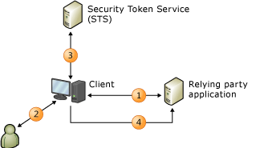

# Claims-Based Identity Model
When you build claims-aware applications, the user identity is represented in your application as a set of claims. One claim could be the user’s name, another might be an email address. The idea is that an external identity system is configured to give your application everything it needs to know about the user with each request she makes, along with cryptographic assurance that the identity data you receive comes from a trusted source.  
  
 Under this model, single sign-on is much easier to achieve, and your application is no longer responsible for the following:  
  
-   Authenticating users.  
  
-   Storing user accounts and passwords.  
  
-   Calling to enterprise directories to look up user identity details.  
  
-   Integrating with identity systems from other platforms or companies.  
  
 Under this model, your application makes identity-related decisions based on claims supplied by the system that authenticated your user. This could be anything from simple application personalization with the user’s first name, to authorizing the user to access higher valued features and resources in your application.  
  
 This topic provides the following information:  
  
-   [Introduction to Claims-Based Identity](../../../docs/framework/security/claims-based-identity-model.md#BKMK_1)  
  
-   [Basic Scenario for a Claims-Based Identity Model](../../../docs/framework/security/claims-based-identity-model.md#BKMK_2)  
  
   
## Introduction to Claims-Based Identity  
 The following terminology and concepts can help you understand this new architecture for identity.  
  
### Identity  
 For the purposes of describing the programming model in Windows Identity Foundation (WIF), we will use the term "identity" to represent a set of attributes that describe a user or some other entity in a system that you want to secure.  
  
### Claim  
 Think of a claim as a piece of identity information such as name, email address, age, membership in the Sales role. The more claims your application receives, the more you’ll know about your user. You may be wondering why these are called "claims," rather than "attributes," as is commonly used in describing enterprise directories. The reason has to do with the delivery method. In this model, your application doesn’t look up user attributes in a directory. Instead, the user delivers claims to your application, and your application examines them. Each claim is made by an issuer, and you trust the claim only as much as you trust the issuer. For example, you trust a claim made by your company’s domain controller more than you trust a claim made by the user herself. WIF represents claims with a <xref:System.Security.Claims.Claim> type, which has an <xref:System.Security.Claims.Claim.Issuer%2A> property that allows you to find out who issued the claim.  
  
### Security Token  
 The user delivers a set of claims to your application along with a request. In a Web service, these claims are carried in the security header of the SOAP envelope. In a browser-based Web application, the claims arrive through an HTTP POST from the user’s browser, and may later be cached in a cookie if a session is desired. Regardless of how these claims arrive, they must be serialized, which is where security tokens come in. A security token is a serialized set of claims that is digitally signed by the issuing authority. The signature is important: it gives you assurance that the user didn’t just make up a bunch of claims and send them to you. In low security situations where cryptography isn’t necessary or desired, you can use unsigned tokens, but that scenario is not described in this topic.  
  
 One of the core features in WIF is the ability to create and read security tokens. WIF and the .NET Framework handle all of the cryptographic work, and present your application with a set of claims that you can read.  
  
### Issuing Authority  
 There are lots of different types of issuing authorities, from domain controllers that issue Kerberos tickets, to certification authorities that issue X.509 certificates, but the specific type of authority discussed in this topic issues security tokens that contain claims. This issuing authority is a Web application or Web service that knows how to issue security tokens. It must have enough knowledge to be able to issue the proper claims given the target relying party and the user making the request, and might be responsible for interacting with user stores to look up claims and authenticate the users themselves.  
  
 Whatever issuing authority you choose, it plays a central role in your identity solution. When you factor authentication out of your application by relying on claims, you’re passing responsibility to that authority and asking it to authenticate users on your behalf.  
  
### Security Token Service (STS)  
 A security token service (STS) is the service component that builds, signs, and issues security tokens according to the WS-Trust and WS-Federation protocols. There’s a lot of work that goes into implementing these protocols, but WIF does all of this work for you, making it feasible for someone who isn’t an expert in the protocols to get an STS up and running with very little effort. You can use a pre-built STS such as [Active Directory® Federation Services (AD FS) 2.0](http://go.microsoft.com/fwlink/?LinkID=247516), a cloud STS such as a [Windows Azure Access Control Service (ACS)](http://go.microsoft.com/fwlink/?LinkID=247517), or, if you want to issue custom tokens or provide custom authentication or authorization, you can build your own custom STS using WIF. WIF makes it easy to build your own STS.  
  
### Relying Party Application  
 When you build an application that relies on claims, you are building a relying party (RP) application. Synonyms for an RP include "claims-aware application" and "claims-based application". Web applications and Web services can both be RPs. A RP application consumes the tokens issued by a STS and extracts the claims from tokens to use them for identity related tasks. WIF offers functionalities to help you build RP applications.  
  
### Standards  
 In order to make all of this interoperable, several WS-* standards are used in the previous scenario. Policy is retrieved using WS-MetadataExchange, and the policy itself is structured according to the WS-Policy specification. The STS exposes endpoints that implement the WS-Trust specification, which describes how to request and receive security tokens. Most STSs today issue tokens formatted with Security Assertion Markup Langauge (SAML). SAML is an industry-recognized XML vocabulary that can be used to represent claims in an interoperable way. Or, in a multi-platform situation, this allows you to communicate with an STS on an entirely different platform and achieve single sign-on across all of your applications, regardless of platform.  
  
### Browser-Based Applications  
 Smart clients aren’t the only ones who can use the claims-based identity model. Browser-based applications (also referred to as passive clients) can use it as well. The following scenario describes how this works.  
  
 First, the user points a browser at a claims-aware Web application (the relying party application). The Web application redirects the browser to the STS so the user can be authenticated. The STS is hosted in a simple web application that reads the incoming request, authenticates the user using standard HTTP mechanisms, and then creates a SAML token and replies with a piece of JavaScript code that causes the browser to initiate an HTTP POST that sends the SAML token back to the RP. The body of this POST contains the claims that the RP requested. At this point, it is common for the RP to package the claims into a cookie so that the user doesn’t have to be redirected for each request.  
  
   
## Basic Scenario for a Claims-Based Identity Model  
 The following is an example of a claims-based system.  
  
   
  
 This diagram shows a Web site (the relying party application, RP) that has been configured to use WIF for authentication and a client, a web browser, that wants to use that site.  
  
1.  When an unauthenticated user requests a page their browser is redirected to the identity provider (IP) pages.  
  
2.  The IP requires the user to present their credentials, e.g. username/password, Kerberos, etc.  
  
3.  The IP issues a token back to that is returned to the browser.  
  
4.  The browser is now redirected back to the originally requested page where WIF determines if the token satisfies the requirements to access the page. If so a cookie is issued to establish a session so the authentication only needs to occur once, and control is passed to the application.
