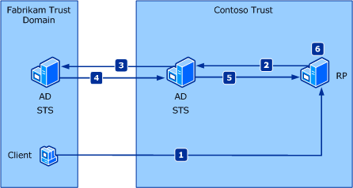

# WSFederation Authentication Module Overview
Windows Identity Foundation (WIF) includes support for federated authentication in ASP.NET applications through the WS-Federated Authentication Module (WS-FAM). This topic will help you understand how federated authentication works and how to use it.  
  
### Overview of Federated Authentication  
 Federated authentication allows a Security Token Service (STS) in one trust domain to provide authentication information to an STS in another trust domain when there is a trust relationship between the two domains. An example of this is shown in the following illustration.  
  
   
  
1.  A client in the Fabrikam trust domain sends a request to a Relying Party (RP) application in the Contoso trust domain.  
  
2.  The RP redirects the client to an STS in the Contoso trust domain. This STS has no knowledge of the client.  
  
3.  The Contoso STS redirects the client to an STS in the Fabrikam trust domain, with which the Contoso trust domain has a trust relationship.  
  
4.  The Fabrikam STS verifies the client’s identity and issues a security token to the Contoso STS.  
  
5.  The Contoso STS uses the Fabrikam token to create its own token that can be used by the RP and sends it to the RP.  
  
6.  The RP extracts the client’s claims from the security token and makes an authorization decision.  
  
### Using the Federated Authentication Module with ASP.NET  
 <xref:System.IdentityModel.Services.WSFederationAuthenticationModule> (WS-FAM) is an HTTP module that lets you add federated authentication to an [!INCLUDE[vstecasp](../../../includes/vstecasp-md.md)] application. Federated authentication lets authentication logic be handled by the STS and lets you focus on writing business logic.  
  
 You configure the WS-FAM to specify the STS to which non-authenticated requests should be redirected. WIF lets you authenticate a user in two ways:  
  
1.  Passive redirect: When an unauthenticated user tries to access a protected resource, and you want to simply redirect them to an STS without requiring a login page, then this is the right approach. The STS verifies the user’s identity, and issues a security token that contains the appropriate claims for that user. This option requires the WS-FAM to be added in the HTTP Modules pipeline. You can use the Identity and Access Tool for Visual Studio 2012 to modify your application’s configuration file to use the WS-FAM and to federate with an STS. For more information, see [Identity and Access Tool for Visual Studio 2012](../../../docs/framework/security/identity-and-access-tool-for-vs.md).  
  
2.  You can call the <xref:System.IdentityModel.Services.WSFederationAuthenticationModule.SignIn%2A?displayProperty=nameWithType> method or the <xref:System.IdentityModel.Services.WSFederationAuthenticationModule.RedirectToIdentityProvider%2A> method from the code-behind for a sign-in page in your RP application.  
  
 In passive redirect, all communication is performed through response/redirect from the client (typically a browser). You can add the WS-FAM to your application’s HTTP pipeline, where it watches for unauthenticated user requests and redirects users to the STS you specify.  
  
 The WS-FAM also raises several events that let you customize its functionality in an [!INCLUDE[vstecasp](../../../includes/vstecasp-md.md)] application.  
  
### How the WS-FAM Works  
 The WS-FAM is implemented in the <xref:System.IdentityModel.Services.WSFederationAuthenticationModule> class. Typically, you add the WS-FAM to the HTTP pipeline of your [!INCLUDE[vstecasp](../../../includes/vstecasp-md.md)] RP application. When an unauthenticated user tries to access a protected resource, the RP returns a "401 authorization denied" HTTP response. The WS-FAM intercepts this response instead of allowing the client to receive it, then it redirects the user to the specified STS. The STS issues a security token, which the WS-FAM again intercepts. The WS-FAM uses the token to create an instance of <xref:System.Security.Claims.ClaimsPrincipal> for the authenticated user, which enables regular [!INCLUDE[dnprdnshort](../../../includes/dnprdnshort-md.md)] authorization mechanisms to function.  
  
 Because HTTP is stateless, we need a way to avoid repeating this whole process every time that the user tries to access another protected resource. This is where the <xref:System.IdentityModel.Services.SessionAuthenticationModule> comes in. When the STS issues a security token for the user, <xref:System.IdentityModel.Services.SessionAuthenticationModule> also creates a session security token for the user and puts it in a cookie. On subsequent requests, the <xref:System.IdentityModel.Services.SessionAuthenticationModule> intercepts this cookie and uses it to reconstruct the user’s <xref:System.Security.Claims.ClaimsPrincipal>.  
  
 The following diagram shows the overall flow of information in the passive redirect case. The request is automatically redirected via the STS to establish credentials without a login page:  
  
   
  
 The following diagram shows more detail on what happens when the user has authenticated to the STS and their security tokens are processed by the <xref:System.IdentityModel.Services.WSFederationAuthenticationModule>:  
  
   
  
 The following diagram shows more detail on what happens when the user’s security tokens have been serialized into cookies and are intercepted by the <xref:System.IdentityModel.Services.SessionAuthenticationModule>:  
  
   
  
### Events  
 <xref:System.IdentityModel.Services.WSFederationAuthenticationModule>, <xref:System.IdentityModel.Services.SessionAuthenticationModule>, and their parent class, <xref:System.IdentityModel.Services.HttpModuleBase>, raise events at various stages of processing of an HTTP request. You can handle these events in the `global.asax` file of your [!INCLUDE[vstecasp](../../../includes/vstecasp-md.md)] application.  
  
-   The ASP.NET infrastructure invokes the module’s <xref:System.IdentityModel.Services.HttpModuleBase.Init%2A> method to initialize the module.  
  
-   The <xref:System.IdentityModel.Services.FederatedAuthentication.FederationConfigurationCreated?displayProperty=nameWithType> event is raised when the ASP.NET infrastructure invokes the <xref:System.IdentityModel.Services.HttpModuleBase.Init%2A> method for the first time on one of the application’s modules that derive from <xref:System.IdentityModel.Services.HttpModuleBase>. This method accesses the static <xref:System.IdentityModel.Services.FederatedAuthentication.FederationConfiguration%2A?displayProperty=nameWithType> property, which causes configuration to be loaded from the Web.config file. This event is only raised the first time this property is accessed. The <xref:System.IdentityModel.Services.Configuration.FederationConfiguration> object that is initialized from configuration can be accessed through the <xref:System.IdentityModel.Services.Configuration.FederationConfigurationCreatedEventArgs.FederationConfiguration%2A?displayProperty=nameWithType> property in an event handler. You can use this event to modify the configuration before it is applied to any modules. You can add a handler for this event in the Application_Start method:  
  
    ```  
    void Application_Start(object sender, EventArgs e)  
    {  
        FederatedAuthentication.FederationConfigurationCreated += new EventHandler<FederationConfigurationCreatedEventArgs>(FederatedAuthentication_FederationConfigurationCreated);  
    }  
    ```  
  
     Each module overrides the <xref:System.IdentityModel.Services.HttpModuleBase.InitializeModule%2A?displayProperty=nameWithType> and <xref:System.IdentityModel.Services.HttpModuleBase.InitializePropertiesFromConfiguration%2A?displayProperty=nameWithType> abstract methods. The first of these methods adds handlers for ASP.NET pipeline events that are of interest to the module. In most cases the module’s default implementation will suffice. The second of these methods initializes the module’s properties from its <xref:System.IdentityModel.Services.HttpModuleBase.FederationConfiguration%2A?displayProperty=nameWithType> property. (This is a copy of the configuration that was loaded previously.) You may need to override this second method if you want to support the initialization of new properties from configuration in classes that you derive from <xref:System.IdentityModel.Services.WSFederationAuthenticationModule> or <xref:System.IdentityModel.Services.SessionAuthenticationModule>. In such cases you would also need to derive from the appropriate configuration objects to support the added configuration properties; for example, from <xref:System.IdentityModel.Configuration.IdentityConfiguration>, <xref:System.IdentityModel.Services.Configuration.WsFederationConfiguration>, or <xref:System.IdentityModel.Services.Configuration.FederationConfiguration>.  
  
-   The WS-FAM raises the <xref:System.IdentityModel.Services.WSFederationAuthenticationModule.SecurityTokenReceived> event when it intercepts a security token that has been issued by the STS.  
  
-   The WS-FAM raises the <xref:System.IdentityModel.Services.WSFederationAuthenticationModule.SecurityTokenValidated> event after it has validated the token.  
  
-   The <xref:System.IdentityModel.Services.SessionAuthenticationModule> raises the <xref:System.IdentityModel.Services.SessionAuthenticationModule.SessionSecurityTokenCreated> event when it creates a session security token for the user.  
  
-   The <xref:System.IdentityModel.Services.SessionAuthenticationModule> raises the <xref:System.IdentityModel.Services.SessionAuthenticationModule.SessionSecurityTokenReceived> event when it intercepts subsequent requests with the cookie that contains the session security token.  
  
-   Before the WS-FAM redirects the user to the issuer, it raises the <xref:System.IdentityModel.Services.WSFederationAuthenticationModule.RedirectingToIdentityProvider> event. The WS-Federation sign-in request is available through the <xref:System.IdentityModel.Services.RedirectingToIdentityProviderEventArgs.SignInRequestMessage%2A> property of the <xref:System.IdentityModel.Services.RedirectingToIdentityProviderEventArgs> passed in the event. You may choose to modify the request before sending this out to the issuer.  
  
-   The WS-FAM raises the <xref:System.IdentityModel.Services.WSFederationAuthenticationModule.SignedIn> event when the cookie is successfully written and the user is signed in.  
  
-   The WS-FAM raises the <xref:System.IdentityModel.Services.WSFederationAuthenticationModule.SigningOut> event one time per session as the session is being closed down for each user. It is not raised if the session is closed down on the client-side (for example, by deleting the session cookie). In an SSO environment, the IP-STS can request each RP to sign out, too. This will also raise this event, with <xref:System.IdentityModel.Services.SigningOutEventArgs.IsIPInitiated%2A> set to `true`.  
  
> [!NOTE]
>  You should not use the <xref:System.Threading.Thread.CurrentPrincipal%2A?displayProperty=nameWithType> property during any event raised by <xref:System.IdentityModel.Services.WSFederationAuthenticationModule> or <xref:System.IdentityModel.Services.SessionAuthenticationModule>. This is because <xref:System.Threading.Thread.CurrentPrincipal%2A?displayProperty=nameWithType> is set after the authentication process, while events are raised during the authentication process.  
  
### Configuration of Federated Authentication  
 The WS-FAM and SAM are configured through the [\<federationConfiguration>](../../../docs/framework/configure-apps/file-schema/windows-identity-foundation/federationconfiguration.md) element. The [\<wsFederation>](../../../docs/framework/configure-apps/file-schema/windows-identity-foundation/wsfederation.md) child element configures default values for the WS-FAM properties; such as the <xref:System.IdentityModel.Services.WSFederationAuthenticationModule.Issuer%2A> property and the <xref:System.IdentityModel.Services.WSFederationAuthenticationModule.Realm%2A> property. (These values can be changed on a per request basis by providing handlers for some of the WS-FAM events; for example, <xref:System.IdentityModel.Services.WSFederationAuthenticationModule.RedirectingToIdentityProvider>.) The cookie handler that is used by the SAM is configured through the [\<cookieHandler>](../../../docs/framework/configure-apps/file-schema/windows-identity-foundation/cookiehandler.md) child element. WIF provides a default cookie handler implemented in the <xref:System.IdentityModel.Services.ChunkedCookieHandler> class that can have its chunk size set through the [\<chunkedCookieHandler>](../../../docs/framework/configure-apps/file-schema/windows-identity-foundation/chunkedcookiehandler.md) element. The `<federationConfiguration>` element references an <xref:System.IdentityModel.Configuration.IdentityConfiguration>, which provides configuration for other WIF components used in the application, such as the <xref:System.Security.Claims.ClaimsAuthenticationManager> and the <xref:System.Security.Claims.ClaimsAuthorizationManager>. The identity configuration may be referenced explicitly by specifying a named [\<identityConfiguration>](../../../docs/framework/configure-apps/file-schema/windows-identity-foundation/identityconfiguration.md) element in the `identityConfigurationName` attribute of the `<federationConfiguration>` element. If the identity configuration is not referenced explicitly, the default identity configuration will be used.  
  
 The following XML shows a configuration of an ASP.NET relying party (RP) application. The <xref:System.IdentityModel.Configuration.SystemIdentityModelSection> and <xref:System.IdentityModel.Services.Configuration.SystemIdentityModelServicesSection> configuration sections are added under the `<configSections>` element. The SAM and WS-FAM are added to the HTTP Modules under the `<system.webServer>`/`<modules>` element. Finally the WIF components are configured under the `<system.identityModel>`/`<identityConfiguration>` and `<system.identityModel.services>`/`<federationConfiguration>` elements. This configuration specifies the chunked cookie handler as it is the default cookie handler and there is not a cookie handler type specified in the `<cookieHandler>` element.  
  
> [!WARNING]
>  In the following example, both the `requireHttps` attribute of the `<wsFederation>` element and the `requireSsl` attribute of the `<cookieHandler>` element are `false`. This presents a potential security threat. In production, both these values should be set `true`.  
  
```xml  
<configuration>  
  <configSections>  
    <section name="system.identityModel" type="System.IdentityModel.Configuration.SystemIdentityModelSection, System.IdentityModel, Version=4.0.0.0, Culture=neutral, PublicKeyToken=B77A5C561934E089" />  
    <section name="system.identityModel.services" type="System.IdentityModel.Services.Configuration.SystemIdentityModelServicesSection, System.IdentityModel.Services, Version=4.0.0.0, Culture=neutral, PublicKeyToken=B77A5C561934E089" />  
  </configSections>  
  
  ...  
  
  <system.webServer>  
    <modules>  
      <add name="WSFederationAuthenticationModule" type="System.IdentityModel.Services.WSFederationAuthenticationModule, System.IdentityModel.Services, Version=4.0.0.0, Culture=neutral, PublicKeyToken=b77a5c561934e089" preCondition="managedHandler" />  
      <add name="SessionAuthenticationModule" type="System.IdentityModel.Services.SessionAuthenticationModule, System.IdentityModel.Services, Version=4.0.0.0, Culture=neutral, PublicKeyToken=b77a5c561934e089" preCondition="managedHandler" />  
    </modules>  
  </system.webServer>  
  
  <system.identityModel>  
    <identityConfiguration>  
      <audienceUris>  
        <add value="http://localhost:50969/" />  
      </audienceUris>  
      <certificateValidation certificateValidationMode="None" />  
      <issuerNameRegistry type="System.IdentityModel.Tokens.ConfigurationBasedIssuerNameRegistry, System.IdentityModel, Version=4.0.0.0, Culture=neutral, PublicKeyToken=b77a5c561934e089">  
        <trustedIssuers>  
          <add thumbprint="9B74CB2F320F7AAFC156E1252270B1DC01EF40D0" name="LocalSTS" />  
        </trustedIssuers>  
      </issuerNameRegistry>  
    </identityConfiguration>  
  </system.identityModel>  
  <system.identityModel.services>  
    <federationConfiguration>  
      <wsFederation passiveRedirectEnabled="true" issuer="http://localhost:15839/wsFederationSTS/Issue" realm="http://localhost:50969/" reply="http://localhost:50969/" requireHttps="false" />  
      <cookieHandler requireSsl="false" />  
    </federationConfiguration>  
  </system.identityModel.services>  
</configuration>  
```  
  
## See Also  
 <xref:System.IdentityModel.Services.SessionAuthenticationModule>  
 <xref:System.IdentityModel.Services.WSFederationAuthenticationModule>  
 [\<federationConfiguration>](../../../docs/framework/configure-apps/file-schema/windows-identity-foundation/federationconfiguration.md)
