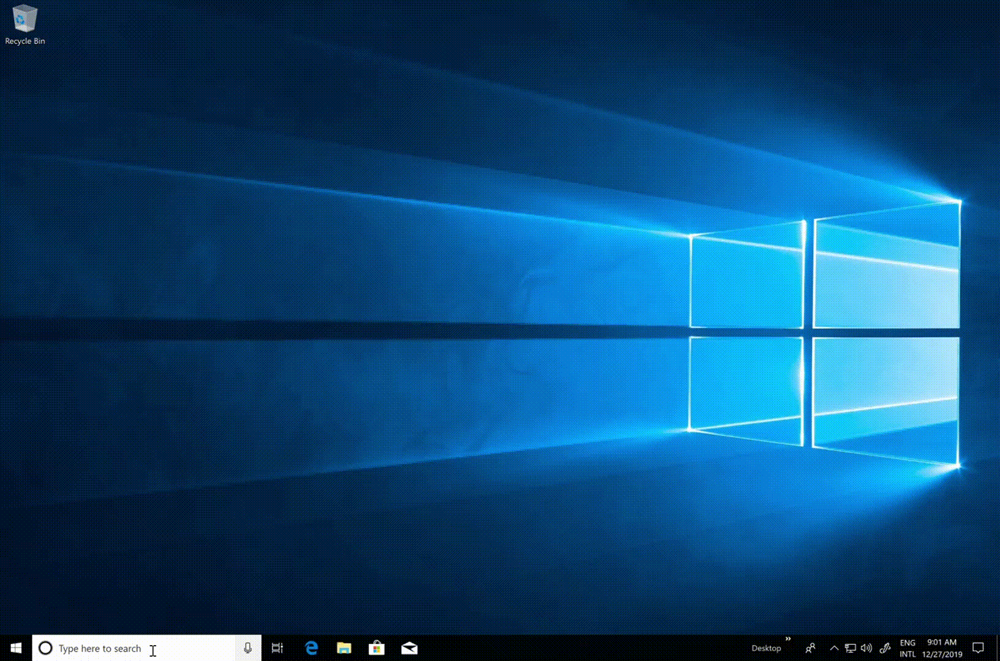
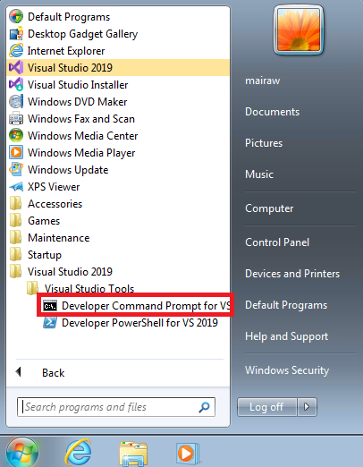
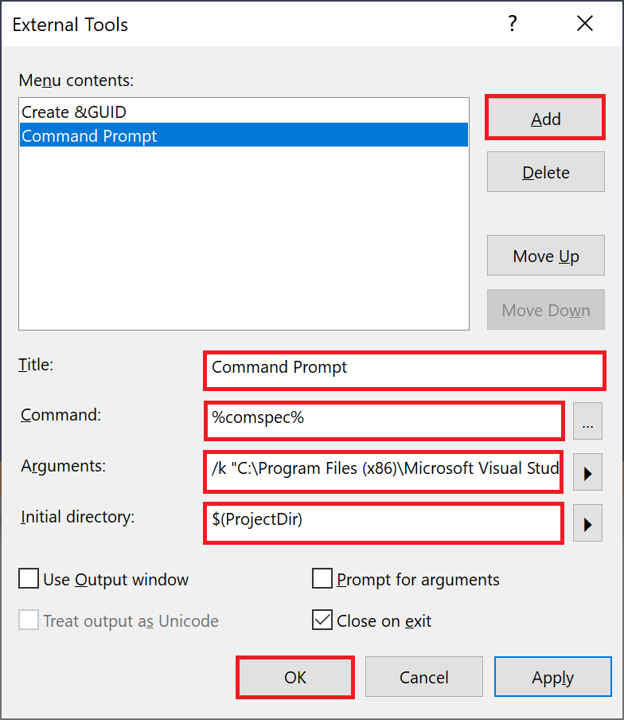
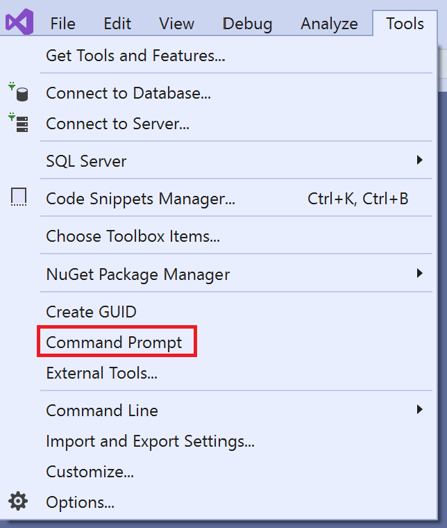

# Developer Command Prompt for Visual Studio

Developer Command Prompt for Visual Studio enables you to use .NET Framework tools more easily. It's a command prompt that automatically sets specific environment variables. After opening Developer Command Prompt, you can enter the commands for [.NET Framework tools](index.md) such as `ildasm` or `clrver`.

## Prerequisites

- [Visual Studio 2019](https://visualstudio.microsoft.com/downloads/?utm_medium=microsoft&utm_source=docs.microsoft.com&utm_campaign=inline+link&utm_content=download+vs2019)

## Search for the command prompt on your machine

You may have multiple command prompts, depending on the version of Visual Studio and any additional SDKs and workloads you've installed. If the following steps don't work, you can try to [manually locate the files on your machine](#manually-locate-the-files-on-your-machine) or [start the command prompt from inside Visual Studio](#start-the-command-prompt-from-inside-visual-studio).

### Windows 10

1. Select **Start**  and scroll to the letter **V**.

1. Expand the **Visual Studio 2019** folder.

1. Choose **Developer Command Prompt for VS 2019** (or the command prompt you want to use).

   Alternatively, you can start typing the name of the command prompt in the search box on the taskbar, and choose the result you want as the result list starts to display the search matches.

   

### Windows 8.1

1. Go to the **Start** screen, by pressing the Windows logo key  on your keyboard for example.

1. On the **Start** screen, press **Ctrl**+**Tab** to open the **Apps** list, and then press **V**. This brings up a list that includes all installed Visual Studio command prompts.

1. Choose **Developer Command Prompt for VS 2019** (or the command prompt you want to use).

### Windows 7

1. Choose **Start** and then expand **All Programs**.

1. Choose **Visual Studio 2019** > **Visual Studio Tools** > **Developer Command Prompt for VS 2019**, or the command prompt you want to use.

   

If you have other SDKs installed, such as the [Windows 10 SDK](https://developer.microsoft.com/windows/downloads/windows-10-sdk) or [previous versions](https://developer.microsoft.com/windows/downloads/sdk-archive), you may see additional command prompts. Check the documentation for the individual tools to determine which version of the command prompt you should use.

## Manually locate the files on your machine

Usually, the shortcuts for the command prompts you have installed are placed at the **Start Menu** folder for Visual Studio, such as in *%ProgramData%\Microsoft\Windows\Start Menu\Programs\Visual Studio 2019\Visual Studio Tools*. But if, for some reason, searching for the command prompt doesn't produce the expected results, you can try to manually locate the shortcut on your machine. Try searching for the name of the command prompt file, such as *VsDevCmd.bat*, or go to the Tools folder, such as *%ProgramFiles(x86)%\Microsoft Visual Studio\2019\Community\Common7\Tools* (path changes according to your Visual Studio version, edition, and installation location).

## Start the command prompt from inside Visual Studio

For easier access, you can add Developer Command Prompt, or any other command prompt, to the Tools menu in Visual Studio. To make the tool available, add it to the external tools list. Here are the steps:

1. Open Visual Studio.

1. On the start window, choose **Continue without code**.

1. On the menu bar, choose **Tools** > **External Tools**.

1. On the **External Tools** dialog box, choose the **Add** button. A new entry appears.

1. Enter a **Title** for your new menu item such as `Command Prompt`.

1. In the **Command** field, specify the file you want to launch, such as `%comspec%` or `C:\Windows\System32\cmd.exe`.

1. In the **Arguments** field, specify where to find the specific command prompt you want to use, such as `/k "C:\Program Files (x86)\Microsoft Visual Studio\2019\Community\Common7\Tools\VsDevCmd.bat"`. This command launches the Developer Command Prompt that's installed with Visual Studio 2019 Community. Change this value according to your Visual Studio version, edition, and installation location.

1. In the **Initial directory** field, specify the directory in which the command prompt will start. Choose a value such as **Project Directory** by selecting the arrow next to the field.

1. Choose the **OK** button.

   

   The new menu item is added, and you can access the command prompt from the Tools menu.

   

## See also

- [.NET Framework Tools](index.md)
- [Managing External Tools](/visualstudio/ide/managing-external-tools)
- [Use the Microsoft C++ toolset from the command line](/cpp/build/building-on-the-command-line)
