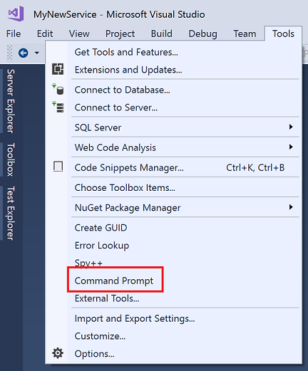

# Developer Command Prompt for Visual Studio

The Developer Command Prompt for Visual Studio enables you to use .NET Framework tools more easily. It is a command prompt that automatically sets specific environment variables.

> [!div class="button"]
> [Download Visual Studio](https://visualstudio.microsoft.com/downloads/?utm_medium=microsoft&utm_source=docs.microsoft.com&utm_campaign=button+cta&utm_content=download+vs2019)

## Search for the command prompt on your machine

You may have multiple command prompts, depending on the version of Visual Studio and any additional SDKs you've installed. For example, 64-bit versions of Visual Studio provide both 32-bit and 64-bit command prompts. (The 32-bit and 64-bit versions of most tools are the same; however, a few tools make changes specific to 32-bit and 64-bit environments.) If the following steps don't work, you can try [Manually locate the files on your machine](#manually-locate-the-files-on-your-machine) or [Run the command prompt from inside Visual Studio](#run-the-command-prompt-from-inside-visual-studio).

### In Windows 10

1. In the search box on the taskbar, start typing the name of the tool, such as `dev` or `developer command prompt`. This brings up a list of installed apps that match your search pattern. If you're looking for a different command prompt, try entering a different search term such as `prompt`.

2. Choose the **Developer Command Prompt for Visual Studio** (or the command prompt you want to use).

### In Windows 8.1

1. Go to the **Start** screen, by pressing the Windows logo key  on your keyboard for example.

2. On the **Start** screen, press **Ctrl**+**Tab** to open the **Apps** list, and then enter `V`. This brings a list that includes all installed Visual Studio command prompts.

3. Choose the **Developer Command Prompt** (or the command prompt you want to use).

### In Windows 8

1. Go to the **Start** screen, by pressing the Windows logo key  on your keyboard for example.

2. On the **Start** screen, press the Windows logo key  `+ Z`.

3. Choose the **Apps view** icon at the bottom of the screen and then enter `V`. This brings a list that includes all installed Visual Studio command prompts.

4. Choose the **Developer Command Prompt** (or the command prompt you want to use).

### In Windows 7

1. Choose **Start**, expand **All Programs**, and then expand **Microsoft Visual Studio**.

2. Depending on the version of Visual Studio you've installed, choose  **Visual Studio Tools**, **Visual Studio Command Prompt**, or the command prompt you want to use.

If you have other SDKs installed, such as the [Windows 10 SDK](https://developer.microsoft.com/windows/downloads/windows-10-sdk) or [previous versions](https://developer.microsoft.com/windows/downloads/sdk-archive), you may see additional command prompts for ARM, x86, or x64 architectures. Check the documentation for the individual tools to determine which version of the command prompt you should use.

## Manually locate the files on your machine

Usually, the shortcuts for the command prompts you have installed are placed at the **Start Menu** folder for Visual Studio, such as in C:\ProgramData\Microsoft\Windows\Start Menu\Programs\Visual Studio 2017\Visual Studio Tools. But if for some reason, searching for the command prompt doesn't bring the expected results, you can try to manually locate the shortcut on your machine. Try searching for the name of the command prompt file, such as *VsDevCmd.bat*, or go to the Tools folder such as C:\Program Files (x86)\Microsoft Visual Studio\2017\Enterprise\Common7\Tools (path changes according to your Visual Studio version, edition, and installation location).

## Run the command prompt from inside Visual Studio

For easier access, you can add the Visual Studio Developer Command Prompt, or any other command prompt, to the **Tools** menu in Visual Studio. To make the tool available, add it to the external tools list. Here are the steps:

1. Open Visual Studio.

2. Select the **Tools** menu, and then choose **External Tools**.

3. On the **External Tools** dialog box, choose the **Add** button. A new entry appears.

4. Enter a **Title** for your new menu item such as `Command Prompt`.

5. In the **Command** field, specify the file you want to launch, such as `%comspec%` or `C:\Windows\System32\cmd.exe`.

6. In the **Arguments** field, specify where to find the specific command prompt you want to use such as `/k "C:\Program Files (x86)\Microsoft Visual Studio\2017\Enterprise\Common7\Tools\VsDevCmd.bat"` (this command launches the Developer Command Prompt that is installed with Visual Studio 2017 Enterprise). Change this value according to your Visual Studio version, edition, and installation location.

7. Choose a value for the **Initial directory** field, such as **Project Directory**.

8. Choose the **OK** button.

   The new menu item is added, and you can access the command prompt from the **Tools** menu.

   

## See also

- [Tools](index.md)
- [Managing External Tools](/visualstudio/ide/managing-external-tools)
