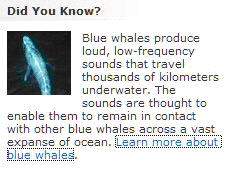

# Access Embedded Objects Using UI Automation
> [!NOTE]
>  This documentation is intended for .NET Framework developers who want to use the managed [!INCLUDE[TLA2#tla_uiautomation](../../../includes/tla2sharptla-uiautomation-md.md)] classes defined in the <xref:System.Windows.Automation> namespace. For the latest information about [!INCLUDE[TLA2#tla_uiautomation](../../../includes/tla2sharptla-uiautomation-md.md)], see [Windows Automation API: UI Automation](http://go.microsoft.com/fwlink/?LinkID=156746).  
  
 This topic shows how [!INCLUDE[TLA#tla_uiautomation](../../../includes/tlasharptla-uiautomation-md.md)] can be used to expose objects embedded within the content of a text control.  
  
> [!NOTE]
>  Embedded objects can include images, hyperlinks, buttons, tables, or ActiveX controls.  
  
 Embedded objects are considered children of the [!INCLUDE[TLA2#tla_uiautomation](../../../includes/tla2sharptla-uiautomation-md.md)] text provider. This allows them to be exposed through the same UI Automation tree structure as all other [!INCLUDE[TLA#tla_ui](../../../includes/tlasharptla-ui-md.md)] elements. Functionality, in turn, is exposed through the control patterns typically required by the embedded objects control type (for example, since hyperlinks are text-based they will support <xref:System.Windows.Automation.TextPattern>).  
  
   
A sample document with textual content, ("Did You Know?"…) and two embedded objects (a picture of a whale and a text hyperlink), used as a target for the code examples.  
  
## Example  
 The following code example demonstrates how to retrieve a collection of embedded objects from within a [!INCLUDE[TLA2#tla_uiautomation](../../../includes/tla2sharptla-uiautomation-md.md)] text provider. For the sample document provided in the introduction, two objects would be returned (an image element and a text element).  
  
> [!NOTE]
>  The image element should have some intrinsic text associated with it that describes the image, typically in its <xref:System.Windows.Automation.AutomationElement.NameProperty> (for example, "A blue whale."). However, when a text range spanning the image object is obtained, neither the image nor this descriptive text is returned in the text stream.  
  
 [!code-csharp[FindText#StartApp](../../../samples/snippets/csharp/VS_Snippets_Wpf/FindText/CSharp/SearchWindow.cs#startapp)]
 [!code-vb[FindText#StartApp](../../../samples/snippets/visualbasic/VS_Snippets_Wpf/FindText/VisualBasic/SearchWindow.vb#startapp)]  
[!code-csharp[FindText#FindTextProvider](../../../samples/snippets/csharp/VS_Snippets_Wpf/FindText/CSharp/SearchWindow.cs#findtextprovider)]
[!code-vb[FindText#FindTextProvider](../../../samples/snippets/visualbasic/VS_Snippets_Wpf/FindText/VisualBasic/SearchWindow.vb#findtextprovider)]  
[!code-csharp[FindText#GetChildren](../../../samples/snippets/csharp/VS_Snippets_Wpf/FindText/CSharp/SearchWindow.cs#getchildren)]
[!code-vb[FindText#GetChildren](../../../samples/snippets/visualbasic/VS_Snippets_Wpf/FindText/VisualBasic/SearchWindow.vb#getchildren)]  
  
## Example  
 The following code example demonstrates how to obtain a text range from an embedded object within a [!INCLUDE[TLA2#tla_uiautomation](../../../includes/tla2sharptla-uiautomation-md.md)] text provider. The text range retrieved is an empty range where the starting endpoint follows "… ocean.(space)" and the ending endpoint precedes the closing "." representing the embedded hyperlink (as shown by the image provided in the introduction). Even though this is an empty range, it is not considered a degenerate range because it has a non-zero span.  
  
> [!NOTE]
>  <xref:System.Windows.Automation.TextPattern> can retrieve a text-based embedded object such as a hyperlink; however, a secondary <xref:System.Windows.Automation.TextPattern> will have to be obtained from the embedded object to expose its full functionality.  
  
 [!code-csharp[UIATextPattern_snip#GetRangeFromChild](../../../samples/snippets/csharp/VS_Snippets_Wpf/UIATextPattern_snip/CSharp/SearchWindow.cs#getrangefromchild)]
 [!code-vb[UIATextPattern_snip#GetRangeFromChild](../../../samples/snippets/visualbasic/VS_Snippets_Wpf/UIATextPattern_snip/VisualBasic/SearchWindow.vb#getrangefromchild)]  
  
## See Also  
 [UI Automation TextPattern Overview](../../../docs/framework/ui-automation/ui-automation-textpattern-overview.md)  
 [UI Automation Control Patterns Overview](../../../docs/framework/ui-automation/ui-automation-control-patterns-overview.md)  
 [UI Automation Control Patterns for Clients](../../../docs/framework/ui-automation/ui-automation-control-patterns-for-clients.md)  
 [Add Content to a Text Box Using UI Automation](../../../docs/framework/ui-automation/add-content-to-a-text-box-using-ui-automation.md)  
 [Find and Highlight Text Using UI Automation](../../../docs/framework/ui-automation/find-and-highlight-text-using-ui-automation.md)
