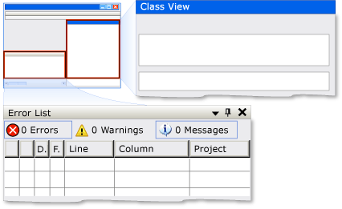

# Implementing the UI Automation Dock Control Pattern
> [!NOTE]
>  This documentation is intended for .NET Framework developers who want to use the managed [!INCLUDE[TLA2#tla_uiautomation](../../../includes/tla2sharptla-uiautomation-md.md)] classes defined in the <xref:System.Windows.Automation> namespace. For the latest information about [!INCLUDE[TLA2#tla_uiautomation](../../../includes/tla2sharptla-uiautomation-md.md)], see [Windows Automation API: UI Automation](http://go.microsoft.com/fwlink/?LinkID=156746).  
  
 This topic introduces guidelines and conventions for implementing <xref:System.Windows.Automation.Provider.IDockProvider>, including information about properties. Links to additional references are listed at the end of the topic.  
  
 The <xref:System.Windows.Automation.DockPattern> control pattern is used to expose the dock properties of a control within a docking container. A docking container is a control that allows you to arrange child elements horizontally and vertically, relative to each other. For examples of controls that implement this control pattern, see [Control Pattern Mapping for UI Automation Clients](../../../docs/framework/ui-automation/control-pattern-mapping-for-ui-automation-clients.md).  
  
   
Docking Example from Visual Studio Where "Class View" Window Is DockPosition.Right and "Error List" Window Is DockPosition.Bottom  
  
   
## Implementation Guidelines and Conventions  
 When implementing the Dock control pattern, note the following guidelines and conventions:  
  
-   <xref:System.Windows.Automation.Provider.IDockProvider> does not expose any properties of the docking container or any properties of controls that are docked adjacent to the current control within the docking container.  
  
-   Controls are docked relative to each other based on their current z-order; the higher their z-order placement, the farther they are placed from the specified edge of the docking container.  
  
-   If the docking container is resized, any docked controls within the container will be repositioned flush to the same edge to which they were originally docked. The docked controls will also resize to fill any space within the container according to the docking behavior of their <xref:System.Windows.Automation.DockPosition>. For example, if <xref:System.Windows.Automation.DockPosition.Top> is specified, the left and right sides of the control will expand to fill any available space. If <xref:System.Windows.Automation.DockPosition.Fill> is specified, all four sides of the control will expand to fill any available space.  
  
-   On a multi-monitor system, controls should dock to the left or right side of the current monitor. If that is not possible, they should dock to the left side of the leftmost monitor or the right side of the rightmost monitor.  
  
   
## Required Members for IDockProvider  
 The following properties and methods are required for implementing the IDockProvider interface.  
  
|Required members|Member type|Notes|  
|----------------------|-----------------|-----------|  
|<xref:System.Windows.Automation.Provider.IDockProvider.DockPosition%2A>|Property|None|  
|<xref:System.Windows.Automation.Provider.IDockProvider.SetDockPosition%2A>|Method|None|  
  
 This control pattern has no associated events.  
  
   
## Exceptions  
 Providers must throw the following exceptions.  
  
|Exception type|Condition|  
|--------------------|---------------|  
|<xref:System.InvalidOperationException>|<xref:System.Windows.Automation.Provider.IDockProvider.SetDockPosition%2A>   -   When a control is not able to execute the requested dock style.|  
  
## See Also  
 [UI Automation Control Patterns Overview](../../../docs/framework/ui-automation/ui-automation-control-patterns-overview.md)  
 [Support Control Patterns in a UI Automation Provider](../../../docs/framework/ui-automation/support-control-patterns-in-a-ui-automation-provider.md)  
 [UI Automation Control Patterns for Clients](../../../docs/framework/ui-automation/ui-automation-control-patterns-for-clients.md)  
 [UI Automation Tree Overview](../../../docs/framework/ui-automation/ui-automation-tree-overview.md)  
 [Use Caching in UI Automation](../../../docs/framework/ui-automation/use-caching-in-ui-automation.md)
