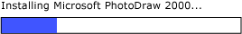

# Implementing the UI Automation RangeValue Control Pattern
> [!NOTE]
>  This documentation is intended for .NET Framework developers who want to use the managed [!INCLUDE[TLA2#tla_uiautomation](../../../includes/tla2sharptla-uiautomation-md.md)] classes defined in the <xref:System.Windows.Automation> namespace. For the latest information about [!INCLUDE[TLA2#tla_uiautomation](../../../includes/tla2sharptla-uiautomation-md.md)], see [Windows Automation API: UI Automation](http://go.microsoft.com/fwlink/?LinkID=156746).  
  
 This topic introduces guidelines and conventions for implementing <xref:System.Windows.Automation.Provider.IRangeValueProvider>, including information about events and properties. Links to additional references are listed at the end of the topic.  
  
 The <xref:System.Windows.Automation.RangeValuePattern> control pattern is used to support controls that can be set to a value within a range. For examples of controls that implement this control pattern, see [Control Pattern Mapping for UI Automation Clients](../../../docs/framework/ui-automation/control-pattern-mapping-for-ui-automation-clients.md).  
  
   
## Implementation Guidelines and Conventions  
 When implementing the Range Value control pattern, note the following guidelines and conventions:  
  
-   Controls allow recalibration of their supported properties based upon locale or user preference. An example of this is a thermometer control that can be set to display the temperature in Fahrenheit or Celsius.  
  
-   Controls that have ambiguous range values, such as progress bars or sliders, should have those values normalized.  
  
   
Example of a Progress Bar Where Value Is of Type Integer and Minimum and Maximum Property Values Are Normalized to 0 and 100, Respectively  
  
   
## Required Members for IRangeValueProvider  
  
|Required member|Member type|Notes|  
|---------------------|-----------------|-----------|  
|<xref:System.Windows.Automation.RangeValuePattern.IsReadOnlyProperty>|Property|None|  
|<xref:System.Windows.Automation.RangeValuePattern.ValueProperty>|Property|None|  
|<xref:System.Windows.Automation.RangeValuePattern.LargeChangeProperty>|Property|None|  
|<xref:System.Windows.Automation.RangeValuePattern.SmallChangeProperty>|Property|None|  
|<xref:System.Windows.Automation.RangeValuePattern.MaximumProperty>|Property|None|  
|<xref:System.Windows.Automation.RangeValuePattern.MinimumProperty>|Property|None|  
|<xref:System.Windows.Automation.RangeValuePattern.SetValue%2A>|Methods|None|  
  
 This control pattern has no associated events.  
  
   
## Exceptions  
 Providers must throw the following exceptions.  
  
|Exception type|Condition|  
|--------------------|---------------|  
|<xref:System.ArgumentOutOfRangeException>|<xref:System.Windows.Automation.RangeValuePattern.SetValue%2A> is called with a value that is either greater than <xref:System.Windows.Automation.RangeValuePattern.MaximumProperty> or less than <xref:System.Windows.Automation.RangeValuePattern.MinimumProperty>.|  
  
## See Also  
 [UI Automation Control Patterns Overview](../../../docs/framework/ui-automation/ui-automation-control-patterns-overview.md)  
 [Support Control Patterns in a UI Automation Provider](../../../docs/framework/ui-automation/support-control-patterns-in-a-ui-automation-provider.md)  
 [UI Automation Control Patterns for Clients](../../../docs/framework/ui-automation/ui-automation-control-patterns-for-clients.md)  
 [UI Automation Tree Overview](../../../docs/framework/ui-automation/ui-automation-tree-overview.md)  
 [Use Caching in UI Automation](../../../docs/framework/ui-automation/use-caching-in-ui-automation.md)
