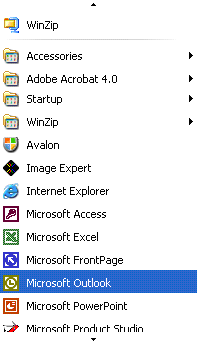

# Implementing the UI Automation Scroll Control Pattern
> [!NOTE]
>  This documentation is intended for .NET Framework developers who want to use the managed [!INCLUDE[TLA2#tla_uiautomation](../../../includes/tla2sharptla-uiautomation-md.md)] classes defined in the <xref:System.Windows.Automation> namespace. For the latest information about [!INCLUDE[TLA2#tla_uiautomation](../../../includes/tla2sharptla-uiautomation-md.md)], see [Windows Automation API: UI Automation](http://go.microsoft.com/fwlink/?LinkID=156746).  
  
 This topic introduces guidelines and conventions for implementing <xref:System.Windows.Automation.Provider.IScrollProvider>, including information about events and properties. Links to additional references are listed at the end of the topic.  
  
 The <xref:System.Windows.Automation.ScrollPattern> control pattern is used to support a control that acts as a scrollable container for a collection of child objects. The control is not required to use scrollbars to support the scrolling functionality, although it commonly does.  
  
   
Example of a Scrolling Control that Does Not Use Scrollbars  
  
 For examples of controls that implement this control, see [Control Pattern Mapping for UI Automation Clients](../../../docs/framework/ui-automation/control-pattern-mapping-for-ui-automation-clients.md).  
  
   
## Implementation Guidelines and Conventions  
 When implementing the Scroll control pattern, note the following guidelines and conventions:  
  
-   The children of this control must implement <xref:System.Windows.Automation.Provider.IScrollItemProvider>.  
  
-   The scrollbars of a container control do not support the <xref:System.Windows.Automation.ScrollPattern> control pattern. They must support the <xref:System.Windows.Automation.RangeValuePattern> control pattern instead.  
  
-   When scrolling is measured in percentages, all values or amounts related to scroll graduation must be normalized to a range of 0 to 100.  
  
-   <xref:System.Windows.Automation.ScrollPatternIdentifiers.HorizontallyScrollableProperty> and <xref:System.Windows.Automation.ScrollPatternIdentifiers.VerticallyScrollableProperty> are independent of the <xref:System.Windows.Automation.AutomationElement.IsEnabledProperty>.  
  
-   If <xref:System.Windows.Automation.ScrollPatternIdentifiers.HorizontallyScrollableProperty> = `false` then <xref:System.Windows.Automation.ScrollPatternIdentifiers.HorizontalViewSizeProperty> should be set to 100% and <xref:System.Windows.Automation.ScrollPatternIdentifiers.HorizontalScrollPercentProperty> should be set to <xref:System.Windows.Automation.ScrollPatternIdentifiers.NoScroll>. Likewise, if <xref:System.Windows.Automation.ScrollPatternIdentifiers.VerticallyScrollableProperty> = `false` then <xref:System.Windows.Automation.ScrollPatternIdentifiers.VerticalViewSizeProperty> should be set to 100 percent and <xref:System.Windows.Automation.ScrollPatternIdentifiers.VerticalScrollPercentProperty> should be set to <xref:System.Windows.Automation.ScrollPatternIdentifiers.NoScroll>. This allows a UI Automation client to use these property values within the <xref:System.Windows.Automation.ScrollPattern.SetScrollPercent%2A> method while avoiding a [race condition](http://support.microsoft.com/default.aspx?scid=kb;en-us;317723) if a direction the client is not interested in scrolling becomes activated.  
  
-   <xref:System.Windows.Automation.Provider.IScrollProvider.HorizontalScrollPercent%2A> is locale-specific. Setting HorizontalScrollPercent = 100.0 must set the scrolling location of the control to the equivalent of its rightmost position for languages such as English that read left to right. Alternately, for languages such as Arabic that read right to left, setting HorizontalScrollPercent = 100.0 must set the scroll location to the leftmost position.  
  
   
## Required Members for IScrollProvider  
 The following properties and methods are required for implementing <xref:System.Windows.Automation.Provider.IScrollProvider>.  
  
|Required member|Member type|Notes|  
|---------------------|-----------------|-----------|  
|<xref:System.Windows.Automation.Provider.IScrollProvider.HorizontalScrollPercent%2A>|Property|None|  
|<xref:System.Windows.Automation.Provider.IScrollProvider.VerticalScrollPercent%2A>|Property|None|  
|<xref:System.Windows.Automation.Provider.IScrollProvider.HorizontalViewSize%2A>|Property|None|  
|<xref:System.Windows.Automation.Provider.IScrollProvider.VerticalViewSize%2A>|Property|None|  
|<xref:System.Windows.Automation.Provider.IScrollProvider.HorizontallyScrollable%2A>|Property|None|  
|<xref:System.Windows.Automation.Provider.IScrollProvider.VerticallyScrollable%2A>|Property|None|  
|<xref:System.Windows.Automation.Provider.IScrollProvider.Scroll%2A>|Method|None|  
|<xref:System.Windows.Automation.Provider.IScrollProvider.SetScrollPercent%2A>|Method|None|  
  
 This control pattern has no associated events.  
  
   
## Exceptions  
 Providers must throw the following exceptions.  
  
|Exception Type|Condition|  
|--------------------|---------------|  
|<xref:System.ArgumentException>|<xref:System.Windows.Automation.Provider.IScrollProvider.Scroll%2A> throws this exception if a control supports <xref:System.Windows.Automation.ScrollAmount.SmallIncrement> values exclusively for horizontal or vertical scrolling, but a <xref:System.Windows.Automation.ScrollAmount.LargeIncrement> value is passed in.|  
|<xref:System.ArgumentException>|<xref:System.Windows.Automation.Provider.IScrollProvider.SetScrollPercent%2A> throws this exception when a value that cannot be converted to a double is passed in.|  
|<xref:System.ArgumentOutOfRangeException>|<xref:System.Windows.Automation.Provider.IScrollProvider.SetScrollPercent%2A> throws this exception when a value greater than 100 or less than 0 is passed in (except -1 which is equivalent to <xref:System.Windows.Automation.ScrollPatternIdentifiers.NoScroll>).|  
|<xref:System.InvalidOperationException>|Both <xref:System.Windows.Automation.Provider.IScrollProvider.Scroll%2A> and <xref:System.Windows.Automation.Provider.IScrollProvider.SetScrollPercent%2A> throw this exception when an attempt is made to scroll in an unsupported direction.|  
  
## See Also  
 [UI Automation Control Patterns Overview](../../../docs/framework/ui-automation/ui-automation-control-patterns-overview.md)  
 [Support Control Patterns in a UI Automation Provider](../../../docs/framework/ui-automation/support-control-patterns-in-a-ui-automation-provider.md)  
 [UI Automation Control Patterns for Clients](../../../docs/framework/ui-automation/ui-automation-control-patterns-for-clients.md)  
 [UI Automation Tree Overview](../../../docs/framework/ui-automation/ui-automation-tree-overview.md)  
 [Use Caching in UI Automation](../../../docs/framework/ui-automation/use-caching-in-ui-automation.md)
