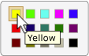

# Implementing the UI Automation Selection Control Pattern
> [!NOTE]
>  This documentation is intended for .NET Framework developers who want to use the managed [!INCLUDE[TLA2#tla_uiautomation](../../../includes/tla2sharptla-uiautomation-md.md)] classes defined in the <xref:System.Windows.Automation> namespace. For the latest information about [!INCLUDE[TLA2#tla_uiautomation](../../../includes/tla2sharptla-uiautomation-md.md)], see [Windows Automation API: UI Automation](http://go.microsoft.com/fwlink/?LinkID=156746).  
  
 This topic introduces guidelines and conventions for implementing <xref:System.Windows.Automation.Provider.ISelectionProvider>, including information about events and properties. Links to additional references are listed at the end of the topic.  
  
 The <xref:System.Windows.Automation.SelectionPattern> control pattern is used to support controls that act as containers for a collection of selectable child items. The children of this element must implement <xref:System.Windows.Automation.Provider.ISelectionItemProvider>. For examples of controls that implement this control pattern, see [Control Pattern Mapping for UI Automation Clients](../../../docs/framework/ui-automation/control-pattern-mapping-for-ui-automation-clients.md).  
  
   
## Implementation Guidelines and Conventions  
 When implementing the Selection control pattern, note the following guidelines and conventions:  
  
-   Controls that implement <xref:System.Windows.Automation.Provider.ISelectionProvider> allow either single or multiple child items to be selected. For example, list box, list view, and tree view support multiple selections whereas combo box, slider, and radio button group support single selection.  
  
-   Controls that have a minimum, maximum, and continuous range, such as the **Volume** slider control, should implement <xref:System.Windows.Automation.Provider.IRangeValueProvider> instead of <xref:System.Windows.Automation.Provider.ISelectionProvider>.  
  
-   Single-selection controls that manage child controls that implement <xref:System.Windows.Automation.Provider.IRawElementProviderFragmentRoot>, such as the **Screen Resolution** slider in the **Display Properties** dialog box or the **Color Picker** selection control from [!INCLUDE[TLA#tla_word](../../../includes/tlasharptla-word-md.md)] (illustrated below), should implement <xref:System.Windows.Automation.Provider.ISelectionProvider>; their children should implement both <xref:System.Windows.Automation.Provider.IRawElementProviderFragment> and <xref:System.Windows.Automation.Provider.ISelectionItemProvider>.  
  
   
Example of Color Swatch String Mapping  
  
-   Menus do not support <xref:System.Windows.Automation.SelectionPattern>. If you are working with menu items that include both graphics and text (such as the **Preview Pane** items in the **View** menu in [!INCLUDE[TLA#tla_outlook](../../../includes/tlasharptla-outlook-md.md)]) and need to convey state, you should implement <xref:System.Windows.Automation.Provider.IToggleProvider>.  
  
   
## Required Members for ISelectionProvider  
 The following properties, methods, and events are required for the <xref:System.Windows.Automation.Provider.ISelectionProvider> interface.  
  
|Required members|Type|Notes|  
|----------------------|----------|-----------|  
|<xref:System.Windows.Automation.Provider.ISelectionProvider.CanSelectMultiple%2A>|Property|Should support property changed events using <xref:System.Windows.Automation.Automation.AddAutomationPropertyChangedEventHandler%2A> and <xref:System.Windows.Automation.Automation.RemoveAutomationPropertyChangedEventHandler%2A>.|  
|<xref:System.Windows.Automation.Provider.ISelectionProvider.IsSelectionRequired%2A>|Property|Should support property changed events using <xref:System.Windows.Automation.Automation.AddAutomationPropertyChangedEventHandler%2A> and <xref:System.Windows.Automation.Automation.RemoveAutomationPropertyChangedEventHandler%2A>.|  
|<xref:System.Windows.Automation.Provider.ISelectionProvider.GetSelection%2A>|Method|None|  
|<xref:System.Windows.Automation.SelectionPatternIdentifiers.InvalidatedEvent>|Event|Raised when a selection in a container has changed significantly and requires sending more addition and removal events than the <xref:System.Windows.Automation.Provider.AutomationInteropProvider.InvalidateLimit> constant permits.|  
  
 The <xref:System.Windows.Automation.Provider.ISelectionProvider.IsSelectionRequired%2A> and <xref:System.Windows.Automation.Provider.ISelectionProvider.CanSelectMultiple%2A> properties can be dynamic. For example, the initial state of a control might not have any items selected by default, indicating that <xref:System.Windows.Automation.Provider.ISelectionProvider.IsSelectionRequired%2A> is `false`. However, after an item is selected, the control must always have at least one item selected. Similarly, in rare cases, a control might allow multiple items to be selected on initialization, but subsequently allow only single selections to be made.  
  
   
## Exceptions  
 Providers must throw the following exceptions.  
  
|Exception Type|Condition|  
|--------------------|---------------|  
|<xref:System.Windows.Automation.ElementNotEnabledException>|If the control is not enabled.|  
|<xref:System.InvalidOperationException>|If the control is hidden.|  
  
## See Also  
 [UI Automation Control Patterns Overview](../../../docs/framework/ui-automation/ui-automation-control-patterns-overview.md)  
 [Support Control Patterns in a UI Automation Provider](../../../docs/framework/ui-automation/support-control-patterns-in-a-ui-automation-provider.md)  
 [UI Automation Control Patterns for Clients](../../../docs/framework/ui-automation/ui-automation-control-patterns-for-clients.md)  
 [Implementing the UI Automation SelectionItem Control Pattern](../../../docs/framework/ui-automation/implementing-the-ui-automation-selectionitem-control-pattern.md)  
 [UI Automation Tree Overview](../../../docs/framework/ui-automation/ui-automation-tree-overview.md)  
 [Use Caching in UI Automation](../../../docs/framework/ui-automation/use-caching-in-ui-automation.md)
