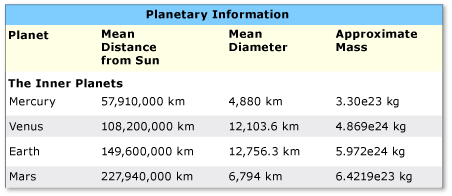
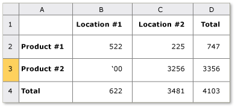

# Implementing the UI Automation Table Control Pattern

> [!NOTE]
> This documentation is intended for .NET Framework developers who want to use the managed UI Automation classes defined in the <xref:System.Windows.Automation> namespace. For the latest information about UI Automation, see [Windows Automation API: UI Automation](/windows/win32/winauto/entry-uiauto-win32).

 This topic introduces guidelines and conventions for implementing <xref:System.Windows.Automation.Provider.ITableProvider>, including information about properties, methods, and events. Links to additional references are listed at the end of the overview.

 The <xref:System.Windows.Automation.TablePattern> control pattern is used to support controls that act as containers for a collection of child elements. The children of this element must implement <xref:System.Windows.Automation.Provider.ITableItemProvider> and be organized in a two-dimensional logical coordinate system that can be traversed by row and column. This control pattern is analogous to <xref:System.Windows.Automation.Provider.IGridProvider>, with the distinction that any control implementing <xref:System.Windows.Automation.Provider.ITableProvider> must also expose a column and/or row header relationship for each child element. For examples of controls that implement this control pattern, see [Control Pattern Mapping for UI Automation Clients](control-pattern-mapping-for-ui-automation-clients.md).

## Implementation Guidelines and Conventions

 When implementing the Table control pattern, note the following guidelines and conventions:

- Access to the content of individual cells is through a two-dimensional logical coordinate system or array provided by the required concurrent implementation of <xref:System.Windows.Automation.Provider.IGridProvider>.

- A column or row header can be contained within a table object or be a separate header object that is associated with a table object.

- Column and row headers may include both a primary header as well as any supporting headers.

> [!NOTE]
> This concept becomes evident in a Microsoft Excel spreadsheet where a user has defined a "First name" column. This column now has two headers—the "First name" header defined by the user and the alphanumeric designation for that column assigned by the application.

- See [Implementing the UI Automation Grid Control Pattern](implementing-the-ui-automation-grid-control-pattern.md) for related grid functionality.

 
Example of a Table with Complex Column Headers

 
Example of a Table with Ambiguous RowOrColumnMajor Property

## Required Members for ITableProvider

 The following properties and methods are required for the ITableProvider interface.

|Required members|Member type|Notes|
|----------------------|-----------------|-----------|
|<xref:System.Windows.Automation.Provider.ITableProvider.RowOrColumnMajor%2A>|Property|None|
|<xref:System.Windows.Automation.Provider.ITableProvider.GetColumnHeaders%2A>|Method|None|
|<xref:System.Windows.Automation.Provider.ITableProvider.GetRowHeaders%2A>|Method|None|

 This control pattern has no associated events.

## Exceptions

 This control pattern has no associated exceptions.

## See also

- [UI Automation Control Patterns Overview](ui-automation-control-patterns-overview.md)
- [Support Control Patterns in a UI Automation Provider](support-control-patterns-in-a-ui-automation-provider.md)
- [UI Automation Control Patterns for Clients](ui-automation-control-patterns-for-clients.md)
- [Implementing the UI Automation TableItem Control Pattern](implementing-the-ui-automation-tableitem-control-pattern.md)
- [Implementing the UI Automation Grid Control Pattern](implementing-the-ui-automation-grid-control-pattern.md)
- [UI Automation Tree Overview](ui-automation-tree-overview.md)
- [Use Caching in UI Automation](use-caching-in-ui-automation.md)
