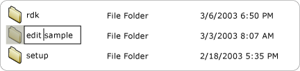
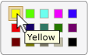

# Implementing the UI Automation Value Control Pattern
> [!NOTE]
>  This documentation is intended for .NET Framework developers who want to use the managed [!INCLUDE[TLA2#tla_uiautomation](../../../includes/tla2sharptla-uiautomation-md.md)] classes defined in the <xref:System.Windows.Automation> namespace. For the latest information about [!INCLUDE[TLA2#tla_uiautomation](../../../includes/tla2sharptla-uiautomation-md.md)], see [Windows Automation API: UI Automation](http://go.microsoft.com/fwlink/?LinkID=156746).  
  
 This topic introduces guidelines and conventions for implementing <xref:System.Windows.Automation.Provider.IValueProvider>, including information on events and properties. Links to additional references are listed at the end of the topic.  
  
 The <xref:System.Windows.Automation.ValuePattern> control pattern is used to support controls that have an intrinsic value not spanning a range and that can be represented as a string. This string can be editable, depending on the control and its settings. For examples of controls that implement this pattern, see [Control Pattern Mapping for UI Automation Clients](../../../docs/framework/ui-automation/control-pattern-mapping-for-ui-automation-clients.md).  
  
   
## Implementation Guidelines and Conventions  
 When implementing the Value control pattern, note the following guidelines and conventions:  
  
-   Controls such as <xref:System.Windows.Automation.ControlType.ListItem> and <xref:System.Windows.Automation.ControlType.TreeItem> must support <xref:System.Windows.Automation.ValuePattern> if the value of any of the items is editable, regardless of the current edit mode of the control. The parent control must also support <xref:System.Windows.Automation.ValuePattern> if the child items are editable.  
  
   
Example of an Editable List Item  
  
-   Single-line edit controls support programmatic access to their contents by implementing <xref:System.Windows.Automation.Provider.IValueProvider>. However, multi-line edit controls do not implement <xref:System.Windows.Automation.Provider.IValueProvider>; instead they provide access to their content by implementing <xref:System.Windows.Automation.Provider.ITextProvider>.  
  
-   To retrieve the textual contents of a multi-line edit control, the control must implement <xref:System.Windows.Automation.Provider.ITextProvider>. However, <xref:System.Windows.Automation.Provider.ITextProvider> does not support setting the value of a control.  
  
-   <xref:System.Windows.Automation.Provider.IValueProvider> does not support the retrieval of formatting information or substring values. Implement <xref:System.Windows.Automation.Provider.ITextProvider> in these scenarios.  
  
-   <xref:System.Windows.Automation.Provider.IValueProvider> must be implemented by controls such as the **Color Picker** selection control from [!INCLUDE[TLA#tla_word](../../../includes/tlasharptla-word-md.md)] (illustrated below), which supports string mapping between a color value (for example, "yellow") and an equivalent internal [!INCLUDE[TLA#tla_rgb](../../../includes/tlasharptla-rgb-md.md)] structure.  
  
   
Example of Color Swatch String Mapping  
  
-   A control should have its <xref:System.Windows.Automation.AutomationElement.IsEnabledProperty> set to `true` and its <xref:System.Windows.Automation.ValuePattern.IsReadOnlyProperty> set to `false` before allowing a call to <xref:System.Windows.Automation.Provider.IValueProvider.SetValue%2A>.  
  
   
## Required Members for IValueProvider  
 The following properties and methods are required for implementing <xref:System.Windows.Automation.Provider.IValueProvider>.  
  
|Required members|Member type|Notes|  
|----------------------|-----------------|-----------|  
|<xref:System.Windows.Automation.ValuePattern.IsReadOnlyProperty>|Property|None|  
|<xref:System.Windows.Automation.ValuePattern.ValueProperty>|Property|None|  
|<xref:System.Windows.Automation.ValuePattern.SetValue%2A>|Method|None|  
  
   
## Exceptions  
 Providers must throw the following exceptions.  
  
|Exception type|Condition|  
|--------------------|---------------|  
|<xref:System.InvalidOperationException>|<xref:System.Windows.Automation.ValuePattern.SetValue%2A>   -   If locale-specific information is passed to a control in an incorrect format such as an incorrectly formatted date.|  
|<xref:System.ArgumentException>|<xref:System.Windows.Automation.ValuePattern.SetValue%2A>   -   If a new value cannot be converted from a string to a format the control recognizes.|  
|<xref:System.Windows.Automation.ElementNotEnabledException>|<xref:System.Windows.Automation.ValuePattern.SetValue%2A>   -   When an attempt is made to manipulate a control that is not enabled.|  
  
## See Also  
 [UI Automation Control Patterns Overview](../../../docs/framework/ui-automation/ui-automation-control-patterns-overview.md)  
 [Support Control Patterns in a UI Automation Provider](../../../docs/framework/ui-automation/support-control-patterns-in-a-ui-automation-provider.md)  
 [UI Automation Control Patterns for Clients](../../../docs/framework/ui-automation/ui-automation-control-patterns-for-clients.md)  
 [TextPattern Insert Text Sample](http://msdn.microsoft.com/library/67353f93-7ee2-42f2-ab76-5c078cf6ca16)  
 [UI Automation Tree Overview](../../../docs/framework/ui-automation/ui-automation-tree-overview.md)  
 [Use Caching in UI Automation](../../../docs/framework/ui-automation/use-caching-in-ui-automation.md)
