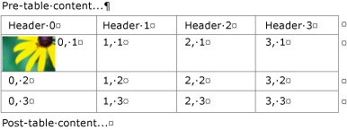
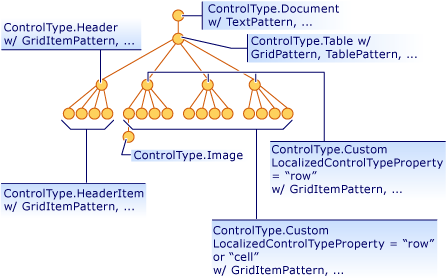
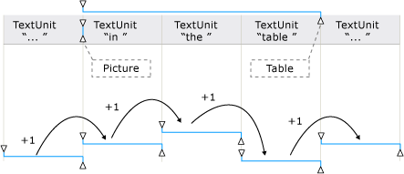
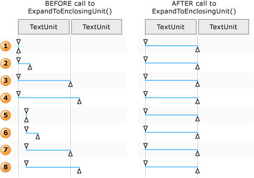

# TextPattern and Embedded Objects Overview
> [!NOTE]
>  This documentation is intended for .NET Framework developers who want to use the managed [!INCLUDE[TLA2#tla_uiautomation](../../../includes/tla2sharptla-uiautomation-md.md)] classes defined in the <xref:System.Windows.Automation> namespace. For the latest information about [!INCLUDE[TLA2#tla_uiautomation](../../../includes/tla2sharptla-uiautomation-md.md)], see [Windows Automation API: UI Automation](http://go.microsoft.com/fwlink/?LinkID=156746).  
  
 This overview describes how [!INCLUDE[TLA#tla_uiautomation](../../../includes/tlasharptla-uiautomation-md.md)] exposes embedded objects, or child elements, within a text document or container.  
  
 In [!INCLUDE[TLA2#tla_uiautomation](../../../includes/tla2sharptla-uiautomation-md.md)] an embedded object is any element that has non-textual boundaries; for example, an image, hyperlink, table, or document type such as an [!INCLUDE[TLA#tla_xl](../../../includes/tlasharptla-xl-md.md)] spreadsheet or [!INCLUDE[TLA#tla_winmedia](../../../includes/tlasharptla-winmedia-md.md)] file. This differs from the standard definition, where an element is created in one application and embedded, or linked, within another. Whether the object can be edited within its original application is irrelevant in the context of [!INCLUDE[TLA2#tla_uiautomation](../../../includes/tla2sharptla-uiautomation-md.md)].  
  
   
## Embedded Objects and the UI Automation Tree  
 Embedded objects are treated as individual elements within the control view of the [!INCLUDE[TLA2#tla_uiautomation](../../../includes/tla2sharptla-uiautomation-md.md)] tree. They are exposed as children of the text container so that they can be accessed through the same model as other controls in [!INCLUDE[TLA2#tla_uiautomation](../../../includes/tla2sharptla-uiautomation-md.md)].  
  
   
Example of a Text Container with Table, Image, and Hyperlink Embedded Objects  
  
   
Example of the Content View for a Portion of the Preceding Text Container  
  
   
## Expose Embedded Objects Using TextPattern and TextPatternRange  
 Used in conjunction, the <xref:System.Windows.Automation.TextPattern> control pattern class and the <xref:System.Windows.Automation.Text.TextPatternRange> class expose methods and properties that facilitate navigation and querying of embedded objects.  
  
 The textual content (or inner text) of a text container and an embedded object, such as a hyperlink or table cell, is exposed as a single, continuous text stream in both the control view and the content view of the [!INCLUDE[TLA2#tla_uiautomation](../../../includes/tla2sharptla-uiautomation-md.md)] tree; object boundaries are ignored. If a UI Automation client is retrieving the text for the purpose of reciting, interpreting, or analyzing in some manner, the text range should be checked for special cases, such as a table with textual content or other embedded objects. This can be accomplished by calling <xref:System.Windows.Automation.Text.TextPatternRange.GetChildren%2A> to obtain an <xref:System.Windows.Automation.AutomationElement> for each embedded object and then calling <xref:System.Windows.Automation.TextPattern.RangeFromChild%2A> to obtain a text range for each element. This is done recursively until all textual content has been retrieved.  
  
   
Example of a text stream with embedded objects and their range spans  
  
 When it is necessary to traverse the content of a text range, a series of steps are involved behind the scenes in order for the <xref:System.Windows.Automation.Text.TextPatternRange.Move%2A> method to execute successfully.  
  
1.  The text range is normalized; that is, the text range is collapsed to a degenerate range at the <xref:System.Windows.Automation.Text.TextPatternRangeEndpoint.Start> endpoint, which makes the <xref:System.Windows.Automation.Text.TextPatternRangeEndpoint.End> endpoint superfluous. This step is necessary to remove ambiguity in situations where a text range spans <xref:System.Windows.Automation.Text.TextUnit> boundaries: for example, "{The U}RL [http://www.microsoft.com](http://www.microsoft.com) is embedded in text" where "{" and "}" are the text range endpoints.  
  
2.  The resulting range is moved backward in the <xref:System.Windows.Automation.TextPattern.DocumentRange%2A> to the beginning of the requested <xref:System.Windows.Automation.Text.TextUnit> boundary.  
  
3.  The range is moved forward or backward in the <xref:System.Windows.Automation.TextPattern.DocumentRange%2A> by the requested number of <xref:System.Windows.Automation.Text.TextUnit> boundaries.  
  
4.  The range is then expanded from a degenerate range state by moving the <xref:System.Windows.Automation.Text.TextPatternRangeEndpoint.End> endpoint by one requested <xref:System.Windows.Automation.Text.TextUnit> boundary.  
  
   
Examples of how a text range is adjusted for Move() and ExpandToEnclosingUnit()  
  
   
## Common Scenarios  
 The following sections present examples of the most common scenarios that involve embedded objects.  
  
 Legend for the examples shown:  
  
 { = <xref:System.Windows.Automation.Text.TextPatternRangeEndpoint.Start>  
  
 } = <xref:System.Windows.Automation.Text.TextPatternRangeEndpoint.End>  
  
   
### Hyperlink  
 **Example 1 - A text range that contains an embedded text hyperlink**  
  
 {The URL [http://www.microsoft.com](http://www.microsoft.com) is embedded in text}.  
  
|Method called|Result|  
|-------------------|------------|  
|<xref:System.Windows.Automation.Text.TextPatternRange.GetText%2A>|Returns the string "The URL http://www.microsoft.com is embedded in text".|  
|<xref:System.Windows.Automation.Text.TextPatternRange.GetEnclosingElement%2A>|Returns the innermost <xref:System.Windows.Automation.AutomationElement> that encloses the text range; in this case, the <xref:System.Windows.Automation.AutomationElement> that represents the text provider itself.|  
|<xref:System.Windows.Automation.Text.TextPatternRange.GetChildren%2A>|Returns an <xref:System.Windows.Automation.AutomationElement> representing the hyperlink control.|  
|<xref:System.Windows.Automation.TextPattern.RangeFromChild%2A> where <xref:System.Windows.Automation.AutomationElement> is the object returned by the previous `GetChildren` method.|Returns the range that represents "http://www.microsoft.com".|  
  
 **Example 2 - A text range that partially spans an embedded text hyperlink**  
  
 The URL http://{[www]} is embedded in text.  
  
|Method called|Result|  
|-------------------|------------|  
|<xref:System.Windows.Automation.Text.TextPatternRange.GetText%2A>|Returns the string "www".|  
|<xref:System.Windows.Automation.Text.TextPatternRange.GetEnclosingElement%2A>|Returns the innermost <xref:System.Windows.Automation.AutomationElement> that encloses the text range; in this case, the hyperlink control.|  
|<xref:System.Windows.Automation.Text.TextPatternRange.GetChildren%2A>|Returns `null` since the text range doesn't span the entire URL string.|  
  
 **Example 3 - A text range that partially spans the content of a text container. The text container has an embedded text hyperlink that is not part of the text range.**  
  
 {The URL} [http://www.microsoft.com](http://www.microsoft.com) is embedded in text.  
  
|Method called|Result|  
|-------------------|------------|  
|<xref:System.Windows.Automation.Text.TextPatternRange.GetText%2A>|Returns the string "The URL".|  
|<xref:System.Windows.Automation.Text.TextPatternRange.GetEnclosingElement%2A>|Returns the innermost <xref:System.Windows.Automation.AutomationElement> that encloses the text range; in this case, the <xref:System.Windows.Automation.AutomationElement> that represents the text provider itself.|  
|<xref:System.Windows.Automation.Text.TextPatternRange.Move%2A> with parameters of (TextUnit.Word, 1).|Moves the text range span to "http" since the text of the hyperlink is comprised of individual words. In this case, the hyperlink is not treated as a single object.   The URL {[http]} is embedded in text.|  
  
   
### Image  
 **Example 1 - A text range that contains an embedded image**  
  
 {The image  is embedded in text}.  
  
|Method called|Result|  
|-------------------|------------|  
|<xref:System.Windows.Automation.Text.TextPatternRange.GetText%2A>|Returns the string "The is embedded in text". Any ALT text associated with the image cannot be expected to be included in the text stream.|  
|<xref:System.Windows.Automation.Text.TextPatternRange.GetEnclosingElement%2A>|Returns the innermost <xref:System.Windows.Automation.AutomationElement> that encloses the text range; in this case, the <xref:System.Windows.Automation.AutomationElement> that represents the text provider itself.|  
|<xref:System.Windows.Automation.Text.TextPatternRange.GetChildren%2A>|Returns an <xref:System.Windows.Automation.AutomationElement> representing the image control.|  
|<xref:System.Windows.Automation.TextPattern.RangeFromChild%2A> where <xref:System.Windows.Automation.AutomationElement> is the object returned by the previous <xref:System.Windows.Automation.Text.TextPatternRange.GetChildren%2A> method.|Returns the degenerate range that represents "".|  
  
 **Example 2 - A text range that partially spans the content of a text container. The text container has an embedded image that is not part of the text range.**  
  
 {The image}  is embedded in text.  
  
|Method called|Result|  
|-------------------|------------|  
|<xref:System.Windows.Automation.Text.TextPatternRange.GetText%2A>|Returns the string "The image".|  
|<xref:System.Windows.Automation.Text.TextPatternRange.GetEnclosingElement%2A>|Returns the innermost <xref:System.Windows.Automation.AutomationElement> that encloses the text range; in this case, the <xref:System.Windows.Automation.AutomationElement> that represents the text provider itself.|  
|<xref:System.Windows.Automation.Text.TextPatternRange.Move%2A> with parameters of (TextUnit.Word, 1).|Moves the text range span to "is ". Because only text-based embedded objects are considered part of the text stream, the image in this example does not affect Move or its return value (1 in this case).|  
  
   
### Table  
  
### Table used for examples  
  
|Cell with Image|Cell with Text|  
|---------------------|--------------------|  
||X|  
||Y|  
|   Image for Z|Z|  
  
 **Example 1 - Get the text container from the content of a cell.**  
  
|Method Called|Result|  
|-------------------|------------|  
|<xref:System.Windows.Automation.GridPattern.GetItem%2A> with parameters (0,0)|Returns the <xref:System.Windows.Automation.AutomationElement> representing the content of the table cell; in this case, the element is a text control.|  
|<xref:System.Windows.Automation.TextPattern.RangeFromChild%2A> where <xref:System.Windows.Automation.AutomationElement> is the object returned by the previous `GetItem` method.|Returns the range that spans the image .|  
|<xref:System.Windows.Automation.Text.TextPatternRange.GetEnclosingElement%2A> for the object returned by the previous `RangeFromChild` method.|Returns the <xref:System.Windows.Automation.AutomationElement> representing the table cell; in this case, the element is a text control that supports TableItemPattern.|  
|<xref:System.Windows.Automation.Text.TextPatternRange.GetEnclosingElement%2A> for the object returned by the previous `GetEnclosingElement` method.|Returns the <xref:System.Windows.Automation.AutomationElement> representing the table.|  
|<xref:System.Windows.Automation.Text.TextPatternRange.GetEnclosingElement%2A> for the object returned by the previous `GetEnclosingElement` method.|Returns the <xref:System.Windows.Automation.AutomationElement> that represents the text provider itself.|  
  
 **Example 2 - Get the text content of a cell.**  
  
|Method Called|Result|  
|-------------------|------------|  
|<xref:System.Windows.Automation.GridPattern.GetItem%2A> with parameters of (1,1).|Returns the <xref:System.Windows.Automation.AutomationElement> representing the content of the table cell; in this case, the element is a text control.|  
|<xref:System.Windows.Automation.TextPattern.RangeFromChild%2A> where <xref:System.Windows.Automation.AutomationElement> is the object returned by the previous `GetItem` method.|Returns "Y".|  
  
## See Also  
 <xref:System.Windows.Automation.TextPattern>  
 <xref:System.Windows.Automation.Text.TextPatternRange>  
 <xref:System.Windows.Automation.Provider.ITextProvider>  
 <xref:System.Windows.Automation.Provider.ITextRangeProvider>  
 [Access Embedded Objects Using UI Automation](../../../docs/framework/ui-automation/access-embedded-objects-using-ui-automation.md)  
 [Expose the Content of a Table Using UI Automation](../../../docs/framework/ui-automation/expose-the-content-of-a-table-using-ui-automation.md)  
 [Traverse Text Using UI Automation](../../../docs/framework/ui-automation/traverse-text-using-ui-automation.md)  
 [TextPattern Search and Selection Sample](http://msdn.microsoft.com/library/0a3bca57-8b72-489d-a57c-da85b7a22c7f)
