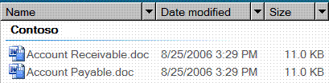

# UI Automation Support for the DataGrid Control Type
> [!NOTE]
>  This documentation is intended for .NET Framework developers who want to use the managed [!INCLUDE[TLA2#tla_uiautomation](../../../includes/tla2sharptla-uiautomation-md.md)] classes defined in the <xref:System.Windows.Automation> namespace. For the latest information about [!INCLUDE[TLA2#tla_uiautomation](../../../includes/tla2sharptla-uiautomation-md.md)], see [Windows Automation API: UI Automation](http://go.microsoft.com/fwlink/?LinkID=156746).  
  
 This topic provides information about [!INCLUDE[TLA#tla_uiautomation](../../../includes/tlasharptla-uiautomation-md.md)] support for the DataGrid control type. In [!INCLUDE[TLA2#tla_uiautomation](../../../includes/tla2sharptla-uiautomation-md.md)], a control type is a set of conditions that a control must meet in order to use the `ControlType` property. The conditions include specific guidelines for [!INCLUDE[TLA2#tla_uiautomation](../../../includes/tla2sharptla-uiautomation-md.md)] tree structure, [!INCLUDE[TLA2#tla_uiautomation](../../../includes/tla2sharptla-uiautomation-md.md)] property values and control patterns.  
  
 The DataGrid control type lets a user easily work with items that contain metadata represented in columns. Data grid controls have rows of items and columns of information about those items. A List View control in Microsoft Vista Explorer is an example that supports the DataGrid control type.  
  
 The following sections define the required [!INCLUDE[TLA2#tla_uiautomation](../../../includes/tla2sharptla-uiautomation-md.md)] tree structure, properties, control patterns, and events for the DataGrid control type. The [!INCLUDE[TLA2#tla_uiautomation](../../../includes/tla2sharptla-uiautomation-md.md)] requirements apply to all data grid controls, whether [!INCLUDE[TLA#tla_winclient](../../../includes/tlasharptla-winclient-md.md)], [!INCLUDE[TLA#tla_win32](../../../includes/tlasharptla-win32-md.md)], or [!INCLUDE[TLA#tla_winforms](../../../includes/tlasharptla-winforms-md.md)].  
  
   
## Required UI Automation Tree Structure  
 The following table depicts the control view and the content view of the [!INCLUDE[TLA2#tla_uiautomation](../../../includes/tla2sharptla-uiautomation-md.md)] tree that pertains to data grid controls and describes what can be contained in each view. For more information about the [!INCLUDE[TLA2#tla_uiautomation](../../../includes/tla2sharptla-uiautomation-md.md)] tree, see [UI Automation Tree Overview](../../../docs/framework/ui-automation/ui-automation-tree-overview.md).  
  
|[!INCLUDE[TLA2#tla_uiautomation](../../../includes/tla2sharptla-uiautomation-md.md)] Tree - Control View|[!INCLUDE[TLA2#tla_uiautomation](../../../includes/tla2sharptla-uiautomation-md.md)] Tree - Content View|  
|------------------------------------------------------------------------------------------------|------------------------------------------------------------------------------------------------|  
|DataGrid   <ul><li>Header (0, 1, or 2)   <ul><li>HeaderItem (number of columns or rows)</li></ul></li><li>DataItem (0 or more; can be structured in hierarchy)</li></ul>|DataGrid   -   DataItem (0 or more; can be structured in hierarchy)|  
  
   
## Required UI Automation Properties  
 The following table lists the properties whose value or definition is especially relevant to data grid controls. For more information on [!INCLUDE[TLA2#tla_uiautomation](../../../includes/tla2sharptla-uiautomation-md.md)] properties, see [UI Automation Properties for Clients](../../../docs/framework/ui-automation/ui-automation-properties-for-clients.md).  
  
|Property|Value|Notes|  
|--------------|-----------|-----------|  
|<xref:System.Windows.Automation.AutomationElementIdentifiers.AutomationIdProperty>|See notes.|The value of this property needs to be unique across all controls in an application.|  
|<xref:System.Windows.Automation.AutomationElementIdentifiers.BoundingRectangleProperty>|See notes.|The outermost rectangle that contains the whole control.|  
|<xref:System.Windows.Automation.AutomationElementIdentifiers.ClickablePointProperty>|See notes.|Supported if there is a bounding rectangle. If not every point within the bounding rectangle is clickable, and you perform specialized hit testing, then override and provide a clickable point.|  
|<xref:System.Windows.Automation.AutomationElementIdentifiers.ControlTypeProperty>|DataGrid|This value is the same for all UI frameworks.|  
|<xref:System.Windows.Automation.AutomationElementIdentifiers.IsContentElementProperty>|True|The value of this property must always be True. This means that the data grid control must always be in the content view of the [!INCLUDE[TLA2#tla_uiautomation](../../../includes/tla2sharptla-uiautomation-md.md)] tree.|  
|<xref:System.Windows.Automation.AutomationElementIdentifiers.IsControlElementProperty>|True|The value of this property must always be True. This means that the data grid control must always be in the control view of the [!INCLUDE[TLA2#tla_uiautomation](../../../includes/tla2sharptla-uiautomation-md.md)] tree.|  
|<xref:System.Windows.Automation.AutomationElementIdentifiers.IsKeyboardFocusableProperty>|See notes.|If the control can receive keyboard focus, it must support this property.|  
|<xref:System.Windows.Automation.AutomationElementIdentifiers.LabeledByProperty>|See notes.|If there is a static text label then this property must expose a reference to that control.|  
|<xref:System.Windows.Automation.AutomationElementIdentifiers.LocalizedControlTypeProperty>|"data grid"|Localized string corresponding to the DataGrid control type.|  
|<xref:System.Windows.Automation.AutomationElementIdentifiers.NameProperty>|See notes.|The data grid control typically gets the value for its `Name` property from a static text label. If there is not a static text label an application developer must assign a value to for the `Name` property. The value of the `Name` property must never be the textual contents of the edit control.|  
  
   
## Required UI Automation Control Patterns  
 The following table lists the control patterns required to be supported by all data grid controls. For more information about control patterns, see [UI Automation Control Patterns Overview](../../../docs/framework/ui-automation/ui-automation-control-patterns-overview.md).  
  
|Control Pattern|Support|Notes|  
|---------------------|-------------|-----------|  
|<xref:System.Windows.Automation.Provider.IGridProvider>|Yes|The data grid control itself always supports the Grid control pattern because the items that it contains metadata that is laid out in a grid.|  
|<xref:System.Windows.Automation.Provider.IScrollProvider>|Depends|The ability to scroll the data grid depends on content and whether scroll bars are present.|  
|<xref:System.Windows.Automation.Provider.ISelectionProvider>|Depends|The ability to select the data grid depends on content.|  
|<xref:System.Windows.Automation.Provider.ITableProvider>|Yes|The data grid control always has a header within its subtree so the Table control pattern must be supported.|  
  
 Data items within the data grid containers will support at a minimum:  
  
-   Selection Item control pattern (if the data grid is selectable)  
  
-   Scroll Item control pattern (if the data grid is scrollable)  
  
-   Grid Item control pattern  
  
-   Table Item control pattern  
  
   
## Required UI Automation Events  
 The following table lists the [!INCLUDE[TLA2#tla_uiautomation](../../../includes/tla2sharptla-uiautomation-md.md)] events required to be supported by all data grid controls. For more information about events, see [UI Automation Events Overview](../../../docs/framework/ui-automation/ui-automation-events-overview.md).  
  
|[!INCLUDE[TLA2#tla_uiautomation](../../../includes/tla2sharptla-uiautomation-md.md)] Event|Support|Notes|  
|---------------------------------------------------------------------------------|-------------|-----------|  
|<xref:System.Windows.Automation.AutomationElementIdentifiers.AutomationFocusChangedEvent>|Required|None|  
|<xref:System.Windows.Automation.AutomationElementIdentifiers.BoundingRectangleProperty> property-changed event.|Required|None|  
|<xref:System.Windows.Automation.AutomationElementIdentifiers.IsEnabledProperty> property-changed event.|Required|None|  
|<xref:System.Windows.Automation.AutomationElementIdentifiers.IsOffscreenProperty> property-changed event.|Required|None|  
|<xref:System.Windows.Automation.AutomationElementIdentifiers.LayoutInvalidatedEvent>|Depends|None|  
|<xref:System.Windows.Automation.AutomationElementIdentifiers.StructureChangedEvent>|Required|None|  
|<xref:System.Windows.Automation.MultipleViewPatternIdentifiers.CurrentViewProperty> property-changed event.|Depends|None|  
|<xref:System.Windows.Automation.ScrollPatternIdentifiers.HorizontallyScrollableProperty> property-changed event.|Depends|If the control supports the Scroll pattern, it must support this event.|  
|<xref:System.Windows.Automation.ScrollPatternIdentifiers.HorizontalScrollPercentProperty> property-changed event.|Depends|If the control supports the Scroll pattern, it must support this event.|  
|<xref:System.Windows.Automation.ScrollPatternIdentifiers.HorizontalViewSizeProperty> property-changed event.|Depends|If the control supports the Scroll pattern, it must support this event.|  
|<xref:System.Windows.Automation.ScrollPatternIdentifiers.VerticalScrollPercentProperty> property-changed event.|Depends|If the control supports the Scroll pattern, it must support this event.|  
|<xref:System.Windows.Automation.ScrollPatternIdentifiers.VerticallyScrollableProperty> property-changed event.|Depends|If the control supports the Scroll pattern, it must support this event.|  
|<xref:System.Windows.Automation.ScrollPatternIdentifiers.VerticalViewSizeProperty> property-changed event.|Depends|If the control supports the Scroll pattern, it must support this event.|  
|<xref:System.Windows.Automation.SelectionPatternIdentifiers.InvalidatedEvent>|Required|None|  
  
   
## Date Grid Control Type Example  
 The following image illustrates a List View control that implements the DataGrid control type.  
  
   
  
 The control view and the content view of the [!INCLUDE[TLA2#tla_uiautomation](../../../includes/tla2sharptla-uiautomation-md.md)] tree that pertains to the List View control is displayed below. The control patterns for each automation element are shown in parentheses.  
  
|[!INCLUDE[TLA2#tla_uiautomation](../../../includes/tla2sharptla-uiautomation-md.md)] Tree - Control View|[!INCLUDE[TLA2#tla_uiautomation](../../../includes/tla2sharptla-uiautomation-md.md)] Tree - Content View|  
|------------------------------------------------------------------------------------------------|------------------------------------------------------------------------------------------------|  
|<ul><li>DataGrid (Table, Grid, Selection)</li><li>Header   <ul><li>HeaderItem "Name" (Invoke)</li><li>HeaderItem "Date Modified" (Invoke)</li><li>HeaderItem "Size" (Invoke)</li></ul></li><li>Group "Contoso" (TableItem, GridItem, SelectionItem, Table*, Grid\*)   <ul><li>DataItem "Accounts Receivable.doc" (SelectionItem, Invoke, TableItem\*, GridItem\*)</li><li>DataItem "Accounts Payable.doc" (SelectionItem, Invoke, TableItem\*, GridItem\*)</li></ul></li></ul>|<ul><li>DataGrid (Table, Grid, Selection)</li><li>Group "Contoso" (TableItem, GridItem, SelectionItem, Table*, Grid\*)   <ul><li>DataItem "Accounts Receivable.doc" (SelectionItem, Invoke, TableItem\*, GridItem\*)</li><li>DataItem "Accounts Payable.doc" (SelectionItem, Invoke, TableItem\*, GridItem\*)</li></ul></li></ul>|  
  
 *The preceding example shows a DataGrid that contains multiple levels of controls. The Group ("Contoso") control contains two DataItem controls ("Accounts Receivable.doc" and "Accounts Payable.doc"). A DataGrid/GridItem pair is independent of a pair at another level. The DataItem controls under a Group can also be exposed as a ListItem control type, enabling them to be presented more clearly as selectable objects, rather than as simple data elements. This example does not include the sub-elements of the grouped data items.  
  
## See Also  
 <xref:System.Windows.Automation.ControlType.DataGrid>  
 [UI Automation Control Types Overview](../../../docs/framework/ui-automation/ui-automation-control-types-overview.md)  
 [UI Automation Overview](../../../docs/framework/ui-automation/ui-automation-overview.md)
