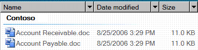

# UI Automation Support for the DataItem Control Type

> [!NOTE]
> This documentation is intended for .NET Framework developers who want to use the managed UI Automation classes defined in the <xref:System.Windows.Automation> namespace. For the latest information about UI Automation, see [Windows Automation API: UI Automation](/windows/win32/winauto/entry-uiauto-win32).

 This topic provides information about Microsoft UI Automation support for the DataItem control type. In UI Automation a control type is a set of conditions that a control must meet in order to use the <xref:System.Windows.Automation.AutomationElement.ControlTypeProperty> property. The conditions include specific guidelines for UI Automation tree structure, UI Automation property values and control patterns.

 An entry in a Contacts list is an example of a data item control. A data item control contains information that is of interest to an end user. It is more complicated than the simple list item because it contains richer information.

 The following sections define the required UI Automation tree structure, properties, control patterns, and events for the DataItem control type. The UI Automation requirements apply to all data item controls, whether Windows Presentation Foundation (WPF), Win32, or Windows Forms.

## Required UI Automation Tree Structure

 The following table depicts the control view and the content view of the UI Automation tree that pertains to data item controls and describes what can be contained in each view. For more information about the UI Automation tree, see [UI Automation Tree Overview](ui-automation-tree-overview.md).

|UI Automation Tree - Control View|UI Automation Tree - Content View|
|------------------------------------------------------------------------------------------------|------------------------------------------------------------------------------------------------|
|DataItem   -   Varies (0 or more; can be structured in hierarchy)|DataItem   -   Varies (0 or more; can be structured in hierarchy)|

 A data item element in a data grid can host a variety of objects, including another layer of data items, or specific grid elements such as text, images, or edit controls. If the data item element has a specific object role, the element should be exposed as a specific control type; for example, a ListItem control type for a selectable data item in the grid.

## Required UI Automation Properties

 The following table lists the properties whose value or definition is especially relevant to data item controls. For more information about UI Automation properties, see [UI Automation Properties for Clients](ui-automation-properties-for-clients.md).

|Property|Value|Notes|
|--------------|-----------|-----------|
|<xref:System.Windows.Automation.AutomationElementIdentifiers.AutomationIdProperty>|See notes.|The value of this property needs to be unique across all controls in an application.|
|<xref:System.Windows.Automation.AutomationElementIdentifiers.BoundingRectangleProperty>|See notes.|The outermost rectangle that contains the whole control.|
|<xref:System.Windows.Automation.AutomationElementIdentifiers.ClickablePointProperty>|See notes.|Supported if there is a bounding rectangle. If not every point within the bounding rectangle is clickable, and you perform specialized hit testing, then override and provide a clickable point.|
|<xref:System.Windows.Automation.AutomationElementIdentifiers.ControlTypeProperty>|DataItem|This value is the same for all UI frameworks.|
|<xref:System.Windows.Automation.AutomationElementIdentifiers.IsContentElementProperty>|True|The data item control must always be content.|
|<xref:System.Windows.Automation.AutomationElementIdentifiers.IsControlElementProperty>|True|The data item control must always be a control.|
|<xref:System.Windows.Automation.AutomationElementIdentifiers.IsKeyboardFocusableProperty>|See notes.|If the control can receive keyboard focus, it must support this property.|
|<xref:System.Windows.Automation.AutomationElementIdentifiers.ItemStatusProperty>|See notes.|If the control contains status that is being updated dynamically then this property must be supported so that an assistive technology can receive updates when the status of the element changes.|
|<xref:System.Windows.Automation.AutomationElementIdentifiers.ItemTypeProperty>|See notes.|This is the string value that conveys to the end user the underlying object that the item represents. Examples are "Media File" or "Contact".|
|<xref:System.Windows.Automation.AutomationElementIdentifiers.LabeledByProperty>|`Null`|Data item controls do not have a static text label.|
|<xref:System.Windows.Automation.AutomationElementIdentifiers.LocalizedControlTypeProperty>|"data item"|Localized string corresponding to the DataItem control type.|
|<xref:System.Windows.Automation.AutomationElementIdentifiers.NameProperty>|See notes.|The data item control always contains a primary text element that relates to what the user would associate as the most semantic identifier for the item.|

## Required UI Automation Control Patterns

 The following table lists the Microsoft UI Automation control patterns required to be supported by all data item controls. For more information about control patterns, see [UI Automation Control Patterns Overview](ui-automation-control-patterns-overview.md).

|Control Pattern|Support|Notes|
|---------------------|-------------|-----------|
|<xref:System.Windows.Automation.Provider.IExpandCollapseProvider>|Depends|If the data item can be expanded or collapsed to show and hide information, the Expand Collapse pattern must be supported.|
|<xref:System.Windows.Automation.Provider.IGridItemProvider>|Depends|Data items will support the Grid Item pattern when a collection of data items is available within a container that can be spatially navigated item-to-item.|
|<xref:System.Windows.Automation.Provider.IScrollItemProvider>|Depends|All data items support the ability to be scrolled into view with the Scroll Item pattern when their data container has more items than can fit on the screen.|
|<xref:System.Windows.Automation.Provider.ISelectionItemProvider>|Yes|All data items must support the Selection Item pattern to indicate when the item is selected.|
|<xref:System.Windows.Automation.Provider.ITableItemProvider>|Depends|If the data item is contained within a Data Grid control type then it will support this pattern.|
|<xref:System.Windows.Automation.Provider.IToggleProvider>|Depends|If the data item contains a state that can be cycled through.|
|<xref:System.Windows.Automation.Provider.IValueProvider>|Depends|If the data item's primary text is editable then the Value pattern must be supported.|

## Working with Data Items in Large Lists

 Large lists are often data virtualized within UI frameworks to assist in performance. Due to this, a UI Automation client cannot use the UI Automation query feature to scrape the contents of the full tree in the same way that it can in other item containers. A client should scroll the item into view (or expand the control to show all valuable options)prior to accessing the full set of information from the data item.

 When calling `SetFocus` on the UI Automation element for the data item, the Microsoft Windows Explorer case will return successfully and cause focus to be set to the Edit within the data item subtree.

## Required UI Automation Events

 The following table lists the UI Automation events required to be supported by all data item controls. For more information about events, see [UI Automation Events Overview](ui-automation-events-overview.md).

|UI Automation Event|Support|Notes|
|---------------------------------------------------------------------------------|-------------|-----------|
|<xref:System.Windows.Automation.AutomationElementIdentifiers.AutomationFocusChangedEvent>|Required|None|
|<xref:System.Windows.Automation.AutomationElementIdentifiers.BoundingRectangleProperty> property-changed event.|Required|None|
|<xref:System.Windows.Automation.AutomationElementIdentifiers.IsEnabledProperty> property-changed event.|Required|None|
|<xref:System.Windows.Automation.AutomationElementIdentifiers.IsOffscreenProperty> property-changed event.|Required|None|
|<xref:System.Windows.Automation.AutomationElementIdentifiers.NameProperty> property-changed event.|Required|None|
|<xref:System.Windows.Automation.AutomationElementIdentifiers.StructureChangedEvent>|Required|None|
|<xref:System.Windows.Automation.InvokePatternIdentifiers.InvokedEvent>|Depends|None|
|<xref:System.Windows.Automation.ExpandCollapsePatternIdentifiers.ExpandCollapseStateProperty> property-changed event.|Depends|None|
|<xref:System.Windows.Automation.SelectionItemPatternIdentifiers.ElementAddedToSelectionEvent>|Required|None|
|<xref:System.Windows.Automation.SelectionItemPatternIdentifiers.ElementRemovedFromSelectionEvent>|Required|None|
|<xref:System.Windows.Automation.SelectionItemPatternIdentifiers.ElementSelectedEvent>|Required|None|
|<xref:System.Windows.Automation.TogglePatternIdentifiers.ToggleStateProperty> property-changed event.|Depends|None|
|<xref:System.Windows.Automation.ValuePatternIdentifiers.ValueProperty> property-changed event.|Depends|None|

## DataItem Control Type Example

 The following image illustrates a DataItem control type in a List View control with support for rich information for the columns.

 

 The Control View and the Content View of the UI Automation tree that pertains to the data item control is displayed below. The control patterns for each automation element are shown in parentheses. The Group "Contoso" is also part of the grid of the Data Grid host control.

|UI Automation Tree - Control View|UI Automation Tree - Content View|
|------------------------------------------------------------------------------------------------|------------------------------------------------------------------------------------------------|
|-   Group "Contoso" (Table, Grid) -   DataItem "Accounts Receivable.doc" (TableItem, GridItem, SelectionItem, Invoke) -   Image "Accounts Receivable.doc" -   Edit "Name" (TableItem, GridItem, Value "Accounts Receivable.doc") -   Edit "Date modified" (TableItem, GridItem, Value "8/25/2006 3:29 PM") -   Edit "Size" (GridItem, TableItem, Value "11.0 KB) -   DataItem "Accounts Payable.doc" (TableItem, GridItem, SelectionItem, Invoke) -   ...|-   Group "Contoso" (Table, Grid) -   DataItem "Accounts Receivable.doc" (TableItem, GridItem, SelectionItem, Invoke) -   Image "Accounts Receivable.doc" -   Edit "Name" (TableItem, GridItem, Value "Accounts Receivable.doc") -   Edit "Date modified" (TableItem, GridItem, Value "8/25/2006 3:29 PM") -   Edit "Size" (GridItem, TableItem, Value "11.0 KB) -   DataItem "Accounts Payable.doc" (TableItem, GridItem, SelectionItem, Invoke) -   …|

 If a grid represents a list of selectable items, the corresponding UI elements can be exposed with the ListItem control type instead of the DataItem control type. In the preceding example, the DataItem elements ("Accounts Receivable.doc" and "Accounts Payable.doc") under Group ("Contoso") can be improved by exposing them as ListItem control types because that type already supports the SelectionItem control pattern.

## See also

- <xref:System.Windows.Automation.ControlType.DataItem>
- [UI Automation Control Types Overview](ui-automation-control-types-overview.md)
- [UI Automation Overview](ui-automation-overview.md)
