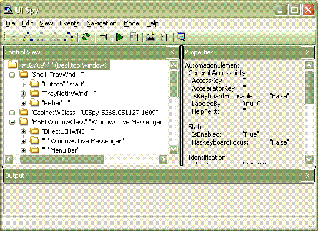

# UI Automation Support for the Pane Control Type
> [!NOTE]
>  This documentation is intended for .NET Framework developers who want to use the managed [!INCLUDE[TLA2#tla_uiautomation](../../../includes/tla2sharptla-uiautomation-md.md)] classes defined in the <xref:System.Windows.Automation> namespace. For the latest information about [!INCLUDE[TLA2#tla_uiautomation](../../../includes/tla2sharptla-uiautomation-md.md)], see [Windows Automation API: UI Automation](http://go.microsoft.com/fwlink/?LinkID=156746).  
  
 This topic provides information about [!INCLUDE[TLA2#tla_uiautomation](../../../includes/tla2sharptla-uiautomation-md.md)] support for the Pane control type. In [!INCLUDE[TLA2#tla_uiautomation](../../../includes/tla2sharptla-uiautomation-md.md)], a control type is a set of conditions that a control must meet in order to use the <xref:System.Windows.Automation.AutomationElement.ControlTypeProperty> property. The conditions include specific guidelines for [!INCLUDE[TLA2#tla_uiautomation](../../../includes/tla2sharptla-uiautomation-md.md)] tree structure, [!INCLUDE[TLA2#tla_uiautomation](../../../includes/tla2sharptla-uiautomation-md.md)] property values and control patterns.  
  
 The Pane control type is used to represent an object within a frame or document window. Users can navigate between pane controls and within the contents of the current pane, but cannot navigate between items in different panes. Thus, pane controls represent a level of grouping lower than windows or documents, but above individual controls. The user navigates between panes by pressing TAB, F6, or CTRL+TAB, depending on the context. No specific keyboard navigation is required by the Pane control type.  
  
 The following sections define the required [!INCLUDE[TLA2#tla_uiautomation](../../../includes/tla2sharptla-uiautomation-md.md)] tree structure, properties, control patterns, and events for the Pane control type. The [!INCLUDE[TLA2#tla_uiautomation](../../../includes/tla2sharptla-uiautomation-md.md)] requirements apply to all list controls, whether [!INCLUDE[TLA#tla_winclient](../../../includes/tlasharptla-winclient-md.md)], [!INCLUDE[TLA#tla_win32](../../../includes/tlasharptla-win32-md.md)], or [!INCLUDE[TLA#tla_winforms](../../../includes/tlasharptla-winforms-md.md)].  
  
   
## Required UI Automation Tree Structure  
 The following table depicts the control view and the content view of the [!INCLUDE[TLA2#tla_uiautomation](../../../includes/tla2sharptla-uiautomation-md.md)] tree that pertains to pane controls and describes what can be contained in each view. For more information on the [!INCLUDE[TLA2#tla_uiautomation](../../../includes/tla2sharptla-uiautomation-md.md)] tree, see [UI Automation Tree Overview](../../../docs/framework/ui-automation/ui-automation-tree-overview.md).  
  
|Control View|Content View|  
|------------------|------------------|  
|Pane|Pane|  
  
   
## Required UI Automation Properties  
 The following table lists the [!INCLUDE[TLA2#tla_uiautomation](../../../includes/tla2sharptla-uiautomation-md.md)] properties whose value or definition is especially relevant to pane controls. For more information on [!INCLUDE[TLA2#tla_uiautomation](../../../includes/tla2sharptla-uiautomation-md.md)] properties, see [UI Automation Properties for Clients](../../../docs/framework/ui-automation/ui-automation-properties-for-clients.md).  
  
|[!INCLUDE[TLA2#tla_uiautomation](../../../includes/tla2sharptla-uiautomation-md.md)] Property|Value|Notes|  
|------------------------------------------------------------------------------------|-----------|-----------|  
|<xref:System.Windows.Automation.AutomationElementIdentifiers.AutomationIdProperty>|See notes.|The value of this property needs to be unique across all controls in an application.|  
|<xref:System.Windows.Automation.AutomationElementIdentifiers.BoundingRectangleProperty>|See notes.|The outermost rectangle that contains the whole control.|  
|<xref:System.Windows.Automation.AutomationElementIdentifiers.IsKeyboardFocusableProperty>|See notes.|If the control can receive keyboard focus, it must support this property.|  
|<xref:System.Windows.Automation.AutomationElementIdentifiers.NameProperty>|See notes.|The value for this property must always be a clear, concise and meaningful title.|  
|<xref:System.Windows.Automation.AutomationElementIdentifiers.ClickablePointProperty>|See notes.|This property exposes a clickable point of the pane control that causes the pane to become focused when it is clicked.|  
|<xref:System.Windows.Automation.AutomationElementIdentifiers.LabeledByProperty>|See notes.|Pane controls typically do not have a static label. If there is a static text label, it should be exposed through this property.|  
|<xref:System.Windows.Automation.AutomationElementIdentifiers.ControlTypeProperty>|Pane|This value is the same for all [!INCLUDE[TLA2#tla_ui](../../../includes/tla2sharptla-ui-md.md)] frameworks.|  
|<xref:System.Windows.Automation.AutomationElementIdentifiers.LocalizedControlTypeProperty>|"pane"|Localized string corresponding to the Pane control type.|  
|<xref:System.Windows.Automation.AutomationElementIdentifiers.IsContentElementProperty>|True|Pane controls are always included in the content view of the [!INCLUDE[TLA2#tla_uiautomation](../../../includes/tla2sharptla-uiautomation-md.md)] tree.|  
|<xref:System.Windows.Automation.AutomationElementIdentifiers.IsControlElementProperty>|True|Pane controls are always included in the control view of the [!INCLUDE[TLA2#tla_uiautomation](../../../includes/tla2sharptla-uiautomation-md.md)] tree.|  
|<xref:System.Windows.Automation.AutomationElementIdentifiers.HelpTextProperty>|""|The help text for pane controls should explain why the purpose of the frame and how it relates to other frames. A description is necessary if the purpose and relationship of frames is not clear from the value of the `NameProperty`. "|  
|<xref:System.Windows.Automation.AutomationElementIdentifiers.AccessKeyProperty>|See notes.|If a specific key combination gives focus to the pane then that information should be exposed through this property.|  
  
   
## Required UI Automation Control Patterns  
 The following table lists the [!INCLUDE[TLA2#tla_uiautomation](../../../includes/tla2sharptla-uiautomation-md.md)] control patterns required to be supported by all pane controls. For more information on control patterns, see [UI Automation Control Patterns Overview](../../../docs/framework/ui-automation/ui-automation-control-patterns-overview.md).  
  
|Control Pattern|Support|Notes|  
|---------------------|-------------|-----------|  
|<xref:System.Windows.Automation.Provider.ITransformProvider>|Depends|Implement this control pattern if the pane control can be moved, resized, or rotated on the screen.|  
|<xref:System.Windows.Automation.Provider.IWindowProvider>|Never|If you need to implement this control pattern, your control should be based on the <xref:System.Windows.Automation.ControlType.Window> control type.|  
|<xref:System.Windows.Automation.Provider.IDockProvider>|Depends|Implement this control pattern if the pane control can be docked.|  
|<xref:System.Windows.Automation.Provider.IScrollProvider>|Depends|Implement this control pattern if the pane control can be scrolled.|  
  
   
## Required UI Automation Events  
 The following table lists the [!INCLUDE[TLA2#tla_uiautomation](../../../includes/tla2sharptla-uiautomation-md.md)] events required to be supported by all pane controls. For more information on events, see [UI Automation Events Overview](../../../docs/framework/ui-automation/ui-automation-events-overview.md).  
  
|[!INCLUDE[TLA2#tla_uiautomation](../../../includes/tla2sharptla-uiautomation-md.md)] Event|Support/Value|Notes|  
|---------------------------------------------------------------------------------|--------------------|-----------|  
|<xref:System.Windows.Automation.WindowPatternIdentifiers.WindowClosedEvent>|Never|None|  
|<xref:System.Windows.Automation.WindowPatternIdentifiers.WindowOpenedEvent>|Never|None|  
|<xref:System.Windows.Automation.AutomationElementIdentifiers.AsyncContentLoadedEvent>|Required|None|  
|<xref:System.Windows.Automation.AutomationElementIdentifiers.BoundingRectangleProperty> property-changed event.|Required|None|  
|<xref:System.Windows.Automation.AutomationElementIdentifiers.IsOffscreenProperty> property-changed event.|Required|None|  
|<xref:System.Windows.Automation.AutomationElementIdentifiers.IsEnabledProperty> property-changed event.|Required|None|  
|<xref:System.Windows.Automation.ScrollPatternIdentifiers.HorizontallyScrollableProperty> property-changed event.|Depends|None|  
|<xref:System.Windows.Automation.ScrollPatternIdentifiers.HorizontalScrollPercentProperty> property-changed event.|Depends|None|  
|<xref:System.Windows.Automation.ScrollPatternIdentifiers.HorizontalViewSizeProperty> property-changed event.|Depends|None|  
|<xref:System.Windows.Automation.ScrollPatternIdentifiers.VerticalScrollPercentProperty> property-changed event.|Depends|None|  
|<xref:System.Windows.Automation.ScrollPatternIdentifiers.VerticallyScrollableProperty> property-changed event.|Depends|None|  
|<xref:System.Windows.Automation.ScrollPatternIdentifiers.VerticalViewSizeProperty> property-changed event.|Depends|None|  
|<xref:System.Windows.Automation.WindowPatternIdentifiers.WindowVisualStateProperty> property-changed event.|Never|None|  
|<xref:System.Windows.Automation.AutomationElementIdentifiers.AutomationFocusChangedEvent>|Required|None|  
|<xref:System.Windows.Automation.AutomationElementIdentifiers.StructureChangedEvent>|Required|None|  
  
   
## Pane Control Type Example  
 The following image illustrates a control that implements the Pane control type.  
  
   
  
|[!INCLUDE[TLA2#tla_uiautomation](../../../includes/tla2sharptla-uiautomation-md.md)] Tree - Control View|[!INCLUDE[TLA2#tla_uiautomation](../../../includes/tla2sharptla-uiautomation-md.md)] Tree - Content View|  
|------------------------------------------------------------------------------------------------|------------------------------------------------------------------------------------------------|  
|<ul><li>Pane</li><li>Tree (Scroll Pattern)   <ul><li>TreeItem</li><li>Pane</li><li>Edit (Scroll Pattern</li></ul></li></ul>|-   Pane -   Tree (Scroll Pattern) -   TreeItem -   …Pane -   Edit -   (Scroll Pattern)|  
  
## See Also  
 <xref:System.Windows.Automation.ControlType.Pane>  
 [UI Automation Control Types Overview](../../../docs/framework/ui-automation/ui-automation-control-types-overview.md)  
 [UI Automation Overview](../../../docs/framework/ui-automation/ui-automation-overview.md)
