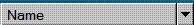

# UI Automation Support for the SplitButton Control Type
> [!NOTE]
>  This documentation is intended for .NET Framework developers who want to use the managed [!INCLUDE[TLA2#tla_uiautomation](../../../includes/tla2sharptla-uiautomation-md.md)] classes defined in the <xref:System.Windows.Automation> namespace. For the latest information about [!INCLUDE[TLA2#tla_uiautomation](../../../includes/tla2sharptla-uiautomation-md.md)], see [Windows Automation API: UI Automation](http://go.microsoft.com/fwlink/?LinkID=156746).  
  
 This topic provides information about [!INCLUDE[TLA2#tla_uiautomation](../../../includes/tla2sharptla-uiautomation-md.md)] support for the SplitButton control type. In [!INCLUDE[TLA2#tla_uiautomation](../../../includes/tla2sharptla-uiautomation-md.md)], a control type is a set of conditions that a control must meet in order to use the <xref:System.Windows.Automation.AutomationElement.ControlTypeProperty> property. The conditions include specific guidelines for [!INCLUDE[TLA2#tla_uiautomation](../../../includes/tla2sharptla-uiautomation-md.md)] tree structure, [!INCLUDE[TLA2#tla_uiautomation](../../../includes/tla2sharptla-uiautomation-md.md)] property values and control patterns.  
  
 The split button control enables the ability to perform an action on a control and expand the control to see a list of other possible actions that can be performed.  
  
 The following sections define the required [!INCLUDE[TLA2#tla_uiautomation](../../../includes/tla2sharptla-uiautomation-md.md)] tree structure, properties, control patterns, and events for the SplitButton control type. The [!INCLUDE[TLA2#tla_uiautomation](../../../includes/tla2sharptla-uiautomation-md.md)] requirements apply to all split button controls, whether [!INCLUDE[TLA#tla_winclient](../../../includes/tlasharptla-winclient-md.md)], [!INCLUDE[TLA#tla_win32](../../../includes/tlasharptla-win32-md.md)], or [!INCLUDE[TLA#tla_winforms](../../../includes/tlasharptla-winforms-md.md)].  
  
   
## Required UI Automation Tree Structure  
 The following table depicts the control view and the content view of the [!INCLUDE[TLA2#tla_uiautomation](../../../includes/tla2sharptla-uiautomation-md.md)] tree that pertains to split button controls and describes what can be contained in each view. For more information about the [!INCLUDE[TLA2#tla_uiautomation](../../../includes/tla2sharptla-uiautomation-md.md)] tree, see [UI Automation Tree Overview](../../../docs/framework/ui-automation/ui-automation-tree-overview.md).  
  
|Control View|Content View|  
|------------------|------------------|  
|SplitButton   <ul><li>Image (0 or 1)</li><li>Text (0 or 1)</li><li>Button (1 or 2)   <ul><li>Menu (0 or 1; appears as child of button that supports ExpandCollapse pattern)</li><li>MenuItem (1 to many)</li></ul></li></ul>|SplitButton   -   MenuItem (1 to many)|  
  
   
## Required UI Automation Properties  
 The following table lists the [!INCLUDE[TLA2#tla_uiautomation](../../../includes/tla2sharptla-uiautomation-md.md)] properties whose value or definition is especially relevant to split button controls. For more information about [!INCLUDE[TLA2#tla_uiautomation](../../../includes/tla2sharptla-uiautomation-md.md)] properties, see [UI Automation Properties for Clients](../../../docs/framework/ui-automation/ui-automation-properties-for-clients.md).  
  
|[!INCLUDE[TLA2#tla_uiautomation](../../../includes/tla2sharptla-uiautomation-md.md)] Property|Value|Notes|  
|------------------------------------------------------------------------------------|-----------|-----------|  
|<xref:System.Windows.Automation.AutomationElementIdentifiers.AutomationIdProperty>|See notes.|The value of this property needs to be unique across all controls in an application.|  
|<xref:System.Windows.Automation.AutomationElementIdentifiers.BoundingRectangleProperty>|See notes.|The outermost rectangle that contains the whole control.|  
|<xref:System.Windows.Automation.AutomationElementIdentifiers.ClickablePointProperty>|See notes.|Supported if there is a bounding rectangle. If not every point within the bounding rectangle is clickable, and you perform specialized hit testing, then override and provide a clickable point.|  
|<xref:System.Windows.Automation.AutomationElementIdentifiers.IsKeyboardFocusableProperty>|See notes.|If the control can receive keyboard focus, it must support this property.|  
|<xref:System.Windows.Automation.AutomationElementIdentifiers.NameProperty>|"Back"|The split button control's name is displayed on the button.|  
|<xref:System.Windows.Automation.AutomationElementIdentifiers.LabeledByProperty>|Null|Split button controls do not have a static text label.|  
|<xref:System.Windows.Automation.AutomationElementIdentifiers.ControlTypeProperty>|SplitButton|This value is the same for all UI frameworks.|  
|<xref:System.Windows.Automation.AutomationElementIdentifiers.LocalizedControlTypeProperty>|"split button"|Localized string corresponding to the SplitButton control type.|  
|<xref:System.Windows.Automation.AutomationElementIdentifiers.HelpTextProperty>|See notes.|The help text can indicate the result of activating the split button, which is typically the same type of information presented through a tooltip.|  
|<xref:System.Windows.Automation.AutomationElementIdentifiers.IsContentElementProperty>|True|The split button control contains information for the end user.|  
|<xref:System.Windows.Automation.AutomationElementIdentifiers.IsControlElementProperty>|True|The split button control is visible to the end user.|  
  
   
## Required UI Automation Control Patterns  
 The following table lists the [!INCLUDE[TLA2#tla_uiautomation](../../../includes/tla2sharptla-uiautomation-md.md)] control patterns required to be supported by split button controls. For more information about control patterns, see [UI Automation Control Patterns Overview](../../../docs/framework/ui-automation/ui-automation-control-patterns-overview.md).  
  
|Control Pattern|Support|Notes|  
|---------------------|-------------|-----------|  
|<xref:System.Windows.Automation.Provider.IInvokeProvider>|Required|Split buttons always have a default action associated with Invoke.|  
|<xref:System.Windows.Automation.Provider.IExpandCollapseProvider>|Required|Split buttons always have the ability to expand a list of options.|  
  
   
## Required UI Automation Events  
 The following table lists the [!INCLUDE[TLA2#tla_uiautomation](../../../includes/tla2sharptla-uiautomation-md.md)] events required to be supported by all split button controls. For more information on events, see [UI Automation Events Overview](../../../docs/framework/ui-automation/ui-automation-events-overview.md).  
  
|[!INCLUDE[TLA2#tla_uiautomation](../../../includes/tla2sharptla-uiautomation-md.md)] Event|Support|Notes|  
|---------------------------------------------------------------------------------|-------------|-----------|  
|<xref:System.Windows.Automation.InvokePatternIdentifiers.InvokedEvent>|Required|None|  
|<xref:System.Windows.Automation.AutomationElementIdentifiers.BoundingRectangleProperty> property-changed event.|Required|None|  
|<xref:System.Windows.Automation.AutomationElementIdentifiers.IsOffscreenProperty> property-changed event.|Required|None|  
|<xref:System.Windows.Automation.AutomationElementIdentifiers.IsEnabledProperty> property-changed event.|Required|None|  
|<xref:System.Windows.Automation.ExpandCollapsePatternIdentifiers.ExpandCollapseStateProperty> property-changed event.|Required|None|  
|<xref:System.Windows.Automation.AutomationElementIdentifiers.AutomationFocusChangedEvent>|Required|None|  
|<xref:System.Windows.Automation.AutomationElementIdentifiers.StructureChangedEvent>|Required|None|  
  
   
## SplitButton Control Example  
 The following image illustrates a SplitButton control type in a data grid control.  
  
   
  
 The Control View and the Content View of the UI Automation tree that pertains to the data grid and split button controls is displayed below. The control patterns for each automation element are shown in parentheses.  
  
|[!INCLUDE[TLA2#tla_uiautomation](../../../includes/tla2sharptla-uiautomation-md.md)] Tree - Control View|[!INCLUDE[TLA2#tla_uiautomation](../../../includes/tla2sharptla-uiautomation-md.md)] Tree - Content View|  
|------------------------------------------------------------------------------------------------|------------------------------------------------------------------------------------------------|  
|<ul><li>SplitButton "Name" (Invoke, ExpandCollapse)</li><li>Button "More options" (Invoke)   <ul><li>Menu</li><li>MenuItem</li><li>…</li></ul></li></ul>|<ul><li>SplitButton "Name" (Invoke, ExpandCollapse)</li><li>Button "More options" (Invoke)   <ul><li>Menu</li><li>MenuItem</li><li>…</li></ul></li></ul>|  
  
## See Also  
 <xref:System.Windows.Automation.ControlType.SplitButton>  
 [UI Automation Control Types Overview](../../../docs/framework/ui-automation/ui-automation-control-types-overview.md)  
 [UI Automation Overview](../../../docs/framework/ui-automation/ui-automation-overview.md)
