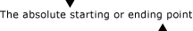

# UI Automation TextPattern Overview
> [!NOTE]
>  This documentation is intended for .NET Framework developers who want to use the managed [!INCLUDE[TLA2#tla_uiautomation](../../../includes/tla2sharptla-uiautomation-md.md)] classes defined in the <xref:System.Windows.Automation> namespace. For the latest information about [!INCLUDE[TLA2#tla_uiautomation](../../../includes/tla2sharptla-uiautomation-md.md)], see [Windows Automation API: UI Automation](http://go.microsoft.com/fwlink/?LinkID=156746).  
  
 This overview describes how to use [!INCLUDE[TLA#tla_uiautomation](../../../includes/tlasharptla-uiautomation-md.md)] to expose the textual content, including format and style attributes, of text controls in [!INCLUDE[TLA2#tla_uiautomation](../../../includes/tla2sharptla-uiautomation-md.md)]-supported platforms. These controls include, but are not limited to, the [!INCLUDE[TLA#tla_winfx](../../../includes/tlasharptla-winfx-md.md)] <xref:System.Windows.Controls.TextBox> and <xref:System.Windows.Controls.RichTextBox> as well as their [!INCLUDE[TLA2#tla_win32](../../../includes/tla2sharptla-win32-md.md)] equivalents.  
  
 Exposing the textual content of a control is accomplished through the use of the <xref:System.Windows.Automation.TextPattern> control pattern, which represents the contents of a text container as a text stream. In turn, <xref:System.Windows.Automation.TextPattern> requires the support of the <xref:System.Windows.Automation.Text.TextPatternRange> class to expose format and style attributes. <xref:System.Windows.Automation.Text.TextPatternRange> supports <xref:System.Windows.Automation.TextPattern> by representing contiguous or multiple, disjoint text spans in a text container with a collection of <xref:System.Windows.Automation.Text.TextPatternRangeEndpoint.Start> and <xref:System.Windows.Automation.Text.TextPatternRangeEndpoint.End> endpoints. <xref:System.Windows.Automation.Text.TextPatternRange> supports functionality such as selection, comparison, retrieval and traversal.  
  
> [!NOTE]
>  The <xref:System.Windows.Automation.TextPattern> classes do not provide a means to insert or modify text. However, depending on the control, this may be accomplished by the [!INCLUDE[TLA2#tla_uiautomation](../../../includes/tla2sharptla-uiautomation-md.md)] <xref:System.Windows.Automation.ValuePattern> or through direct keyboard input. See the [TextPattern Insert Text Sample](http://msdn.microsoft.com/library/67353f93-7ee2-42f2-ab76-5c078cf6ca16) for an example.  
  
 The functionality described in this overview is vital to assistive technology vendors and their end users. Assistive technologies can use [!INCLUDE[TLA2#tla_uiautomation](../../../includes/tla2sharptla-uiautomation-md.md)] to gather complete text formatting information for the user and provide programmatic navigation and selection of text by <xref:System.Windows.Automation.Text.TextUnit> (character, word, line, or paragraph).  
  
   
## UI Automation TextPattern vs. Text Services Framework  
 [!INCLUDE[TLA#tla_tsf](../../../includes/tlasharptla-tsf-md.md)] is a simple and scalable system framework that enables natural language services and advanced text input on the desktop and within applications. In addition to providing interfaces for applications to expose their text store it also supports metadata for that text store.  
  
 However, [!INCLUDE[TLA2#tla_tsf](../../../includes/tla2sharptla-tsf-md.md)] was designed for applications that need to inject input into context-aware scenarios whereas <xref:System.Windows.Automation.TextPattern> is a read-only solution (with the limited workaround noted above) meant to provide optimized access to a text store for screen-readers and Braille devices.  
  
 In short, accessible technologies that require read-only access to a text store can use <xref:System.Windows.Automation.TextPattern>, but will need the more complex functionality of [!INCLUDE[TLA2#tla_tsf](../../../includes/tla2sharptla-tsf-md.md)] for context-aware input.  
  
   
## Control Types  
  
#### Text  
 The Text control is the basic element representing a piece of text on the screen.  
  
 A standalone text control can be used as a label or static text on a form. Text controls can also be contained within the structure of a <xref:System.Windows.Automation.ControlType.ListItem>, <xref:System.Windows.Automation.ControlType.TreeItem> or <xref:System.Windows.Automation.ControlType.DataItem>.  
  
> [!NOTE]
>  Text controls might not appear in the content view of the [!INCLUDE[TLA2#tla_uiautomation](../../../includes/tla2sharptla-uiautomation-md.md)] tree (see [UI Automation Tree Overview](../../../docs/framework/ui-automation/ui-automation-tree-overview.md)). This is because text controls are often displayed through the Name property of another control. For instance, the text that is used to label an Edit control is exposed through the Name property of the Edit control. Because the Edit control is in the content view of the [!INCLUDE[TLA2#tla_uiautomation](../../../includes/tla2sharptla-uiautomation-md.md)] tree, it is not necessary for the text element itself to be in that view of the [!INCLUDE[TLA2#tla_uiautomation](../../../includes/tla2sharptla-uiautomation-md.md)] tree. The only text that shows up in the content view is text that is not redundant information. This enables any assistive technology to quickly filter only on the pieces of information that their users need.  
  
#### Edit  
 Edit controls enable a user to view and edit a single line of text.  
  
> [!NOTE]
>  The single line of text may wrap in certain layout scenarios.  
  
#### Document  
 Document controls let a user navigate and obtain information from multiple pages of text.  
  
   
## TextPattern Client API's  
  
|||  
|-|-|  
|`System.Windows.Automation.TextPattern Class`|The entry point for the [!INCLUDE[TLA#tla_uiautomation](../../../includes/tlasharptla-uiautomation-md.md)] text model.   This class also contains the two <xref:System.Windows.Automation.TextPattern> event listeners, <xref:System.Windows.Automation.TextPattern.TextSelectionChangedEvent> and <xref:System.Windows.Automation.TextPattern.TextChangedEvent>.|  
|`System.Windows.Automation.Text.TextPatternRange Class`|The representation of a span of text within a text container that supports <xref:System.Windows.Automation.TextPattern>.   UI Automation clients should be careful about the current validity of a text range created using <xref:System.Windows.Automation.Text.TextPatternRange>. If the original text in the text control is completely replaced by new text, the current text range becomes invalid. However, the text range may still have some viability if only part of the original text is changed and the underlying text control is managing its text "pointer" with anchors (or endpoints) rather than with absolute character positioning.   Clients can listen for a <xref:System.Windows.Automation.TextPattern.TextChangedEvent> for notification of any changes to the textual content they are working with.|  
|`System.Windows.Automation.AutomationTextAttribute Class`|Used to identify the formatting attributes of a text range.|  
  
   
## TextPattern Provider API's  
 UI elements or controls that support <xref:System.Windows.Automation.TextPattern> by implementing the <xref:System.Windows.Automation.Provider.ITextProvider> and <xref:System.Windows.Automation.Provider.ITextRangeProvider> interfaces, either natively or through [!INCLUDE[TLA#tla_uiautomation](../../../includes/tlasharptla-uiautomation-md.md)] proxies, are capable of exposing detailed attribute information for any text they contain in addition to providing robust navigational capabilities.  
  
 A <xref:System.Windows.Automation.TextPattern> provider does not have to support all text attributes if the control lacks support for any particular attributes.  
  
 A <xref:System.Windows.Automation.TextPattern> provider must support the <xref:System.Windows.Automation.TextPattern.GetSelection%2A> and <xref:System.Windows.Automation.Text.TextPatternRange.Select%2A> functions if the control supports text selection or placement of the text cursor (or system caret) within the text area. If the control does not support this functionality then it does not need to support either of these methods. However, the control must expose the type of text selection it supports by implementing the <xref:System.Windows.Automation.Provider.ITextProvider.SupportedTextSelection%2A> property.  
  
 A <xref:System.Windows.Automation.TextPattern> provider must always support the <xref:System.Windows.Automation.Text.TextUnit> constants <xref:System.Windows.Automation.Text.TextUnit.Character> and <xref:System.Windows.Automation.Text.TextUnit.Document> as well as any other <xref:System.Windows.Automation.Text.TextUnit> constants it is capable of supporting.  
  
> [!NOTE]
>  The provider may skip support for a specific <xref:System.Windows.Automation.Text.TextUnit> by deferring to the next largest <xref:System.Windows.Automation.Text.TextUnit> supported in the following order: <xref:System.Windows.Automation.Text.TextUnit.Character>, <xref:System.Windows.Automation.Text.TextUnit.Format>, <xref:System.Windows.Automation.Text.TextUnit.Word>, <xref:System.Windows.Automation.Text.TextUnit.Line>, <xref:System.Windows.Automation.Text.TextUnit.Paragraph>, <xref:System.Windows.Automation.Text.TextUnit.Page>, and <xref:System.Windows.Automation.Text.TextUnit.Document>.  
  
|||  
|-|-|  
|`ITextProvider Interface`|Exposes methods, properties and attributes that support <xref:System.Windows.Automation.TextPattern> in client applications (see <xref:System.Windows.Automation.Provider.ITextProvider>).|  
|`ITextRangeProvider Interface`|Represents a span of text in a text provider (see <xref:System.Windows.Automation.Provider.ITextRangeProvider>).|  
|`System.Windows.Automation.TextPatternIdentifiers Class`|Contains values that are used as identifiers for text providers (see <xref:System.Windows.Automation.TextPatternIdentifiers>).|  
  
   
## Security  
 The [!INCLUDE[TLA2#tla_uiautomation](../../../includes/tla2sharptla-uiautomation-md.md)] architecture was designed with security in mind (see [UI Automation Security Overview](../../../docs/framework/ui-automation/ui-automation-security-overview.md)). However, the TextPattern classes described in this overview require some specific security considerations.  
  
-   [!INCLUDE[TLA#tla_uiautomation](../../../includes/tlasharptla-uiautomation-md.md)] text providers supply read-only interfaces and do not provide the ability to change the existing text in a control.  
  
-   UI Automation clients can only use [!INCLUDE[TLA#tla_uiautomation](../../../includes/tlasharptla-uiautomation-md.md)] if they are fully "trusted". An example of this would be the protected Logon Desktop, where only known and trusted applications can run.  
  
-   Developers of UI Automation providers should be aware that all information they choose to expose in their controls through [!INCLUDE[TLA#tla_uiautomation](../../../includes/tlasharptla-uiautomation-md.md)] is essentially public and fully accessible by other code. [!INCLUDE[TLA#tla_uiautomation](../../../includes/tlasharptla-uiautomation-md.md)] makes no effort to determine the trustworthiness of any UI Automation client and therefore the UI Automation provider should not expose protected content or sensitive textual information (such as password fields).  
  
-   One of the most significant changes in security for [!INCLUDE[TLA#tla_winvista](../../../includes/tlasharptla-winvista-md.md)] is broadly referred to as "Secure Input" which encompasses technologies such as Least-privileged (or Limited) User Accounts (LUA) and UI Privilege Level Isolation (UIPI).  
  
    -   UIPI prevents one program from controlling and/or monitoring another more "privileged" program, preventing cross-process window message attacks that spoof user input.  
  
    -   LUA sets limits on the privileges of applications being run by users in the Administrators group. Applications won't necessarily have administrator privileges, but will instead run with the least privileges necessary. As a consequence, there may be some restrictions enforced in LUA scenarios. Most notably string truncation (including TextPattern strings), where it may be necessary to limit the size of strings being retrieved from administrator-level applications so they aren't forced to allocate memory to the point of disabling the application.  
  
   
## Performance  
 Because TextPattern relies on cross-process calls for most of its functionality, it does not provide a caching mechanism to improve performance when processing content. This is unlike other control patterns in [!INCLUDE[TLA#tla_uiautomation](../../../includes/tlasharptla-uiautomation-md.md)] that can be accessed using the <xref:System.Windows.Automation.AutomationElement.GetCachedPattern%2A> or <xref:System.Windows.Automation.AutomationElement.TryGetCachedPattern%2A> methods.  
  
 One tactic for improving performance is by making sure UI Automation clients attempt to retrieve moderately-sized blocks of text using <xref:System.Windows.Automation.Text.TextPatternRange.GetText%2A>. For example, GetText(1) calls will incur cross-process hits for each character whereas one GetText(-1) call will incur one cross-process hit, but can have high latency depending on the size of the text provider.  
  
   
## TextPattern Terminology  
 **Attribute**  
 A formatting characteristic of a text range (for example, <xref:System.Windows.Automation.TextPattern.IsItalicAttribute> or <xref:System.Windows.Automation.TextPattern.FontNameAttribute>).  
  
 **Degenerate Range**  
 A degenerate range is an empty or zero-character text range. For the purposes of the TextPattern control pattern, the text insertion point (or system caret) is considered a degenerate range. If no text is selected, <xref:System.Windows.Automation.TextPattern.GetSelection%2A> would return a degenerate range at the text insertion point and <xref:System.Windows.Automation.TextPattern.RangeFromPoint%2A> would return a degenerate range as its starting endpoint. <xref:System.Windows.Automation.TextPattern.RangeFromChild%2A> and <xref:System.Windows.Automation.TextPattern.GetVisibleRanges%2A> may return degenerate ranges when the text provider cannot find any text ranges that match the given condition. This degenerate range can be used as a starting endpoint within the text provider. <xref:System.Windows.Automation.Text.TextPatternRange.FindText%2A> and <xref:System.Windows.Automation.Text.TextPatternRange.FindAttribute%2A> return a null reference (`Nothing` in [!INCLUDE[TLA2#tla_visualbnet](../../../includes/tla2sharptla-visualbnet-md.md)]) to avoid confusion with a discovered range versus a degenerate range.  
  
 **Embedded Object**  
 There are two types of embedded objects in the [!INCLUDE[TLA2#tla_uiautomation](../../../includes/tla2sharptla-uiautomation-md.md)] text model. They consist of text-based content elements such as hyperlinks or tables, and control elements such as images and buttons. For more detailed information, see [Access Embedded Objects Using UI Automation](../../../docs/framework/ui-automation/access-embedded-objects-using-ui-automation.md).  
  
 **Endpoint**  
 The absolute <xref:System.Windows.Automation.Text.TextPatternRangeEndpoint.Start> or <xref:System.Windows.Automation.Text.TextPatternRangeEndpoint.End> point of a text range within a text container.  
  
   
The following illustrates a set of start and end points.  
  
 **TextRange**  
 A representation of a span of text, with start and end points, in a text container including all associated attributes and functionality.  
  
 <xref:System.Windows.Automation.Text.TextUnit>  
 A pre-defined unit of text (character, word, line, or paragraph) used for navigating through logical segments of a text range.  
  
## See Also  
 [UI Automation Control Patterns for Clients](../../../docs/framework/ui-automation/ui-automation-control-patterns-for-clients.md)  
 [UI Automation Control Patterns Overview](../../../docs/framework/ui-automation/ui-automation-control-patterns-overview.md)  
 [UI Automation Tree Overview](../../../docs/framework/ui-automation/ui-automation-tree-overview.md)  
 [Use Caching in UI Automation](../../../docs/framework/ui-automation/use-caching-in-ui-automation.md)  
 [Support Control Patterns in a UI Automation Provider](../../../docs/framework/ui-automation/support-control-patterns-in-a-ui-automation-provider.md)  
 [Control Pattern Mapping for UI Automation Clients](../../../docs/framework/ui-automation/control-pattern-mapping-for-ui-automation-clients.md)  
 [Text Services Framework](http://msdn.microsoft.com/library/default.asp?url=/library/tsf/tsf/text_services_framework.asp)
