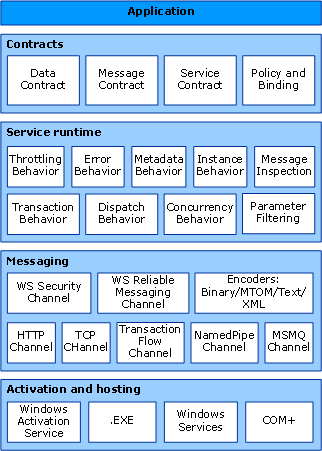

# Windows Communication Foundation Architecture
The following graphic illustrates the major layers of the [!INCLUDE[indigo1](../../../includes/indigo1-md.md)] architecture.  
  
## WCF Architecture  
   
  
### Contracts and Descriptions  
 Contracts define various aspects of the message system. The data contract describes every parameter that makes up every message that a service can create or consume. The message parameters are defined by XML Schema definition language (XSD) documents, enabling any system that understands XML to process the documents. The message contract defines specific message parts using SOAP protocols, and allows finer-grained control over parts of the message, when interoperability demands such precision. The service contract specifies the actual method signatures of the service, and is distributed as an interface in one of the supported programming languages, such as Visual Basic or Visual C#.  
  
 Policies and bindings stipulate the conditions required to communicate with a service.  For example, the binding must (at a minimum) specify the transport used (for example, HTTP or TCP), and an encoding. Policies include security requirements and other conditions that must be met to communicate with a service.  
  
### Service Runtime  
 The service runtime layer contains the behaviors that occur only during the actual operation of the service, that is, the runtime behaviors of the service. Throttling controls how many messages are processed, which can be varied if the demand for the service grows to a preset limit. An error behavior specifies what occurs when an internal error occurs on the service, for example, by controlling what information is communicated to the client. (Too much information can give a malicious user an advantage in mounting an attack.) Metadata behavior governs how and whether metadata is made available to the outside world. Instance behavior specifies how many instances of the service can be run (for example, a singleton specifies only one instance to process all messages). Transaction behavior enables the rollback of transacted operations if a failure occurs. Dispatch behavior is the control of how a message is processed by the [!INCLUDE[indigo2](../../../includes/indigo2-md.md)] infrastructure.  
  
 Extensibility enables customization of runtime processes. For example, message inspection is the facility to inspect parts of a message, and parameter filtering enables preset actions to occur based on filters acting on message headers.  
  
### Messaging  
 The messaging layer is composed of *channels*. A channel is a component that processes a message in some way, for example, by authenticating a message. A set of channels is also known as a *channel stack*. Channels operate on messages and message headers. This is different from the service runtime layer, which is primarily concerned about processing the contents of message bodies.  
  
 There are two types of channels: transport channels and protocol channels.  
  
 Transport channels read and write messages from the network (or some other communication point with the outside world). Some transports use an encoder to convert messages (which are represented as XML Infosets) to and from the byte stream representation used by the network. Examples of transports are HTTP, named pipes, TCP, and MSMQ. Examples of encodings are XML and optimized binary.  
  
 Protocol channels implement message processing protocols, often by reading or writing additional headers to the message. Examples of such protocols include WS-Security and WS-Reliability.  
  
 The messaging layer illustrates the possible formats and exchange patterns of the data. WS-Security is an implementation of the WS-Security specification enabling security at the message layer. The WS-Reliable Messaging channel enables the guarantee of message delivery. The encoders present a variety of encodings that can be used to suit the needs of the message. The HTTP channel specifies that the HyperText Transport Protocol is used for message delivery. The TCP channel similarly specifies the TCP protocol. The Transaction Flow channel governs transacted message patterns. The Named Pipe channel enables interprocess communication. The MSMQ channel enables interoperation with MSMQ applications.  
  
### Hosting and Activation  
 In its final form, a service is a program. Like other programs, a service must be run in an executable. This is known as a *self-hosted* service.  
  
 Services can also be *hosted*, or run in an executable managed by an external agent, such as IIS or Windows Activation Service (WAS). WAS enables [!INCLUDE[indigo2](../../../includes/indigo2-md.md)] applications to be activated automatically when deployed on a computer running WAS. Services can also be manually run as executables (.exe files). A service can also be run automatically as a Windows service. COM+ components can also be hosted as [!INCLUDE[indigo2](../../../includes/indigo2-md.md)] services.  
  
## See Also  
 [What Is Windows Communication Foundation](../../../docs/framework/wcf/whats-wcf.md)  
 [Fundamental Windows Communication Foundation Concepts](../../../docs/framework/wcf/fundamental-concepts.md)
