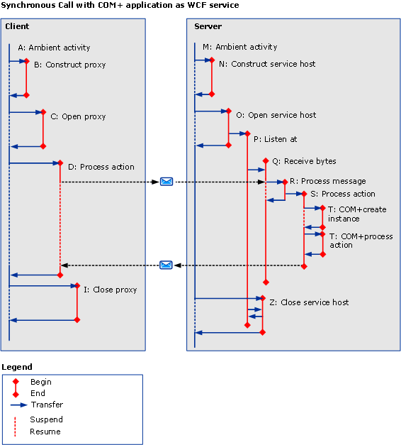

# COM+
The following figure shows how you can use activity tracing in a COM+ application. Instead of executing user code on the server, we can define a COM+ activity for each method call to the COM+ object model.  
  
 
