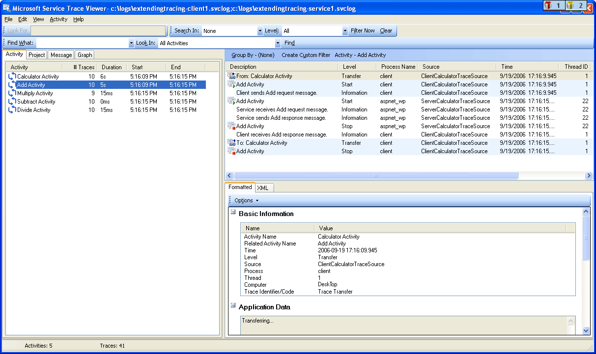
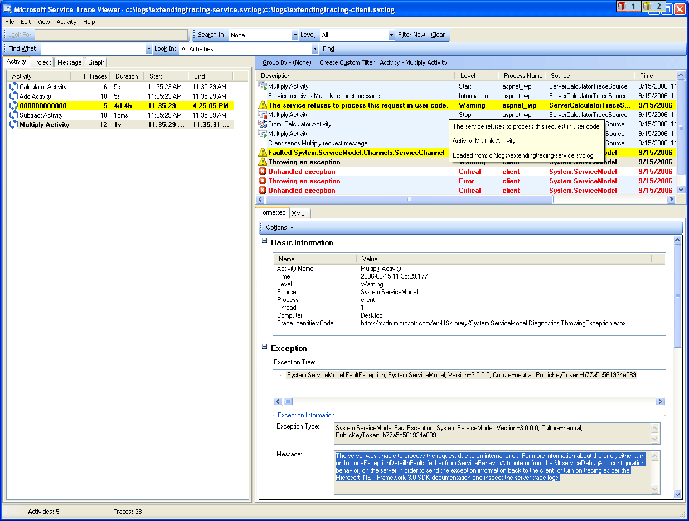

# Emitting User-Code Traces
In addition to enabling tracing in configuration to collect instrumentation data generated by [!INCLUDE[indigo1](../../../../../includes/indigo1-md.md)], you can also emit traces programmatically in user code. In this way, you can proactively create instrumentation data that you can peruse later for diagnostic purpose. This topic discusses how you can do this.  
  
 In addition, the [Extending Tracing](../../../../../docs/framework/wcf/samples/extending-tracing.md) sample includes all the code demonstrated in the following sections.  
  
## Creating a Trace Source  
 You can use the following code to create a user trace source.  
  
```  
TraceSource ts = new TraceSource("myUserTraceSource");  
```  
  
## Creating Activities  
 Activities are logical unit of processing. You can create one activity for each major processing unit in which you want traces to be grouped together. For example, you can create one activity for each request to the service. To do so, perform the following steps.  
  
1.  Save the activity ID in scope.  
  
2.  Create a new activity ID.  
  
3.  Transfer from the activity in scope to the new one, set the new activity in scope and emit a start trace for that activity.  
  
 The following code demonstrates how to do this.  
  
```  
Guid oldID = Trace.CorrelationManager.ActivityId;  
Guid traceID = Guid.NewGuid();  
ts.TraceTransfer(0, "transfer", traceID);  
Trace.CorrelationManager.ActivityId = traceID; // Trace is static  
ts.TraceEvent(TraceEventType.Start, 0, "Add request");  
```  
  
## Emitting Traces within a User Activity  
 The following code emits traces within a user activity.  
  
```  
double value1 = 100.00D;  
double value2 = 15.99D;  
ts.TraceInformation("Client sends message to Add " + value1 + ", " + value2);  
double result = client.Add(value1, value2);  
ts.TraceInformation("Client receives Add response '" + result + "'");  
```  
  
## Stopping the Activities  
 To stop the activities, transfer back to the old activity, stop the current activity id, and reset the old activity id in scope.  
  
 The following code demonstrates how to do this.  
  
```  
ts.TraceTransfer(0, "transfer", oldID);  
ts.TraceEvent(TraceEventType.Stop, 0, "Add request");  
Trace.CorrelationManager.ActivityId = oldID;  
```  
  
## Propagating the Activity ID to A Service  
 If you set the `propagateActivity` attribute to `true` for the `System.ServiceModel` trace source in both the client and service configuration files, the service processing for the Add request occurs in the same activity as the one defined in the client. If the service defines its own activities and transfers, the service traces do not appear in the client-propagated activity. Instead, they appear in an activity correlated by transfer traces to the activity whose ID is propagated by the client.  
  
> [!NOTE]
>  If the `propagateActivity` attribute is set to `true` on both the client and service, the ambient activity in the operation scope of the service is set by [!INCLUDE[indigo2](../../../../../includes/indigo2-md.md)].  
  
 You can use the following code to check whether an activity was set in scope by [!INCLUDE[indigo2](../../../../../includes/indigo2-md.md)].  
  
```  
// Check if an activity was set in scope by WCF, if it was   
// propagated from the client. If not, ( ambient activity is   
// equal to Guid.Empty), create a new one.  
if(Trace.CorrelationManager.ActivityId == Guid.Empty)  
{  
    Guid newGuid = Guid.NewGuid();  
    Trace.CorrelationManager.ActivityId = newGuid;  
}  
// Emit your Start trace.  
ts.TraceEvent(TraceEventType.Start, 0, "Add Activity");  
  
// Emit the processing traces for that request.  
serviceTs.TraceInformation("Service receives Add "   
                            + n1 + ", " + n2);  
// double result = n1 + n2;  
serviceTs.TraceInformation("Service sends Add result" + result);  
  
// Emit the Stop trace and exit the method scope.  
ts.TraceEvent(TraceEventType.Stop, 0, "Add Activity");  
// return result;  
```  
  
## Tracing Exceptions Thrown in Code  
 When you throw an exception in code, you can also trace the exception at Warning level or up using the following code.  
  
```  
ts.TraceEvent(TraceEventType.Warning, 0, "Throwing exception " + "exceptionMessage");  
```  
  
## Viewing User Traces in the Service Trace Viewer Tool  
 This section contains screenshots of traces generated by running the [Extending Tracing](../../../../../docs/framework/wcf/samples/extending-tracing.md) sample, when viewed using the [Service Trace Viewer Tool (SvcTraceViewer.exe)](../../../../../docs/framework/wcf/service-trace-viewer-tool-svctraceviewer-exe.md).  
  
 In the following diagram, the "Add request" activity created previously is selected on the left panel. It is listed with three other Math operation activities (Divide, Subtract, Multiply) that constitute the application client program. The user code has defined one new activity for each operation to isolate potential error occurrences in different requests.  
  
 To demonstrate the use of transfers in the [Extending Tracing](../../../../../docs/framework/wcf/samples/extending-tracing.md) sample, a Calculator activity that encapsulates the four operation requests is also created. For each request, there is a transfer back and forth from the Calculator activity to the request activity (trace is highlighted in the upper right panel in the figure).  
  
 When you select an activity on the left panel, the traces included by this activity are shown on the upper right panel. If `propagateActivity` is `true` at every endpoint in the request path, traces in the request activity are from all processes that participate in the request. In this example, you can see traces from both the client and service in the 4th column in the panel.  
  
 This activity shows the following order of processing:  
  
1.  Client sends message to Add.  
  
2.  Service receives Add request message.  
  
3.  Service sends Add response.  
  
4.  Client receives Add response.  
  
 All these traces were emitted at Information level. Clicking a trace in the upper-right panel shows the details of that trace in the lower-right panel.  
  
 In the following diagram, we also see transfer traces from and to the Calculator activity, as well as two pairs of Start and Stop traces per request activity, one for the client and one for the service (one for each trace source).  
  
   
List of activities by creation time (left panel) and their nested activities (upper-right panel)  
  
 If the service code throws an exception that causes the client to throw as well (for example, when the client did not get the response to its request), both the service and client warning or error messages occur in the same activity for direct correlation. In the following diagram, the service throws an exception that states "The service refuses to process this request in user code." The client also throws an exception that states "The server was unable to process the request due to an internal error."  
  
   
Errors across endpoints for a given request appear in the same activity if the request activity id was propagated  
  
 Double-clicking the Multiply activity on the left panel shows the following graph, with the traces for the Multiply activity for each process involved. We can see a warning first occurred at the service (exception thrown), which is followed by warnings and errors on the client because the request could not be processed. Therefore, we can imply the causal error relationship between endpoints and derive the root cause of the error.  
  
   
Graph view of error correlation  
  
 To obtain the previous traces, we set `ActivityTracing` for the user trace sources and `propagateActivity=true` for the `System.ServiceModel` trace source. We did not set `ActivityTracing` for the `System.ServiceModel` trace source to enable user code to user code activity propagation. (When ServiceModel activity tracing is on, the activity ID defined in the client is not propagated all the way to the service user code; Transfers, however, correlate the client and service user code activities to the intermediate [!INCLUDE[indigo2](../../../../../includes/indigo2-md.md)] activities.)  
  
 Defining activities and propagating the activity ID enables us to perform direct error correlation across endpoints. In this way, we can locate the root cause of an error more quickly.  
  
## See Also  
 [Extending Tracing](../../../../../docs/framework/wcf/samples/extending-tracing.md)
