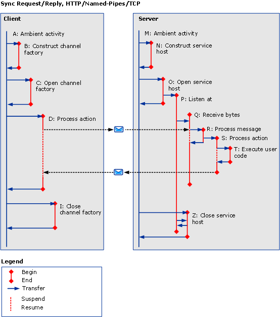

# Synchronous Scenarios using HTTP, TCP or Named-Pipe
This topic describes the activities and transfers for different synchronous request/reply scenarios, with a single-threaded client, using HTTP, TCP or named pipe. See [Asynchronous Scenarios using HTTP, TCP, or Named-Pipe](../../../../../docs/framework/wcf/diagnostics/tracing/asynchronous-scenarios-using-http-tcp-or-named-pipe.md) for more information on multi-threaded requests.  
  
## Synchronous Request/Reply without Errors  
 This section describes the activities and transfers for a valid synchronous request/reply scenario, with single-threaded client.  
  
### Client  
  
#### Establishing Communication with Service Endpoint  
 A client is constructed and opened. For each of these steps, the ambient activity (A) is transferred to a "Construct Client" (B) and "Open Client" (C) activity respectively. For each activity being transferred to, the ambient activity is suspended until there is a transfer back, that is, until ServiceModel code is executed.  
  
#### Making a Request to Service Endpoint  
 The ambient activity is transferred to a "ProcessAction" (D) activity. Within this activity, a request message is sent, and a response message is received. The activity ends when control returns to user code. Because this is a synchronous request, the ambient activity suspends until control returns.  
  
#### Closing Communication with Service Endpoint  
 The client's close activity (I) is created from the ambient activity. This is identical to new and open.  
  
### Server  
  
#### Setting up a Service Host  
 The ServiceHost’s new and open activities (N and O) are created from the ambient activity (M).  
  
 A listener activity (P) is created from opening a ServiceHost for each listener. The listener activity waits to receive and process data.  
  
#### Receiving Data on the Wire  
 When data arrives on the wire, a "ReceiveBytes" activity is created if it does not already exist (Q) to process the received data. This activity can be reused for multiple messages within a connection or queue.  
  
 The ReceiveBytes activity launches a ProcessMessage activity (R) if it has enough data to form a SOAP action message.  
  
 In activity R, the message headers are processed, and the activityID header is verified. If this header is present, the activity ID is set to the ProcessAction activity; otherwise, a new ID is created.  
  
 ProcessAction activity (S) is created and being transferred to, when the call is processed. This activity ends when all processing related to the incoming message is completed, including executing user code (T) and sending the response message if applicable.  
  
#### Closing a Service Host  
 The ServiceHost’s close activity (Z) is created from the ambient activity.  
  
   
  
 In \<A: name>, `A` is a shortcut symbol that describes the activity in the previous text and in table 3. `Name` is a shortened name of the activity.  
  
 If `propagateActivity`=`true`, Process Action on both the client and service have the same activity ID.  
  
## Synchronous Request/Reply with Errors  
 The only difference with the previous scenario is that a SOAP fault message is returned as a response message. If `propagateActivity`=`true`, the activity ID of the request message is added to the SOAP fault message.  
  
## Synchronous One-Way without Errors  
 The only difference with the first scenario is that no message is returned to the server. For HTTP-based protocols, a status (valid or error) is still returned to the client. This is because HTTP is the only protocol with a request-response semantics that is part of the [!INCLUDE[indigo2](../../../../../includes/indigo2-md.md)] protocol stack. Because TCP processing is hidden from [!INCLUDE[indigo2](../../../../../includes/indigo2-md.md)], no acknowledgement is sent to the client.  
  
## Synchronous One-Way with Errors  
 If an error occurs while processing the message (Q or beyond), no notification is returned to the client. This is identical to the "Synchronous One-Way without Errors" scenario. You should not use a One-Way scenario if you want to receive an error message.  
  
## Duplex  
 The difference with the previous scenarios is that the client acts as a service, in which it creates the ReceiveBytes and ProcessMessage activities, similar to the Asynchronous scenarios.
