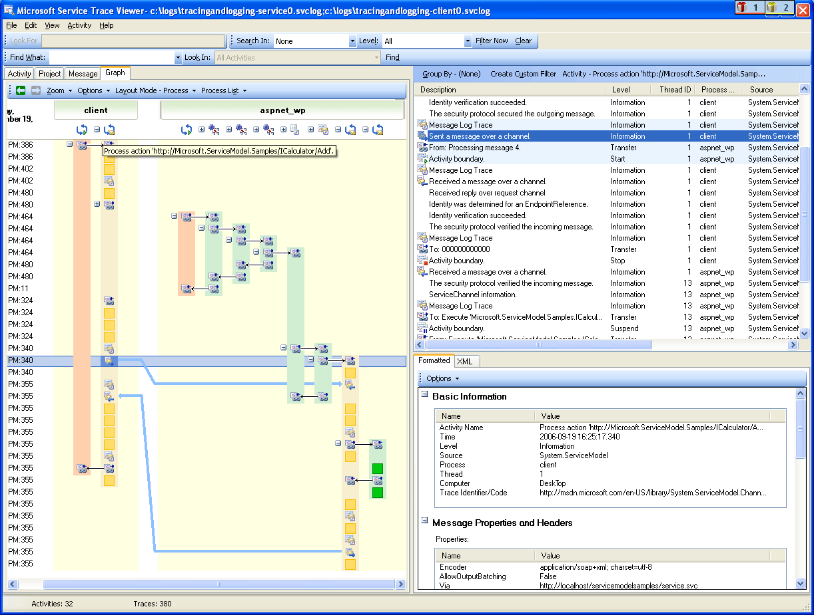
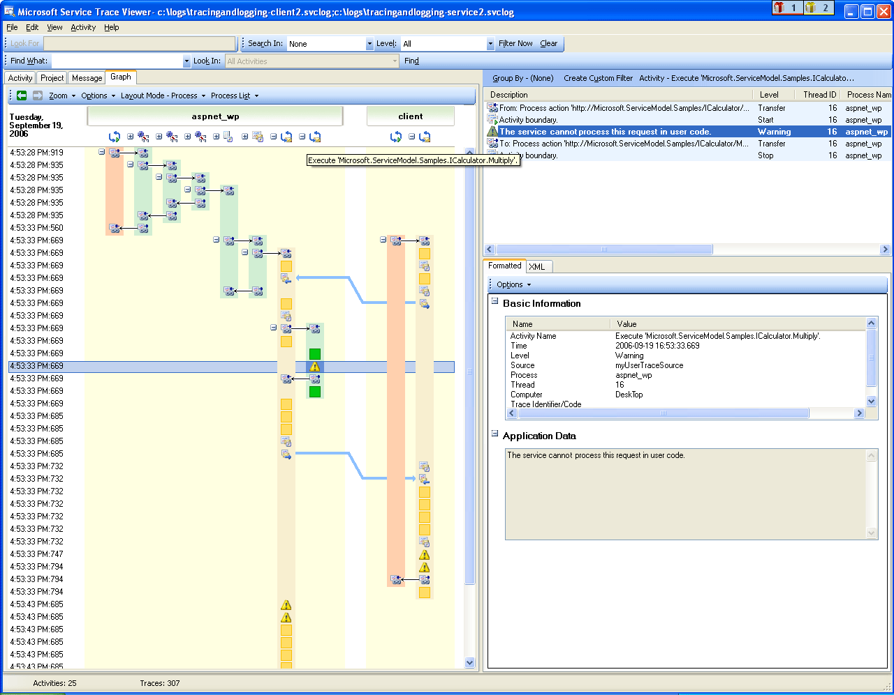
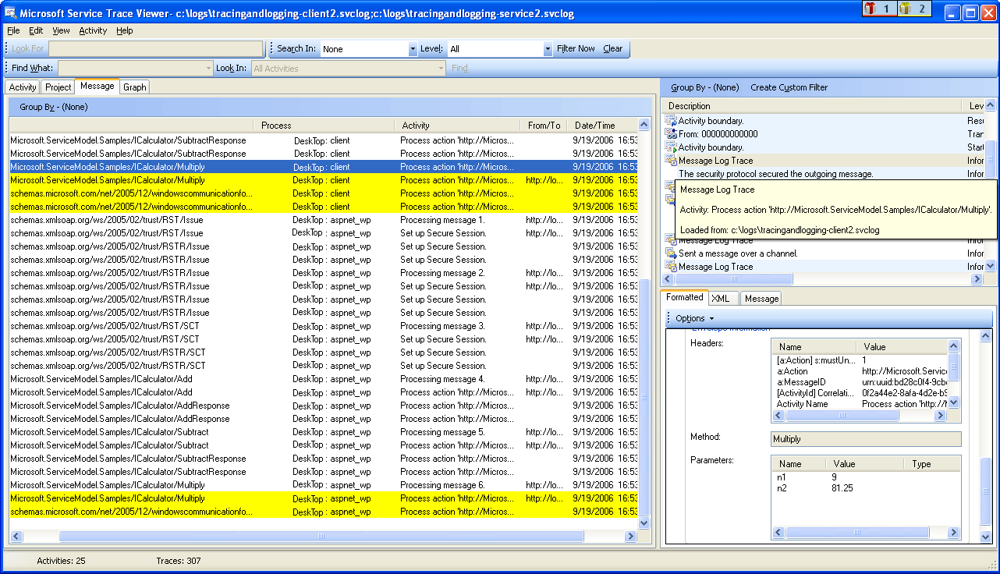

# Using Service Trace Viewer for Viewing Correlated Traces and Troubleshooting
This topic describes the format of trace data, how to view it, and approaches that use the Service Trace Viewer to troubleshoot your application.  
  
## Using the Service Trace Viewer Tool  
 The [!INCLUDE[indigo1](../../../../../includes/indigo1-md.md)] Service Trace Viewer tool helps you correlate diagnostic traces produced by [!INCLUDE[indigo2](../../../../../includes/indigo2-md.md)] listeners to locate the root cause of an error. The tool gives you a way to easily view, group, and filter traces so that you can diagnose, repair and verify issues with [!INCLUDE[indigo2](../../../../../includes/indigo2-md.md)] services. For more information about using this tool, see [Service Trace Viewer Tool (SvcTraceViewer.exe)](../../../../../docs/framework/wcf/service-trace-viewer-tool-svctraceviewer-exe.md).  
  
 This topic contains screenshots of traces generated by running the [Tracing and Message Logging](../../../../../docs/framework/wcf/samples/tracing-and-message-logging.md) sample, when viewed using the [Service Trace Viewer Tool (SvcTraceViewer.exe)](../../../../../docs/framework/wcf/service-trace-viewer-tool-svctraceviewer-exe.md). This topic demonstrates how to understand trace content, activities and their correlation, and how to analyze large numbers of traces when troubleshooting.  
  
## Viewing Trace Content  
 A trace event contains the following most significant information:  
  
-   Activity name when set.  
  
-   Emission time.  
  
-   Trace level.  
  
-   Trace source name.  
  
-   Process name.  
  
-   Thread id.  
  
-   A unique trace identifier, which is a URL that points to a destination in Microsoft Docs, from which you can obtain more information related to the trace.  
  
 All of these can be seen in the upper right panel in the Service Trace Viewer, or in the **Basic Information** section in the formatted view of the lower-right panel when selecting a trace.  
  
> [!NOTE]
>  If the client and the service are on the same machine, the traces for both applications will be present. These can be filtered using the **Process Name** column.  
  
 In addition, the formatted view also provides a description for the trace and additional detailed information when available. The latter can include exception type and message, call stacks, message action, from/to fields, and other exception information.  
  
 In the XML view, useful xml tags include the following:  
  
-   \<SubType> (trace level).  
  
-   \<TimeCreated>.  
  
-   \<Source> (trace source name).  
  
-   \<Correlation> (activity id set when emitting the trace).  
  
-   \<Execution> (process and thread id).  
  
-   \<Computer>.  
  
-   \<ExtendedData>, including \<Action>, \<MessageID> and the \<ActivityId> set in the message header when sending a message.  
  
 If you examine the "Sent a message over a channel" trace, you may see the following content.  
  
```xml  
<E2ETraceEvent xmlns="http://schemas.microsoft.com/2004/06/E2ETraceEvent">  
   <System xmlns="http://schemas.microsoft.com/2004/06/windows/eventlog/system">  
      <EventID>262163</EventID>  
      <Type>3</Type>  
      <SubType Name="Information">0</SubType>  
      <Level>8</Level>  
      <TimeCreated SystemTime="2006-08-04T18:45:30.8491051Z" />  
      <Source Name="System.ServiceModel" />  
       <Correlation ActivityID="{27c6331d-8998-43aa-a382-03239013a6bd}"/>  
       <Execution ProcessName="client" ProcessID="1808" ThreadID="1" />  
       <Channel />  
       <Computer>TEST1</Computer>  
   </System>  
   <ApplicationData>  
       <TraceData>  
          <DataItem>  
             <TraceRecord xmlns="http://schemas.microsoft.com/2004/10/E2ETraceEvent/TraceRecord" Severity="Information">  
                 <TraceIdentifier>http://msdn.microsoft.com/library/System.ServiceModel.Channels.MessageSent.aspx</TraceIdentifier>  
                 <Description>Sent a message over a channel.</Description>  
                 <AppDomain>client.exe</AppDomain>  
                 <Source>System.ServiceModel.Channels.ClientFramingDuplexSessionChannel/35191196</Source>  
                <ExtendedData xmlns="http://schemas.microsoft.com/2006/08/ServiceModel/MessageTransmitTraceRecord">  
  
                  <MessageProperties>  
                     <AllowOutputBatching>False</AllowOutputBatching>  
                  </MessageProperties>  
                  <MessageHeaders>  
                     <Action d4p1:mustUnderstand="1" xmlns:d4p1="http://www.w3.org/2003/05/soap-envelope" xmlns="http://www.w3.org/2005/08/addressing">http://Microsoft.ServiceModel.Samples/ICalculator/Multiply</Action>  
                     <MessageID xmlns="http://www.w3.org/2005/08/addressing">urn:uuid:7c6670d8-4c9c-496e-b6a0-2ceb6db35338</MessageID>  
                     <ActivityId CorrelationId="b02e2189-0816-4387-980c-dd8e306440f5" xmlns="http://schemas.microsoft.com/2004/09/ServiceModel/Diagnostics">27c6331d-8998-43aa-a382-03239013a6bd</ActivityId>  
                     <ReplyTo xmlns="http://www.w3.org/2005/08/addressing">  
                        <Address>http://www.w3.org/2005/08/addressing/anonymous</Address>  
                    </ReplyTo>  
                    <To d4p1:mustUnderstand="1" xmlns:d4p1="http://www.w3.org/2003/05/soap-envelope" xmlns="http://www.w3.org/2005/08/addressing">net.tcp://localhost/servicemodelsamples/service</To>  
                  </MessageHeaders>  
                  <RemoteAddress>net.tcp://localhost/servicemodelsamples/service</RemoteAddress>  
                </ExtendedData>  
            </TraceRecord>  
          </DataItem>  
       </TraceData>  
   </ApplicationData>  
</E2ETraceEvent>  
```  
  
## ServiceModel E2E Tracing  
 When the `System.ServiceModel` trace source is set with a `switchValue` other than Off, and `ActivityTracing`, [!INCLUDE[indigo2](../../../../../includes/indigo2-md.md)] creates activities and transfers for [!INCLUDE[indigo2](../../../../../includes/indigo2-md.md)] processing.  
  
 An activity is a logical unit of processing that groups all traces related to that processing unit. For example, you can define one activity for each request. Transfers create a causal relationship between activities within endpoints. Propagating the activity ID enables you to relate activities across endpoints. This can be done by setting `propagateActivity`=`true` in configuration at every endpoint. Activities, transfers, and propagation allow you to perform error correlation. In this way, you can find the root cause of an error more quickly.  
  
 On the client, one [!INCLUDE[indigo2](../../../../../includes/indigo2-md.md)] activity is created for each object model call (for example, Open ChannelFactory, Add, Divide, and so on.) Each of the operation calls is processed in a "Process Action" activity.  
  
 In the following screenshot, extracted from the [Tracing and Message Logging](../../../../../docs/framework/wcf/samples/tracing-and-message-logging.md) sample the left panel displays the list of activities created in the client process, sorted by creation time. The following is a chronological list of activities:  
  
-   Constructed the channel factory (ClientBase).  
  
-   Opened the channel factory.  
  
-   Processed the Add action.  
  
-   Set up the Secure Session (this OCCURRED on the first request) and processed three security infrastructure response messages: RST, RSTR, SCT (Process message 1, 2, 3).  
  
-   Processed the Subtract, Multiply, and Divide requests.  
  
-   Closed the channel factory, and doing so closed the Secure session and processed the security message response Cancel.  
  
 We see the security infrastructure messages because of the wsHttpBinding.  
  
> [!NOTE]
>  In [!INCLUDE[indigo2](../../../../../includes/indigo2-md.md)], we show response messages being processed initially in a separate activity (Process message) before we correlate them to the corresponding Process Action activity that includes the request message, through a transfer. This happens for infrastructure messages and asynchronous requests and is due to the fact that we must inspect the message, read the activityId header, and identify the existing Process Action activity with that id to correlate to it. For synchronous requests, we are blocking for the response and hence know which Process action the response relates to.  
  
   
WCF client activities listed by creation time (left panel) and their nested activities and traces (upper right panel)  
  
 When we select an activity in the left panel, we can see nested activities and traces on the upper right panel. Therefore, this is a reduced hierarchical view of the list of activities on the left, based on the selected parent activity. Because the selected Process action Add is the first request made, this activity contains the Set Up Secure Session activity (transfer to, transfer back from), and traces for the actual processing of the Add action.  
  
 If we double click the Process action Add activity in the left panel, we can see a graphical representation of the client [!INCLUDE[indigo2](../../../../../includes/indigo2-md.md)] activities related to Add. The first activity on the left is the root activity (0000), which is the default activity. [!INCLUDE[indigo2](../../../../../includes/indigo2-md.md)] transfers out of the ambient activity. If this is not defined, [!INCLUDE[indigo2](../../../../../includes/indigo2-md.md)] transfers out of 0000. Here, the second activity, Process Action Add, transfers out of 0. Then we see Setup Secure Session.  
  
   
Graph view of WCF client activities: Ambient Activity (here 0), Process action, and Set Up Secure Session  
  
 On the upper right panel, we can see all traces related to the Process Action Add activity. Specifically, we have sent the request message ("Sent a message over a channel") and received the response ("Received a message over a channel") in the same activity. This is shown in the following graph. For clarity, the Set up Secure Session activity is collapsed in the graph.  
  
   
List of traces for the Process Action activity: we send the request and receive the response in the same activity.  
  
 Here, we load client traces only for clarity, but service traces (request message received and response message sent) appear in the same activity if they are also loaded in the tool and `propagateActivity` was set to `true.` This is shown in a later illustration.  
  
 On the service, the activity model maps to the [!INCLUDE[indigo2](../../../../../includes/indigo2-md.md)] concepts as follows:  
  
1.  We construct and open a ServiceHost (this may create several host-related activities, for instance, in the case of security).  
  
2.  We create a Listen At activity for each listener in the ServiceHost (with transfers in and out of Open ServiceHost).  
  
3.  When the listener detects a communication request initiated by the client, it transfers to a "Receive Bytes" activity, in which all bytes sent from the client are processed. In this activity, we can see any connection errors that have happened during the client-service interaction.  
  
4.  For each set of bytes that is received that corresponds to a message, we process these bytes in a "Process Message" activity, where we create the [!INCLUDE[indigo2](../../../../../includes/indigo2-md.md)] Message object. In this activity, we see errors related to a bad envelope or a malformed message.  
  
5.  Once the message is formed, we transfer to a Process Action activity. If `propagateActivity` is set to `true` on both the client and service, this activity has the same id as the one defined in the client, and described previously. From this stage we start to benefit from direct correlation across endpoints, because all traces emitted in [!INCLUDE[indigo2](../../../../../includes/indigo2-md.md)] that are related to the request are in that same activity, including the response message processing.  
  
6.  For out-of-process action, we create an "Execute user code" activity to isolate traces emitted in user code from the ones emitted in [!INCLUDE[indigo2](../../../../../includes/indigo2-md.md)]. In the preceding example, the "Service sends Add response" trace is emitted in the "Execute User code" activity not in the activity propagated by the client, if applicable.  
  
 In the illustration that follows, the first activity on the left is the root activity (0000), which is the default activity. The next three activities are to open the ServiceHost. The activity in column 5 is the listener, and the remaining activities (6 to 8) describe the WCF processing of a message, from bytes processing to user code activation.  
  
   
List of WCF service activities  
  
 The following screenshot shows the activities for both the client and service, and highlights the Process Action Add activity across processes (orange). Arrows relate the request and response messages sent and received by the client and service. The traces of Process Action are separated across processes in the graph, but shown as part of the same activity in the upper-right panel. In this panel, we can see client traces for sent messages followed by service traces for received and processed messages.  
  
   
Graph view of both WCF client and service activities  
  
 In the following error scenario, error and warning traces at the service and client are related. An exception is first thrown in user code on the service (right-most green activity that includes a warning trace for the exception "The service cannot process this request in user code."). When the response is sent to the client, a warning trace is again emitted to denote the fault message (left pink activity). The client then closes its WCF client (yellow activity on the lower-left side), which aborts the connection to the service. The service throws an error (longest pink activity on the right).  
  
   
Error correlation across the service and client  
  
 The sample used to generate these traces is a series of synchronous requests using the wsHttpBinding. There are deviations from this graph for scenarios without security, or with asynchronous requests, where the Process Action activity encompasses the begin and end operations that constitute the asynchronous call, and shows transfers to a callback activity. For more information about additional scenarios, see [End-To-End Tracing Scenarios](../../../../../docs/framework/wcf/diagnostics/tracing/end-to-end-tracing-scenarios.md).  
  
## Troubleshooting Using the Service Trace Viewer  
 When you load trace files in the Service Trace Viewer Tool, you can select any red or yellow activity on the left panel to track down the cause of a problem in your application. The 000 activity typically has unhandled exceptions that bubble up to the user.  
  
   
Selecting red or yellow activity to locate the root of a problem  
  
 On the upper right panel, you can examine traces for the activity you selected on the left. You can then examine red or yellow traces in that panel and see how they are correlated. In the preceding graph, we see warning traces both for the client and service in the same Process Action activity.  
  
 If these traces do not provide you with the root cause of the error, you can utilize the graph by double-clicking the selected activity on the left panel (here Process action). The graph with related activities is then displayed. You can then expand related activities (by clicking the "+" signs) to find the first emitted trace in red or yellow in a related activity. Keep expanding the activities that happened just before the red or yellow trace of interest, following transfers to related activities or message flows across endpoints, until you track the root cause of the problem.  
  
   
Expanding activities to track the root cause of a problem  
  
 If ServiceModel `ActivityTracing` is off but ServiceModel tracing is on, you can see ServiceModel traces emitted in the 0000 activity. However, this requires more effort to understand the correlation of these traces.  
  
 If Message Logging is enabled, you can use the Message Tab to see which message is impacted by the error. By double-clicking a message in red or yellow, you can see the graph view of the related activities. These activities are the ones most closely related to the request where an error happened.  
  
   
To start troubleshooting, you can also pick a red or yellow message trace and double click it to track the root cause  
  
## See Also  
 [End-To-End Tracing Scenarios](../../../../../docs/framework/wcf/diagnostics/tracing/end-to-end-tracing-scenarios.md)  
 [Service Trace Viewer Tool (SvcTraceViewer.exe)](../../../../../docs/framework/wcf/service-trace-viewer-tool-svctraceviewer-exe.md)  
 [Tracing](../../../../../docs/framework/wcf/diagnostics/tracing/index.md)
